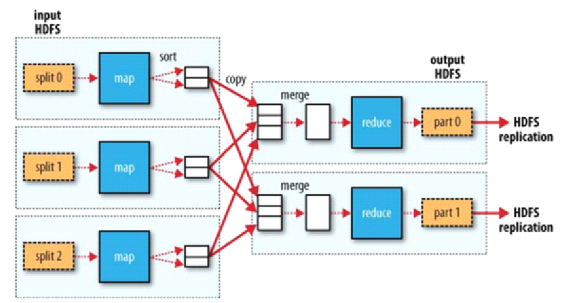
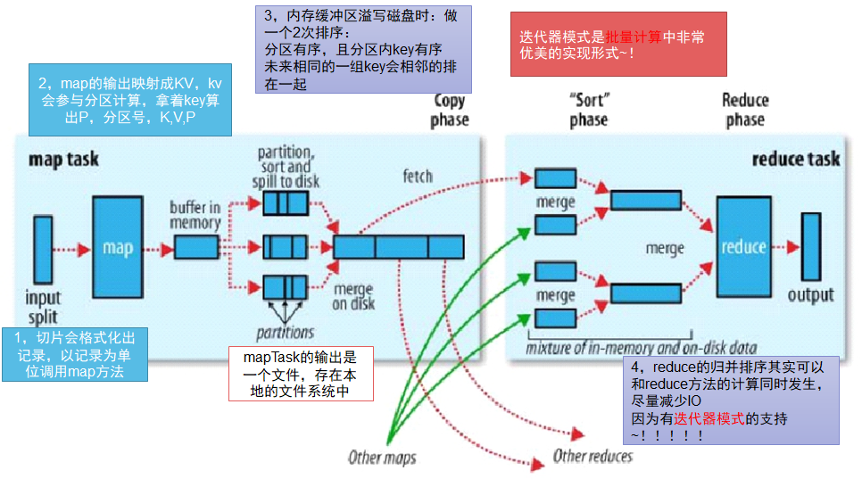
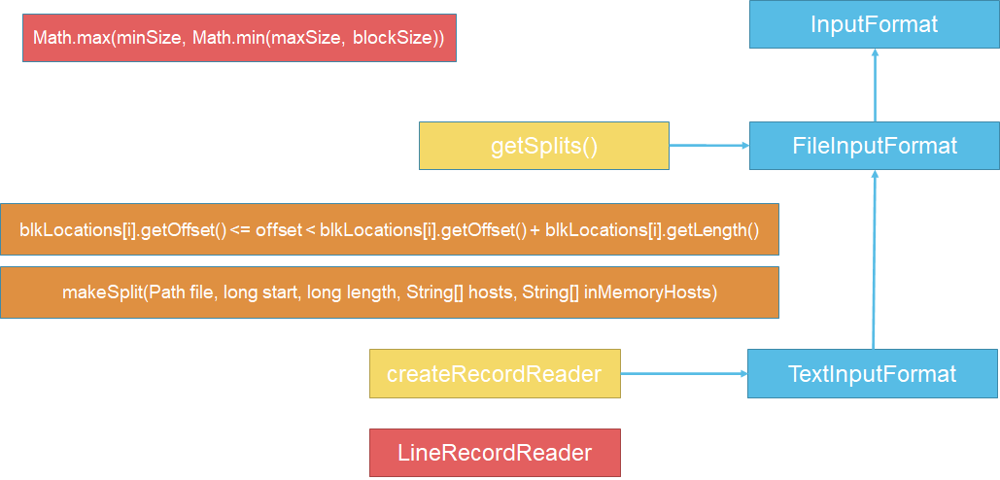
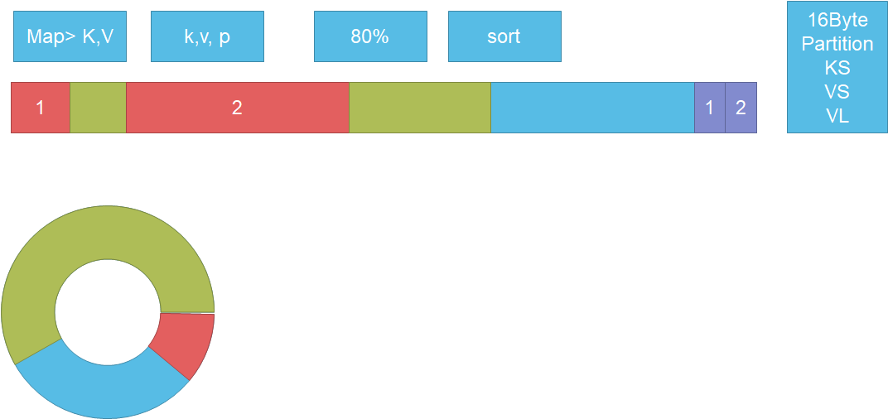
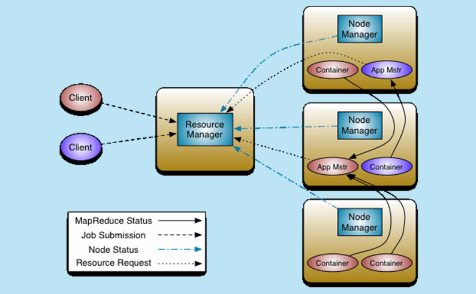

# 1. 大数据初识

> 学习知识的时候要去搞明白它存在的意义，这样学习成本才会低！

Apache Hadoop项目为可靠的、可扩展的分布式计算开发开源软件。

## 1.1 大数据关心的重点

- 分而治之
- 并行计算
- 计算向数据移动
- 数据本地读取

## 1.2 hadoop时间简史

 《The Google File System 》 2003年 

 《MapReduce: Simplified Data Processing on Large Clusters》 2004年 

 《Bigtable: A Distributed Storage System for Structured Data》 2006年

   Hadoop由 Apache Software Foundation 于 2005 年秋天作为Lucene的子项目Nutch的一部分正式引入。

   2006 年 3 月份，Map/Reduce 和 Nutch Distributed File System (NDFS) 分别被纳入称为 Hadoop 的项目中。

  Cloudera公司在2008年开始提供基于Hadoop的软件和服务。2016年10月hadoop-2.6.5

  2017年12月hadoop-3.0.0

hadoop.apache.org

## 1.3 Hadoop项目/生态


hadoop包括4个模块：

1. Hadoop Common

2. Hadoop Distributed File System (HDFS)
3. Hadoop YARN
4. Hadoop MapReduce

Apache中其他与hadoop相关的项目包括:

1. **Ambar** : 一个基于web的用于提供、管理和监视Apache Hadoop集群的工具，包括对Hadoop HDFS、Hadoop MapReduce、Hive、HCatalog、HBase、ZooKeeper、Oozie、Pig和Sqoop的支持。Ambari还提供了一个查看集群运行状况(如heatmaps)的仪表板，以及可视化查看MapReduce、Pig和Hive应用程序的能力，以及以用户友好的方式诊断其性能特征的功能。

2. **Avro**: 数据序列化系统

3. **Cassandra** : 没有单点故障的可伸缩多主数据库。

4. **Chukwa** : 用于管理大型分布式系统的数据收集系统。

5. **HBase** : 可伸缩的分布式数据库，支持大型表的结构化数据存储。

6. **Hive** : 提供数据汇总和特别查询的数据仓库基础设施。

7. **Mahout** : 一个可扩展的机器学习和数据挖掘库。

8. **Pig** : 用于并行计算的高级数据流语言和执行框架。

9. **Spark** : 一个快速和通用的Hadoop数据计算引擎。Spark提供了一个简单而富有表现力的编程模型，它支持广泛的应用程序，包括ETL、机器学习、流处理和图形计算。

10. **Tez** : 一个基于Hadoop YARN的通用数据流编程框架，它提供了一个强大而灵活的引擎，可以执行任意的DAG任务来处理批处理和交互式用例的数据。Hadoop生态系统中的Hive、Pig等框架以及其他商业软件(如ETL工具)正在采用Tez，以取代Hadoop的MapReduce作为底层执行引擎。

11. **ZooKeeper** : 分布式应用程序的高性能协调服务。

    

# 2.Hadoop Distributed File System (HDFS)

## 2.1 存储模型

文件线性按字节切割成块(block)，具有offset，id

文件与文件的block大小可以不一样

一个文件除最后一个block，其他block大小一致

block的大小依据硬件的I/O特性调整

block被分散存放在集群的节点中，具有location

Block具有副本(replication)，没有主从概念，副本不能出现在同一个节点

副本是满足可靠性和性能的关键

文件上传可以指定block大小和副本数，上传后只能修改副本数

一次写入多次读取，不支持修改

支持追加数据

## 2.2 架构设计

HDFS是一个主从(Master/Slaves)架构

由一个NameNode和一些DataNode组成

面向文件包含：文件数据(data)和文件元数据(metadata)

NameNode负责存储和管理文件元数据，并维护了一个层次型的文件目录树

DataNode负责存储文件数据(block块)，并提供block的读写

DataNode与NameNode维持心跳，并汇报自己持有的block信息

Client和NameNode交互文件元数据和DataNode交互文件block数据

## 2.3 角色功能

**NameNode**

- 完全基于内存存储文件元数据、目录结构、文件block的映射
- 需要持久化方案保证数据可靠性
- 提供副本放置策略

**DataNode**

- 基于本地磁盘存储block(文件的形式)
- 并保存block的校验和数据保证block的可靠性
- 与NameNode保持心跳，汇报block列表状态

## 2.4 元数据持久化

任何对文件系统元数据产生修改的操作，Namenode都会使用一种称为EditLog的事务日志记录下来

使用FsImage存储内存所有的元数据状态

使用本地磁盘保存EditLog和FsImage

EditLog具有完整性，数据丢失少，但恢复速度慢，并有体积膨胀风险

FsImage具有恢复速度快，体积与内存数据相当，但不能实时保存，数据丢失多

NameNode使用了FsImage+EditLog整合的方案：

- 滚动将增量的EditLog更新到FsImage，以保证更近时点的FsImage和更小的EditLog体积

## 2.5 安全模式

1. HDFS搭建时会格式化，格式化操作会产生一个空的FsImage

2. 当Namenode启动时，它从硬盘中读取Editlog和FsImage，将所有Editlog中的事务作用在内存中的FsImage上，并将这个新版本的FsImage从内存中保存到本地磁盘上，然后删除旧的Editlog，因为这个旧的Editlog的事务都已经作用在FsImage上了

3. Namenode启动后会进入一个称为安全模式的特殊状态。

4. 处于安全模式的Namenode是不会进行数据块的复制的。

5. Namenode从所有的 Datanode接收心跳信号和块状态报告。

6. 每当Namenode检测确认某个数据块的副本数目达到这个最小值，那么该数据块就会被认为是副本安全(safely replicated)的。

7. 在一定百分比（这个参数可配置）的数据块被Namenode检测确认是安全之后（加上一个额外的30秒等待时间），Namenode将退出安全模式状态。

8. 接下来它会确定还有哪些数据块的副本没有达到指定数目，并将这些数据块复制到其他Datanode上。

**SecondaryNameNode（SNN）**

1. 在非Ha模式下，SNN一般是独立的节点，周期完成对NN的EditLog向FsImage合并，减少EditLog大小，减少NN启动时间

2. 根据配置文件设置的时间间隔fs.checkpoint.period 默认3600秒

3. 根据配置文件设置edits log大小 fs.checkpoint.size 规定edits文件的最大值默认是64MB


## 2.6 副本放置策略

第一个副本：放置在上传文件的DN；如果是集群外提交，则随机挑选一台磁盘不太满，CPU不太忙的节点。

第二个副本：放置在于第一个副本不同的 机架的节点上。

第三个副本：与第二个副本相同机架的节点。

更多副本：随机节点。

## 2.7 读写流程

**HDFS写流程**


1. Client和NN连接创建文件元数据

2. NN判定元数据是否有效: 比如文件是否存在，是有具有写权限
3. NN处发副本放置策略，返回一个有序的DN列表
4. Client和DN建立Pipeline连接
5. Client将块切分成packet（64KB），并使用chunk（512B）+chucksum校验和（4B）填充
6. Client将packet放入发送队列dataqueue中，并向第一个DN发送
7. 第一个DN收到packet后本地保存并发送给第二个DN
8. 第二个DN收到packet后本地保存并发送给第三个DN
9. 这一个过程中，上游节点同时发送下一个packet
10. 生活中类比工厂的流水线：结论：流式其实也是变种的并行计算
11. Hdfs使用这种传输方式，副本数对于client是透明的
12. 当block传输完成，DN们各自向NN汇报，同时client继续传输下一个block
13. 所以，client的传输和block的汇报也是并行的

**HDFS读流程**


1. 为了降低整体的带宽消耗和读取延时，HDFS会尽量让读取程序读取离它最近的副本。

   如果在读取程序的同一个机架上有一个副本，那么就读取该副本。

   如果一个HDFS集群跨越多个数据中心，那么客户端也将首先读本地数据中心的副本。

2. 语义：下载一个文件：

   Client和NN交互文件元数据获取fileBlockLocation

   NN会按距离策略排序返回

   Client尝试下载block并校验数据完整性

3. 语义：下载一个文件其实是获取文件的所有的block元数据，那么子集获取某些block应该成立

   Hdfs支持client给出文件的offset自定义连接哪些block的DN，自定义获取数据

   这个是支持计算层的分治、并行计算的核心


# 3.HDFS HA

单NameNode的HDFS存在一下两个问题：

1. 单点故障

2. 压力过大，内存受限

**HDFS解决方案：**

1. 单点故障：
   - 高可用方案：HA（High Available）
   -  多个NN，主备切换

2. 压力过大，内存受限：
   -  联帮机制： Federation（元数据分片）
   - 多个NN，管理不同的元数据

## 3.1 HA方案

**多台NN主备模式，Active和Standby状态**

在Hadoop 2.0.0之前，存在单点故障问题，一旦NameNode不可用，整个集群将不可用，于是在hadoop2.0.0之后支持启动两个NameNode(3.0.0之后可以启动两个以上的NameNode)，这允许在机器崩溃时快速地将故障转移到新的NameNode，或者在计划维护时允许管理员发起的优雅故障转移。

**Active对外提供服务 **

在典型的HA集群中，两台或更多独立的机器被配置为namenode。在任何时间点，只有一个namenode处于*Active*状态，而其他namenode处于*Standby*状态。活动的NameNode负责集群中的所有客户端操作，而备用服务器只是充当工作者，维护足够的状态，以便在必要时提供快速的故障转移。

**增加journalnode角色(>3台)，负责同步NN的editlog**

为了使备用节点的状态与活动节点保持同步，两个节点都与一组称为JournalNodes (JNs)的独立守护进程通信。当*Active*节点修改namespace时，它会将修改的记录持久地记录到大多数这些JNs中。*Standby*节点能够从JNs中读取编辑，并不断监视它们以查看编辑日志的更改。当备用节点看到编辑时，它将其应用到自己的namespace。在发生故障转移时，*Standby*系统将确保它已从JNs中读取了所有编辑。

在HA模式下，没有必要运行Secondary NameNode, CheckpointNode,  BackupNode。

**增加zkfc角色(与NN同台)，通过zookeeper集群协调NN的主从选举和切换**

自动故障转移增加了两个新的组件一个HDFS部署:ZooKeeper quorum和ZKFailoverController(ZKFC)。

1. 自动故障转移需要依赖**ZooKeeper quorum**以下两个功能：
   - **故障检测**：集群中的每个NameNode机器在ZooKeeper中维护一个持久会话。如果机器崩溃，ZooKeeper会话将过期，通知其他NameNode应该触发故障转移。
   - **Active NameNode 选举**：ZooKeeper提供了一种简单的机制，可以将一个节点选择为活动节点。如果当前活动的NameNode崩溃，另一个节点可能会在ZooKeeper中获得一个特殊的独占锁，指示它应该成为下一个Active的节点。
2. **ZKFailoverController** (ZKFC)是一个新的组件，它是一个ZooKeeper客户端，可以监视和管理NameNode的状态。运行NameNode的每台机器也运行ZKFC，而ZKFC负责以下内容：
   - **健康监控** : ZKFC使用健康检查命令定期ping它的本地NameNode。只要NameNode以健康状态及时响应，ZKFC就认为节点是健康的。如果节点已经崩溃、冻结或以其他方式进入不健康状态，则运行状况监视器将将其标记为不健康。
   - **ZooKeeper session管理**：当本地NameNode正常运行时，ZKFC在ZooKeeper中打开一个会话。如果本地NameNode是活动的，它还持有一个特殊的锁znode。这个锁使用了ZooKeeper对临时节点的支持;如果会话到期，锁节点将被自动删除。
   - **ZooKeeper-based选举**：如果本地NameNode正常运行，并且ZKFC发现当前没有其他节点持有锁znode，那么它将自己尝试获取该锁。如果成功，则它赢得了选举，并负责运行故障转移以使其本地NameNode处于活动状态。故障转移过程类似于上面描述的手动故障转移:首先，如果需要，对前一个活动进行隔离，然后本地NameNode转换到活动状态。

**事件回调机制** ： 

**DN同时向NNs汇报block清单**

为了提供快速的故障转移，Standby 节点还必须拥有集群块位置的最新信息。为了实现这一点，DataNodes配置了所有namenode的位置，并发送块位置信息和心跳给所有NameNode。


安装说明路径：https://hadoop.apache.org/docs/stable/hadoop-project-dist/hadoop-hdfs/HDFSHighAvailabilityWithQJM.html


## 3.2 HDFS Federation


HDFS有两个主要的层级：

1. **Namespace**：
   - 由目录、文件和块组成。
   - 它支持所有与名称空间相关的文件系统操作，如创建、删除、修改和列出文件和目录。
2. **Block Storage Service**：
   - Block管理：NameNode负责
   - Bolck存储：DataNode负责

**元数据分治，复用DN存储**

为了横向扩展名称服务，federation使用多个独立的Namenodes/namespaces。namenode是独立的，不需要彼此协调。Datanodes被所有的namenode用作块的公共存储。每个Datanode都使用集群中的所有namenode注册。Datanodes发送周期性的心跳和block报告。它们还处理来自namenode的命令。

**Block Pool**

块池是属于单个 namespace的一组块。Datanode为集群中的所有Block Pool存储块。每个块池都是独立管理的。这允许namespace为新块生成块id，而不需要与其他名称空间协调。Namenode失败不会阻止Datanode为集群中的其他Namenode提供服务。

Namespace和block pool一起称为名称Namespace卷。它是一个独立的管理单位。当删除一个Namenode/namespace时，就会删除datanode上对应的块池。在集群升级期间，每个名称namespace卷作为一个单元被升级。

**ClusterID**

ClusterID标识符用于标识集群中的所有节点。当一个Namenode被格式化后，这个标识符将被提供或者自动生成。这个ID应该用于将其他namenode格式化到集群中。


**使用Federation的优点**：

1. **Namespace可伸缩性**：联合增加了Namespace的水平伸缩。通过允许在集群中添加更多的namenode，大型部署或使用大量小文件的部署可以从名称空间扩展中获益。
2. **性能**：文件系统吞吐量不受单个Namenode的限制。向集群添加更多的namenode可扩展文件系统的读/写吞吐量。
3. **隔离性**：单个Namenode在多用户环境中无法提供隔离。例如，实验应用程序可能会使Namenode过载，从而降低关键生产应用程序的速度。通过使用多个namenode，可以将不同类别的应用程序和用户隔离到不同的名称空间。

Federation配置**向后兼容**，允许现有的单个Namenode配置无需任何更改即可工作。

Federation添加了一个新的NameServiceID抽象。一个Namenode和它对应的secondary/backup/checkpointer nodes都属于一个NameServiceId。为了支持单个配置文件，Namenode和secondary/backup/checkpointer参数都以NameServiceID作为后缀。

> **CAP原则**：
>
> Consistency：一致性
>
> Availability：可用性
>
> Partition tolerance：分区容忍性
>
> 

# 4. HDFS 权限

hdfs是一个文件系统，类似于unix、linux，有用户概念

	hdfs没有相关命令和接口去创建用户
		信任客户端 <- 默认情况使用的 操作系统提供的用户
				扩展 kerberos LDAP  继承第三方用户认证系统
	有超级用户的概念
		linux系统中超级用户：root
		hdfs系统中超级用户： 是namenode进程的启动用户
	
	有权限概念
		hdfs的权限是自己控制的 来自于hdfs的超级用户
**默认hdfs依赖操作系统上的用户和组**

```shell
#在namenode节点添加用户和组
useradd good
groupadd ooxx
usermod -a -G ooxx good
id good

#从namenode所在节点，更新操作系统用户的group信息到hdfs
hdfs dfsadmin -refreshUserToGroupsMappings
```

通过HADOOP_USER_NAME环境变量配置hdfs的用户

# 5. MapReduce

Hadoop MapReduce是一个软件框架，可以轻松地编写在大型集群(数千个节点)上并行处理大量数据的应用程序，以一种可靠的、容错的方式。

MapReduce框架由单个主ResourceManager、每个集群节点一个worker NodeManager和每个应用程序的MRAppMaster组成

(input) `<k1, v1> ->` **map** `-> <k2, v2> ->` **combine** `-> <k2, v2> ->` **reduce** `-> <k3, v3>` (output)


**Mapper**

Mapper是以一条记录为单位做映射,将输入键值对<K,V>转化为一组中间键值对集合，中间数据不需要跟输入数据的类型一致，一个输入对可以映射为零个或多个输出对。

负责映射、变换、过滤  ，1进N出，一个输入对可以映射为零个或多个输出对。

**Reducer**

Reducer以一组为单位做计算

负责分解、缩小、归纳 ， 一组进N出


map和reduce是一种阻塞关系


## 5.1 MR计算框架



**MR**：数据以一条记录为单位经过map方法映射成KV，相同的key为一组，这一组数据调用一次reduce方法，在方法内**迭代**计算着一组数据。

**split**   一个切片对应一个map运算,默认情况下等于block，也可以大于或者等于block，通过切分split来控制Mapper并行度，split与block的关系可以是1：1  、  1：N 、N:1，Mapper的数量跟split的数量一致

**Mapper** : 每条记录调一次map函数，map输出的数据按照key排序后，可以将相同的key放在一起，

**Reducer**：每组group数据调用一次reduce函数，reducer的数量由用户确定，mapper与reducer的对应关系可以是N:1、1:1、1：N、N:N

**group** : 相同的key为一组group，一组数据只能去到一个Reducer

**partition** : reducer的输出是分区partition，partition跟group(key)对象关系是1:1 、1：N 、N:N

> **迭代器模**式 ：MR使用了迭代器模式
>
> 数据集一般是用迭代计算的方式




每次buffer满了之后会写到一个文件中，buffer在写到文件之前先排序，map任务会生成很多小文件，小文件之间是内部有序，外部无序，采用归并排序算法，合并成一个有序的文件。


## 5.2 MR架构

MapReduce采用主从模式

Master：是整个集群的唯一的全局管理者，功能包括：作业管理、状态监控和任务调度等，即MapReduce中的JobTracker。

Slave：负责任务的执行和任务状态的回报，即MapReduce中的TaskTracker。

### 5.2.1 JobTracker  

资源管理和任务调度，选择合适的dataNode

### 5.2.2 TaskTracker 

管理任务，资源汇报给JobTracker


### 5.2.3 处理流程

1. client会根据每次的计算数据，咨询NN元数据（block），计算出split，得到切片split的清单，即可得到map的数量             

    split是逻辑的，block是物理的，block有offset和locations，split和block有映射关系
     \>>   结果： split包含偏移量offset，以及split对应的map任务应该移动到哪些节点（locations）       

2. client生成计算程序未来运行时相关配置文件（xml文件）

3. client会将用户的jar包、split清单、配置文件xml   上传的hdfs目录上（上传的文件、副本数）

4. client会调用JobTracker，通知要启动一个计算程序了，告知文件存放在hdfs的位置

   

5. JobTracker收到启动程序之后，从hdfs中取回split清单

6. JobTracker根据自己收到的TaskTracker汇报的资源，最终确定每一个split对象的map应该去到哪一个节点，【确定清单】

7. TaskTracker再心跳的时候，JobTracker会取回分配给自己的任务信息

   

8. TaskTracker在心跳任务取回后，从hdfs中下载jar包、split清单、配置文件xml等资源到本地

9. 最后启动任务描述中的MapTask和ReduceTask，最终，代码在某一个节点被启动，是通过Client上传，TaskTracker下载实现的（这一过程叫计算向数据移动）


### 5.2.4 问题

1. JobTracker存在单点故障

2. JobTracker压力过大

3. JobTracker集成了资源管理和任务调度，两者耦合

   弊端：未来新的计算框架不能复用资源管理

   1.  重复造轮子
   2.  因为各自实现资源管理，但是他们部署在同一批硬件上，因为隔离，所以不能感知对方的使用，会产生资源争抢


这些是hadoop 1.x的内容，目前已经被淘汰，2.x产生了yarn，替代了这种方式


## 5.3 MapReduce代码实现

### 5.3.1 hadoop配置

1. mapred-site.xml配置

   ```
    <property>
   	<name>mapreduce.framework.name</name>
   	<value>yarn</value>
    </property>
   ```

2. yarn-site.xml配置

   ```xml
   <property>
   	<name>yarn.nodemanager.aux-services</name>
       <value>mapreduce_shuffle</value>
    </property>
   
   <property>
     <name>yarn.resourcemanager.ha.enabled</name>
     <value>true</value>
   </property>
   <property>
     <name>yarn.resourcemanager.zk-address</name>
     <value>node02:2181,node03:2181,node04:2181</value>
   </property>
   
   <property>
     <name>yarn.resourcemanager.cluster-id</name>
     <value>mashibing</value>
   </property>
   
   <property>
     <name>yarn.resourcemanager.ha.rm-ids</name>
     <value>rm1,rm2</value>
   </property>
   <property>
     <name>yarn.resourcemanager.hostname.rm1</name>
     <value>node03</value>
   </property>
   <property>
     <name>yarn.resourcemanager.hostname.rm2</name>
     <value>node04</value>
   </property>
   ```

3. 修改配置，启动应用

   ```
   node01：
      cd $HADOOP_HOME/etc/hadoop
      cp mapred-site.xml.template   mapred-site.xml  
      vi mapred-site.xml
      vi yarn-site.xml
      scp mapred-site.xml yarn-site.xml    node02:`pwd`
      scp mapred-site.xml yarn-site.xml    node03:`pwd`
      scp mapred-site.xml yarn-site.xml    node04:`pwd`
      vi slaves  //可以不用管，搭建hdfs时候已经改过了。。。
      start-yarn.sh
   node03~04:
      yarn-daemon.sh start resourcemanager
   http://node03:8088
   http://node04:8088
   This is standby RM. Redirecting to the current active RM: http://node03:8088/
   ```

### 5.3.2 代码实现

1.  Mapper将输入key/value映射到一组中间key/value。

```java
import java.io.IOException;
import java.util.StringTokenizer;

import org.apache.hadoop.conf.Configuration;
import org.apache.hadoop.fs.Path;
import org.apache.hadoop.io.IntWritable;
import org.apache.hadoop.io.Text;
import org.apache.hadoop.mapreduce.Job;
import org.apache.hadoop.mapreduce.Mapper;
import org.apache.hadoop.mapreduce.Reducer;
import org.apache.hadoop.mapreduce.lib.input.FileInputFormat;
import org.apache.hadoop.mapreduce.lib.output.FileOutputFormat;

public class WordCount {

  public static class TokenizerMapper
       extends Mapper<Object, Text, Text, IntWritable>{

    private final static IntWritable one = new IntWritable(1);
    private Text word = new Text();

    public void map(Object key, Text value, Context context
                    ) throws IOException, InterruptedException {
      StringTokenizer itr = new StringTokenizer(value.toString());
      while (itr.hasMoreTokens()) {
        word.set(itr.nextToken());
        context.write(word, one);
      }
    }
  }

  public static class IntSumReducer
       extends Reducer<Text,IntWritable,Text,IntWritable> {
    private IntWritable result = new IntWritable();

    public void reduce(Text key, Iterable<IntWritable> values,
                       Context context
                       ) throws IOException, InterruptedException {
      int sum = 0;
      for (IntWritable val : values) {
        sum += val.get();
      }
      result.set(sum);
      context.write(key, result);
    }
  }

  public static void main(String[] args) throws Exception {
    Configuration conf = new Configuration();
    Job job = Job.getInstance(conf, "word count");
    job.setJarByClass(WordCount.class);
    job.setMapperClass(TokenizerMapper.class);
    job.setCombinerClass(IntSumReducer.class);
    job.setReducerClass(IntSumReducer.class);
    job.setOutputKeyClass(Text.class);
    job.setOutputValueClass(IntWritable.class);
    FileInputFormat.addInputPath(job, new Path(args[0]));
    FileOutputFormat.setOutputPath(job, new Path(args[1]));
    System.exit(job.waitForCompletion(true) ? 0 : 1);
  }
}
```

输入key类型可以自定义，自定义的key要实现WritableComparable接口

mapper实现通过 [Job.setMapperClass(Class)](https://hadoop.apache.org/docs/r2.10.1/api/org/apache/hadoop/mapreduce/Job.html)方法传递给Job，然后框架为该任务的InputSplit中的每个键/值对调用[map(WritableComparable, Writable, Context)](https://hadoop.apache.org/docs/r2.10.1/api/org/apache/hadoop/mapreduce/Mapper.html)方法。

通过调用context.write(WritableComparable, Writable)方法收集输出对

用户可以通过Job.setGroupingComparatorClass(Class)指定Comparator来控制分组，Comparator可继承WritableComparator。

用户可以通过Job.setCombinerClass(Class)指定一个 `combiner`	，对中间输出进行本地聚合，这有助于减少从Mapper传输到Reducer的数据量。

job.setNumReduceTasks(num)可以设置Reduce任务的数量，默认是1，如果设置成0，就不会执行reduce任务，直接输出map输出结果

### 5.3.3 运行程序

程序有以下3种运行方式：

1. 开发-> jar  -> 上传到集群中的某一个节点 -> hadoop jar  ooxx.jar  ooxx  in out

```
   hdfs dfs -mkdir -p   /data/wc/input
   hdfs dfs -D dfs.blocksize=1048576  -put data.txt  /data/wc/input
   cd  $HADOOP_HOME
   cd share/hadoop/mapreduce
   hadoop jar  hadoop-mapreduce-examples-2.6.5.jar   wordcount   /data/wc/input   /data/wc/output
      1)webui:
      2)cli:
   hdfs dfs -ls /data/wc/output
      -rw-r--r--   2 root supergroup          0 2019-06-22 11:37 /data/wc/output/_SUCCESS  //标志成功的文件
      -rw-r--r--   2 root supergroup     788922 2019-06-22 11:37 /data/wc/output/part-r-00000  //数据文件
    
    其中除了可能生成part-r-00000文件，也可能生成part-m-00000，r表示是map+reduce task产生的输出，m表示只由是map task产生的输出
    
```

2. 嵌入【linux，windows】（非hadoop jar）的集群方式  on yarn

   ```
   mapred-site.xml文件中的mapreduce.framework.name决定了集群运行方式
   mapreduce.framework.name -> yarn
   
   //如果在windows运行，需要设置下面属性，让框架知道是windows异构平台运行
   conf.set("mapreduce.app-submission.cross-platform","true");
   
   //指定jar包的路径，将会推送jar包到hdfs
   job.setJar("C:\\Users\\Administrator\\IdeaProjects\\msbhadoop\\target\\hadoop-hdfs-1.0-0.1.jar");
     
   ```

3. local，单机  一般自测时采用这种方式

   ```
   将的mapreduce.framework.name设置成local
   mapreduce.framework.name -> local
   
   conf.set("mapreduce.app-submission.cross-platform","true"); //windows上必须配
   
   需要在windows部署hadoop,部署步骤如下：
         1，在win的系统中部署我们的hadoop：
            C:\usr\hadoop-2.6.5\hadoop-2.6.5
         2，在我给你的资料中\hadoop-install\soft\bin  文件覆盖到 你部署的bin目录下
            还要将hadoop.dll  复制到  c:\windwos\system32\
         3，设置环境变量：HADOOP_HOME  设置为C:\usr\hadoop-2.6.5\hadoop-2.6.5 
   ```


> ```
> bin/hadoop command [genericOptions] [commandOptions]
> hadoop jar  ooxx.jar  ooxx   -D  ooxx=ooxx  inpath  outpath
> args :   2类参数  genericOptions   commandOptions
> 
> 参数个性化
>    在执行命令中加上参数，避免在代码中硬编码，实现参数个性化，使用其他更灵活
>    
>    //工具类帮我们把-D 等等的属性直接set到conf，会留下commandOptions
>    GenericOptionsParser parser = new GenericOptionsParser(conf, args); 
>    //othargs是除去hadoop属性之外的其他参数
>    String[] othargs = parser.getRemainingArgs()
> ```

## 5.4 源码分析

源码分析不是为了能写出一个MR框架，而是为了更好的使用和更充分的理解框架的细节

不需要死记硬背代码，主要是理解技术细节和原理

MapReduce是分布式计算框架，主要是追求3个方面：

1. 计算向数据移动    

2. 并行度、分治

3. 数据本地化读取

   

我们跳过yarn的资源管理这个层次，只研究计算层的实现

MR计算层分为三个环节：

1.Client提交规划

2.MapTask

3.ReduceTask

### 5.4.1 Client

Client中没有计算发生，最重要的是：支撑了计算向数据移动和计算的并行度

**Client提交规划**

1.个性化配置程序

- 加载配置文件
- GenericOptionsParser解析参数配置

2.提交程序到集群执行

​	a) path检查

​	b) computing splits

​	c) upload resource

​	d) submit Job

```
job.waitForCompletion(true)
	JobSubmitter.submitJobInternal

//validate the jobs output specs 
checkSpecs(job);

//将jar包和配置文件上传
copyAndConfigureFiles(job, submitJobDir);

// Create the splits for the job
int maps = writeSplits(job, submitJobDir);
	//重点看该方法
	maps = writeNewSplits(job, jobSubmitDir);

// Write job file to submit dir
writeConf(conf, submitJobFile);
```

JobSubmitter.submitJobInternal方法的作用如下：

1，Checking the input and output specifications of the job.
2，Computing the InputSplits for the job.  // split  ->并行度和计算向数据移动就可以实现了
3，Setup the requisite accounting information for the DistributedCache of the job, if necessary.
4，Copying the job's jar and configuration to the map-reduce system directory on the distributed file-system.
5，Submitting the job to the JobTracker and optionally monitoring it's status


MR框架默认的输入格式化类： TextInputFormat < FileInputFormat < InputFormat
                  getSplits()              

默认情况下：   

   minSize = 1
   maxSize = Long.Max
   blockSize = file

 splitSize = Math.max(minSize, Math.min(maxSize, blockSize));  //默认split大小等于block大小
      切片split是一个窗口机制：（调大split改小minSize，调小split改大maxSize）
         如果我想得到一个比block大的split：

   if ((blkLocations[i].getOffset() <= offset < blkLocations[i].getOffset() + blkLocations[i].getLength()))

 split：解耦 存储层和计算层

```
FileSplit(Path file, long start, long length, String[] hosts,String[] inMemoryHosts)
```

​      1，file   切片归属文件
​      2，offset  split起始位置的偏移量，偏移量是相对于文件的
​      3，length  split的长度
​      4，hosts   切片对应块的位置信息

 根据切片信息  ，支撑的计算向数据移动




### 5.4.2 MapTask

input ->  map  -> output

```java
MapTask.run(final JobConf job, final TaskUmbilicalProtocol umbilical)
	runNewMapper(job, splitMetaInfo, umbilical, reporter);
		//从hdfs中获取序列化的split文件，并创建InputSplit对象
	    split = getSplitDetails(new Path(splitIndex.getSplitLocation()),splitIndex.getStartOffset());
        
        //返回LineRecordReader给input
        RecordReader<INKEY,INVALUE> input =new NewTrackingRecordReader<INKEY,INVALUE>(split, inputFormat, reporter, taskContext);
        	this.real = inputFormat.createRecordReader(split, taskContext);
        		return new LineRecordReader(recordDelimiterBytes);
   
		input.initialize(split, mapperContext);  -> LineRecordReader
			fileIn = fs.open(file);
			fileIn.seek(start);
			if (start != 0) {
      			start += in.readLine(new Text(), 0, maxBytesToConsume(start));
    		}
       
         //调用Mapper中的run方法    
         mapper.run(mapperContext);

Mapper.run(context)         
	while (context.nextKeyValue()) {
        map(context.getCurrentKey(), context.getCurrentValue(), context);
    }

context.write(K key, V value)
	collector.collect(key, value,partitioner.getPartition(key, value, partitions));
```

**input** :(split+format)  通用的知识，未来的spark底层也是
   来自于我们的输入格式化类给我们实际返回的记录读取器对象

 **LineRecordreader**  

```
TextInputFormat->LineRecordreader
               split: file , offset , length
               initialize():
                  in = fs.open(file).seek(offset)
                  除了第一个切片对应的map，之后的map都在init环节， 从切片包含的数据中，让出第一行，
                  并把切片的起始更新为切片的第二行。
                  换言之，前一个map会多读取一行，来弥补hdfs把数据切割的问题~！
               nextKeyValue():
				  key.set(pos);
				  in.readLine(value, maxLineLength, maxBytesToConsume(pos));
               	  1，读取数据中的一条记录对key，value赋值
                  2，返回布尔值
               getCurrentKey():  直接返回key
               getCurrentValue(): 直接放回value
```

**output**

```java
   output = new NewOutputCollector(taskContext, job, umbilical, reporter);
   NewOutputCollector
      partitions = jobContext.getNumReduceTasks();
      partitioner
	     当partitions>1时，partitioner为mapreduce.job.partitioner.class属性设置的partitioner类，
         用户没设置，就默认为HashPartitioner -> (key.hashCode() & Integer.MAX_VALUE) % numReduceTasks
         partitions=1时分区数返回0
      collector  ——>  MapOutputBuffer
            *：
               map输出的KV会序列化成字节数组，算出分区P，最中是3元组：K,V,P
               buffer是使用的环形缓冲区：
                  1，本质还是线性字节数组
                  2，赤道，两端方向放KV,索引
                  3，索引：是固定宽度：16B：4个int
                     a)P  分区编号
                     b)KS K开始位置
                     c)VS V开始位置
                     d)VL V长度
                  5,如果数据填充到阈值：80%，启动线程：
                     快速排序80%数据，同时map输出的线程向剩余的空间写
                     快速排序的过程：是比较key排序，但是移动的是索引
                  6，最终，溢写时只要按照排序的索引，卸下的文件中的数据就是有序的
                     注意：排序是二次排序（索引里有P，排序先比较索引的P决定顺序，然后在比较相同P中的Key的顺序）
                        分区有序  ： 最后reduce拉取是按照分区的
                        分区内key有序： 因为reduce计算是按分组计算，分组的语义（相同的key排在了一起）
                  7，调优：combiner
                     1，其实就是一个map里的reduce
                        按组统计
                     2，发生在哪个时间点：
                        a)内存溢写数据之前排序之后
                           溢写的io变少~！
                        b)最终map输出结束，过程中，buffer溢写出多个小文件（内部有序）
                           minSpillsForCombine = 3
                           map最终会把溢写出来的小文件合并成一个大文件：
                              避免小文件的碎片化对未来reduce拉取数据造成的随机读写
                           也会触发combine
                     3，combine注意
                        必须幂等
                        例子：
                           1，求和计算
                           1，平均数计算
                              80：数值和，个数和
            init():
			   默认参数如下：
               spillper = 0.8 
               sortmb = 100M 
               sorter = QuickSort
               comparator = job.getOutputKeyComparator();
                        1，优先取用户覆盖的自定义排序比较器
                        2，保底，取key这个类型自身的比较器
               combiner ？参考reduce
                  minSpillsForCombine = 3

               SpillThread  溢写线程
                  sortAndSpill()
                     if (combinerRunner == null)
```



### 5.4.3 ReduceTask

```
input ->  reduce  -> output
map:run:   while (context.nextKeyValue())
         一条记录调用一次map
reduce:run:    while (context.nextKey())
         一组数据调用一次reduce

ReduceTask执行步骤：
   1，shuffle：  洗牌（相同的key被拉取到一个分区），拉取数据
   2，sort：  整个MR框架中只有map端是无序到有序的过程，用的是快速排序
         reduce这里的所谓的sort其实
         你可以想成就是对着map排好序的一堆小文件做归并排序
      grouping comparator
      1970-1-22 33   bj
      1970-1-8  23   sh
         排序比较啥：年，月，温度，，且温度倒序
         分组比较器：年，月
   3，reduce：

run：
   rIter = shuffle。。//reduce拉取回属于自己的数据，并包装成迭代器~！真@迭代器
      file(磁盘上)-> open -> readline -> hasNext() next()
      时时刻刻想：我们做的是大数据计算，数据可能撑爆内存~！
   comparator = job.getOutputValueGroupingComparator();
         1，取用户设置的分组比较器
         2，取getOutputKeyComparator();
            1，优先取用户覆盖的自定义排序比较器
            2，保底，取key这个类型自身的比较器
         #：分组比较器可不可以复用排序比较器
            什么叫做排序比较器：返回值：-1,0,1
            什么叫做分组比较器：返回值：布尔值，false/true
            排序比较器可不可以做分组比较器：可以的

         mapTask            			 reduceTask
                     				1，取用户自定义的分组比较器
         1，用户定义的排序比较器        2，用户定义的排序比较器
         2，取key自身的排序比较器      3，取key自身的排序比较器
         组合方式：
            1）不设置排序和分组比较器：
               map：取key自身的排序比较器
               reduce：取key自身的排序比较器
            2）设置了排序
               map：用户定义的排序比较器
               reduce：用户定义的排序比较器
            3）设置了分组
               map：取key自身的排序比较器
               reduce：取用户自定义的分组比较器
            4）设置了排序和分组
               map：用户定义的排序比较器
               reduce：取用户自定义的分组比较器
         做减法：结论，框架很灵活，给了我们各种加工数据排序和分组的方式
   
   ReduceContextImpl
      input = rIter  真@迭代器
      hasMore = true
      nextKeyIsSame = false
      iterable = ValueIterable
      iterator = ValueIterator

      ValueIterable
         iterator()
            return iterator;
      ValueIterator  假@迭代器  嵌套迭代器
         hasNext()
            return firstValue || nextKeyIsSame;
         next()
            nextKeyValue();

      nextKey()
         nextKeyValue()

      nextKeyValue()
         1，通过input取数据，对key和value赋值
         2，返回布尔值
         3，多取一条记录判断更新nextKeyIsSame
            窥探下一条记录是不是还是一组的！
      
      getCurrentKey()
         return key

      getValues()
         return iterable;

   **：
      reduceTask拉取回的数据被包装成一个迭代器
      reduce方法被调用的时候，并没有把一组数据真的加载到内存
         而是传递一个迭代器-values
         在reduce方法中使用这个迭代器的时候：
            hasNext方法判断nextKeyIsSame：下一条是不是还是一组
            next方法：负责调取nextKeyValue方法，从reduceTask级别的迭代器中取记录，
               并同时更新nextKeyIsSame
      以上的设计艺术：
         充分利用了迭代器模式：
            规避了内存数据OOM的问题
            且：之前不是说了框架是排序的
               所以真假迭代器他们只需要协作，一次I/O就可以线性处理完每一组数据~！
               
               
               
```

# 6. Yarn

## 6.1 yarn架构



**ResourceManager** :  主节点  负责资源管理

**NodeManager** : 从节点    向RM汇报心跳，提交自己的资源情况

**AppMaster** : 是JobTracker的阉割版，不带资源管理，JobTracker是常服务，没有任务时也在运行

​					AppMaster 只有任务调度，变成按需启动，其实也是一个container

**Container** : 会注册到app master，即是物理的也是逻辑的，逻辑上是一个对象，有多大内存，cpu，io等属性，物理上会启动一个jvm进程，采用下面方式避免container资源超额：

​		1. NM有线程监控container资源情况，超额就会由NM直接kill 进程

​		2. cgroup内核级技术，在启动jvm进程，由内核约束死资源


**MR运行**  MapReduce on yarn 

1. MR-Cli切片清单计算，将切片清单，配置文件和jar上传到hdfs，通知RM申请AppMaster
2. RM挑一个不忙的节点通知NM启动一个container，在里面放射一个AppMaster
3. 启动AppMaster，从hdfs下载切片清单，向RM申请container
4. RM根据掌握的资源情况得到一个确定清单，通知NM启动container
5. container启动后会反向注册到AppMaster进程，注册成功后，app master将会知道自己可供调度的资源
6. AppMaster将任务Task发送给container
7. container从hdfs上下载jar，通过反射Task类为对象，调用方法执行，其结果就是我们的业务逻辑代码的执行计算
8. 框架有Task失败重试的机制，如果container挂了，AppMaster会通知RM，RM重新申请container，AppMaster挂了也一样


## 6.2 MapReduce问题解决   

1. 单点故障（曾经是全局的，JT挂了，整个计算层没有了调度）      

    每一个app 有一个自己的AppMaster 调度    

    Yarn支持AppMaster 失败重试

2. 压力过大    

   Yarn 中每个计算程序自有AppMaster，每个AppMaster只负责自己计算程序的任务调度，轻量了

   AppMaster是在不同的节点中启动的，可以承担更大的负载

3. 集成了【资源管理和任务调度】，两者耦合

   因为Yarn只是资源管理，不负责具体的任务调度

   只要计算框架继承yarn的AppMaster，大家都可以使用一个统一视图的资源层


