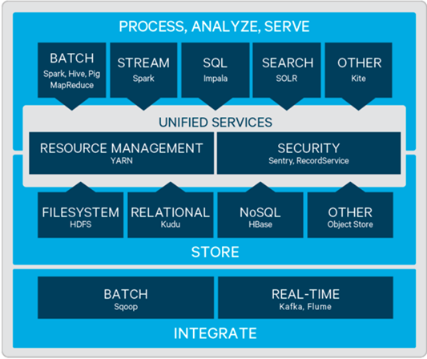
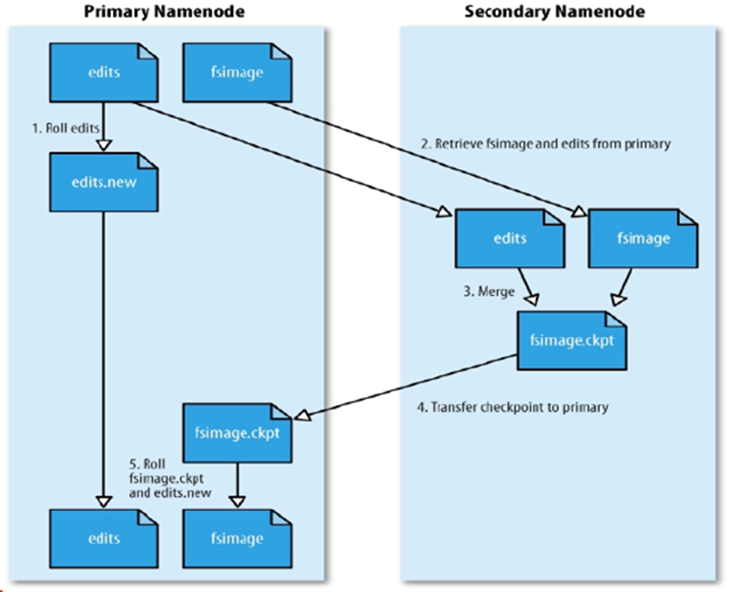
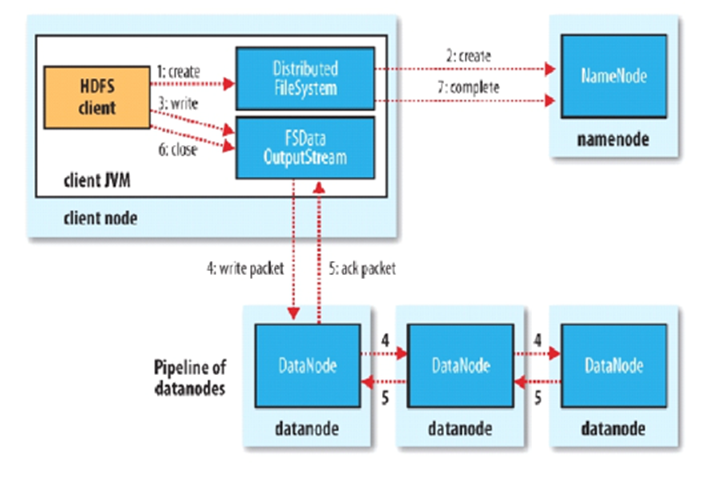
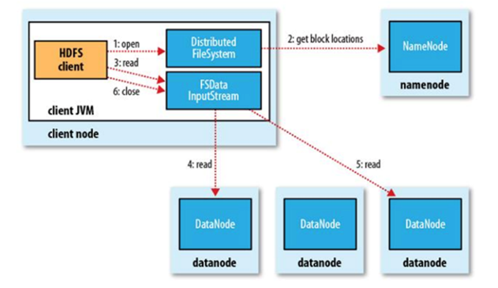
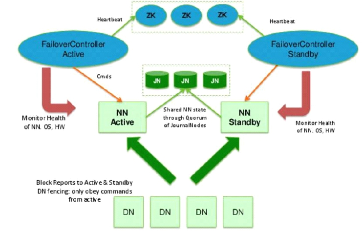
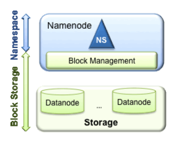
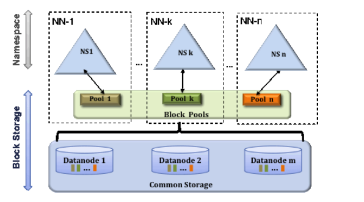
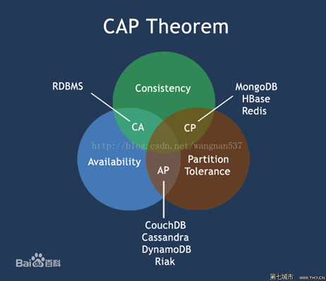

# 1. 大数据初识

> 学习知识的时候要去搞明白它存在的意义，这样学习成本才会低！

Apache Hadoop项目为可靠的、可扩展的分布式计算开发开源软件。

## 1.1 大数据关心的重点

- 分而治之
- 并行计算
- 计算向数据移动
- 数据本地读取

## 1.2 hadoop时间简史

 《The Google File System 》 2003年 

 《MapReduce: Simplified Data Processing on Large Clusters》 2004年 

 《Bigtable: A Distributed Storage System for Structured Data》 2006年

   Hadoop由 Apache Software Foundation 于 2005 年秋天作为Lucene的子项目Nutch的一部分正式引入。

   2006 年 3 月份，Map/Reduce 和 Nutch Distributed File System (NDFS) 分别被纳入称为 Hadoop 的项目中。

  Cloudera公司在2008年开始提供基于Hadoop的软件和服务。2016年10月hadoop-2.6.5

  2017年12月hadoop-3.0.0

hadoop.apache.org

## 1.3 Hadoop项目/生态



hadoop包括4个模块：

1. Hadoop Common

2. Hadoop Distributed File System (HDFS)
3. Hadoop YARN
4. Hadoop MapReduce

Apache中其他与hadoop相关的项目包括:

1. **Ambar** : 一个基于web的用于提供、管理和监视Apache Hadoop集群的工具，包括对Hadoop HDFS、Hadoop MapReduce、Hive、HCatalog、HBase、ZooKeeper、Oozie、Pig和Sqoop的支持。Ambari还提供了一个查看集群运行状况(如heatmaps)的仪表板，以及可视化查看MapReduce、Pig和Hive应用程序的能力，以及以用户友好的方式诊断其性能特征的功能。

2. **Avro**: 数据序列化系统

3. **Cassandra** : 没有单点故障的可伸缩多主数据库。

4. **Chukwa** : 用于管理大型分布式系统的数据收集系统。

5. **HBase** : 可伸缩的分布式数据库，支持大型表的结构化数据存储。

6. **Hive** : 提供数据汇总和特别查询的数据仓库基础设施。

7. **Mahout** : 一个可扩展的机器学习和数据挖掘库。

8. **Pig** : 用于并行计算的高级数据流语言和执行框架。

9. **Spark** : 一个快速和通用的Hadoop数据计算引擎。Spark提供了一个简单而富有表现力的编程模型，它支持广泛的应用程序，包括ETL、机器学习、流处理和图形计算。

10. **Tez** : 一个基于Hadoop YARN的通用数据流编程框架，它提供了一个强大而灵活的引擎，可以执行任意的DAG任务来处理批处理和交互式用例的数据。Hadoop生态系统中的Hive、Pig等框架以及其他商业软件(如ETL工具)正在采用Tez，以取代Hadoop的MapReduce作为底层执行引擎。

11. **ZooKeeper** : 分布式应用程序的高性能协调服务。

    

# 2.Hadoop Distributed File System (HDFS)

## 2.1 存储模型

文件线性按字节切割成块(block)，具有offset，id

文件与文件的block大小可以不一样

一个文件除最后一个block，其他block大小一致

block的大小依据硬件的I/O特性调整

block被分散存放在集群的节点中，具有location

Block具有副本(replication)，没有主从概念，副本不能出现在同一个节点

副本是满足可靠性和性能的关键

文件上传可以指定block大小和副本数，上传后只能修改副本数

一次写入多次读取，不支持修改

支持追加数据

## 2.2 架构设计

HDFS是一个主从(Master/Slaves)架构

由一个NameNode和一些DataNode组成

面向文件包含：文件数据(data)和文件元数据(metadata)

NameNode负责存储和管理文件元数据，并维护了一个层次型的文件目录树

DataNode负责存储文件数据(block块)，并提供block的读写

DataNode与NameNode维持心跳，并汇报自己持有的block信息

Client和NameNode交互文件元数据和DataNode交互文件block数据

## 2.3 角色功能

**NameNode**

- 完全基于内存存储文件元数据、目录结构、文件block的映射
- 需要持久化方案保证数据可靠性
- 提供副本放置策略

**DataNode**

- 基于本地磁盘存储block(文件的形式)
- 并保存block的校验和数据保证block的可靠性
- 与NameNode保持心跳，汇报block列表状态

## 2.4 元数据持久化

任何对文件系统元数据产生修改的操作，Namenode都会使用一种称为EditLog的事务日志记录下来

使用FsImage存储内存所有的元数据状态

使用本地磁盘保存EditLog和FsImage

EditLog具有完整性，数据丢失少，但恢复速度慢，并有体积膨胀风险

FsImage具有恢复速度快，体积与内存数据相当，但不能实时保存，数据丢失多

NameNode使用了FsImage+EditLog整合的方案：

- 滚动将增量的EditLog更新到FsImage，以保证更近时点的FsImage和更小的EditLog体积

## 2.5 安全模式

1. HDFS搭建时会格式化，格式化操作会产生一个空的FsImage

2. 当Namenode启动时，它从硬盘中读取Editlog和FsImage，将所有Editlog中的事务作用在内存中的FsImage上，并将这个新版本的FsImage从内存中保存到本地磁盘上，然后删除旧的Editlog，因为这个旧的Editlog的事务都已经作用在FsImage上了

3. Namenode启动后会进入一个称为安全模式的特殊状态。

4. 处于安全模式的Namenode是不会进行数据块的复制的。

5. Namenode从所有的 Datanode接收心跳信号和块状态报告。

6. 每当Namenode检测确认某个数据块的副本数目达到这个最小值，那么该数据块就会被认为是副本安全(safely replicated)的。

7. 在一定百分比（这个参数可配置）的数据块被Namenode检测确认是安全之后（加上一个额外的30秒等待时间），Namenode将退出安全模式状态。

8. 接下来它会确定还有哪些数据块的副本没有达到指定数目，并将这些数据块复制到其他Datanode上。

**SecondaryNameNode（SNN）**

1. 在非Ha模式下，SNN一般是独立的节点，周期完成对NN的EditLog向FsImage合并，减少EditLog大小，减少NN启动时间

2. 根据配置文件设置的时间间隔fs.checkpoint.period 默认3600秒

3. 根据配置文件设置edits log大小 fs.checkpoint.size 规定edits文件的最大值默认是64MB



## 2.6 副本放置策略

第一个副本：放置在上传文件的DN；如果是集群外提交，则随机挑选一台磁盘不太满，CPU不太忙的节点。

第二个副本：放置在于第一个副本不同的 机架的节点上。

第三个副本：与第二个副本相同机架的节点。

更多副本：随机节点。

## 2.7 读写流程

**HDFS写流程**



1. Client和NN连接创建文件元数据

2. NN判定元数据是否有效: 比如文件是否存在，是有具有写权限
3. NN处发副本放置策略，返回一个有序的DN列表
4. Client和DN建立Pipeline连接
5. Client将块切分成packet（64KB），并使用chunk（512B）+chucksum校验和（4B）填充
6. Client将packet放入发送队列dataqueue中，并向第一个DN发送
7. 第一个DN收到packet后本地保存并发送给第二个DN
8. 第二个DN收到packet后本地保存并发送给第三个DN
9. 这一个过程中，上游节点同时发送下一个packet
10. 生活中类比工厂的流水线：结论：流式其实也是变种的并行计算
11. Hdfs使用这种传输方式，副本数对于client是透明的
12. 当block传输完成，DN们各自向NN汇报，同时client继续传输下一个block
13. 所以，client的传输和block的汇报也是并行的

**HDFS读流程**



1. 为了降低整体的带宽消耗和读取延时，HDFS会尽量让读取程序读取离它最近的副本。

   如果在读取程序的同一个机架上有一个副本，那么就读取该副本。

   如果一个HDFS集群跨越多个数据中心，那么客户端也将首先读本地数据中心的副本。

2. 语义：下载一个文件：

   Client和NN交互文件元数据获取fileBlockLocation

   NN会按距离策略排序返回

   Client尝试下载block并校验数据完整性

3. 语义：下载一个文件其实是获取文件的所有的block元数据，那么子集获取某些block应该成立

   Hdfs支持client给出文件的offset自定义连接哪些block的DN，自定义获取数据

   这个是支持计算层的分治、并行计算的核心


# 3.HDFS HA

单NameNode的HDFS存在一下两个问题：

1. 单点故障

2. 压力过大，内存受限

**HDFS解决方案：**

1. 单点故障：
   - 高可用方案：HA（High Available）
   -  多个NN，主备切换

2. 压力过大，内存受限：
   -  联帮机制： Federation（元数据分片）
   - 多个NN，管理不同的元数据

## 3.1 HA方案

**多台NN主备模式，Active和Standby状态**

在Hadoop 2.0.0之前，存在单点故障问题，一旦NameNode不可用，整个集群将不可用，于是在hadoop2.0.0之后支持启动两个NameNode(3.0.0之后可以启动两个以上的NameNode)，这允许在机器崩溃时快速地将故障转移到新的NameNode，或者在计划维护时允许管理员发起的优雅故障转移。

**Active对外提供服务 **

在典型的HA集群中，两台或更多独立的机器被配置为namenode。在任何时间点，只有一个namenode处于*Active*状态，而其他namenode处于*Standby*状态。活动的NameNode负责集群中的所有客户端操作，而备用服务器只是充当工作者，维护足够的状态，以便在必要时提供快速的故障转移。

**增加journalnode角色(>3台)，负责同步NN的editlog**

为了使备用节点的状态与活动节点保持同步，两个节点都与一组称为JournalNodes (JNs)的独立守护进程通信。当*Active*节点修改namespace时，它会将修改的记录持久地记录到大多数这些JNs中。*Standby*节点能够从JNs中读取编辑，并不断监视它们以查看编辑日志的更改。当备用节点看到编辑时，它将其应用到自己的namespace。在发生故障转移时，*Standby*系统将确保它已从JNs中读取了所有编辑。

在HA模式下，没有必要运行Secondary NameNode, CheckpointNode,  BackupNode。

**增加zkfc角色(与NN同台)，通过zookeeper集群协调NN的主从选举和切换**

自动故障转移增加了两个新的组件一个HDFS部署:ZooKeeper quorum和ZKFailoverController(ZKFC)。

1. 自动故障转移需要依赖**ZooKeeper quorum**以下两个功能：
   - **故障检测**：集群中的每个NameNode机器在ZooKeeper中维护一个持久会话。如果机器崩溃，ZooKeeper会话将过期，通知其他NameNode应该触发故障转移。
   - **Active NameNode 选举**：ZooKeeper提供了一种简单的机制，可以将一个节点选择为活动节点。如果当前活动的NameNode崩溃，另一个节点可能会在ZooKeeper中获得一个特殊的独占锁，指示它应该成为下一个Active的节点。
2. **ZKFailoverController** (ZKFC)是一个新的组件，它是一个ZooKeeper客户端，可以监视和管理NameNode的状态。运行NameNode的每台机器也运行ZKFC，而ZKFC负责以下内容：
   - **健康监控** : ZKFC使用健康检查命令定期ping它的本地NameNode。只要NameNode以健康状态及时响应，ZKFC就认为节点是健康的。如果节点已经崩溃、冻结或以其他方式进入不健康状态，则运行状况监视器将将其标记为不健康。
   - **ZooKeeper session管理**：当本地NameNode正常运行时，ZKFC在ZooKeeper中打开一个会话。如果本地NameNode是活动的，它还持有一个特殊的锁znode。这个锁使用了ZooKeeper对临时节点的支持;如果会话到期，锁节点将被自动删除。
   - **ZooKeeper-based选举**：如果本地NameNode正常运行，并且ZKFC发现当前没有其他节点持有锁znode，那么它将自己尝试获取该锁。如果成功，则它赢得了选举，并负责运行故障转移以使其本地NameNode处于活动状态。故障转移过程类似于上面描述的手动故障转移:首先，如果需要，对前一个活动进行隔离，然后本地NameNode转换到活动状态。

**事件回调机制** ： 

**DN同时向NNs汇报block清单**

为了提供快速的故障转移，Standby 节点还必须拥有集群块位置的最新信息。为了实现这一点，DataNodes配置了所有namenode的位置，并发送块位置信息和心跳给所有NameNode。



安装说明路径：https://hadoop.apache.org/docs/stable/hadoop-project-dist/hadoop-hdfs/HDFSHighAvailabilityWithQJM.html


## 3.2 HDFS Federation



HDFS有两个主要的层级：

1. **Namespace**：
   - 由目录、文件和块组成。
   - 它支持所有与名称空间相关的文件系统操作，如创建、删除、修改和列出文件和目录。
2. **Block Storage Service**：
   - Block管理：NameNode负责
   - Bolck存储：DataNode负责

**元数据分治，复用DN存储**

为了横向扩展名称服务，federation使用多个独立的Namenodes/namespaces。namenode是独立的，不需要彼此协调。Datanodes被所有的namenode用作块的公共存储。每个Datanode都使用集群中的所有namenode注册。Datanodes发送周期性的心跳和block报告。它们还处理来自namenode的命令。

**Block Pool**

块池是属于单个 namespace的一组块。Datanode为集群中的所有Block Pool存储块。每个块池都是独立管理的。这允许namespace为新块生成块id，而不需要与其他名称空间协调。Namenode失败不会阻止Datanode为集群中的其他Namenode提供服务。

Namespace和block pool一起称为名称Namespace卷。它是一个独立的管理单位。当删除一个Namenode/namespace时，就会删除datanode上对应的块池。在集群升级期间，每个名称namespace卷作为一个单元被升级。

**ClusterID**

ClusterID标识符用于标识集群中的所有节点。当一个Namenode被格式化后，这个标识符将被提供或者自动生成。这个ID应该用于将其他namenode格式化到集群中。




**使用Federation的优点**：

1. **Namespace可伸缩性**：联合增加了Namespace的水平伸缩。通过允许在集群中添加更多的namenode，大型部署或使用大量小文件的部署可以从名称空间扩展中获益。
2. **性能**：文件系统吞吐量不受单个Namenode的限制。向集群添加更多的namenode可扩展文件系统的读/写吞吐量。
3. **隔离性**：单个Namenode在多用户环境中无法提供隔离。例如，实验应用程序可能会使Namenode过载，从而降低关键生产应用程序的速度。通过使用多个namenode，可以将不同类别的应用程序和用户隔离到不同的名称空间。

Federation配置**向后兼容**，允许现有的单个Namenode配置无需任何更改即可工作。

Federation添加了一个新的NameServiceID抽象。一个Namenode和它对应的secondary/backup/checkpointer nodes都属于一个NameServiceId。为了支持单个配置文件，Namenode和secondary/backup/checkpointer参数都以NameServiceID作为后缀。

> **CAP原则**：
>
> Consistency：一致性
>
> Availability：可用性
>
> Partition tolerance：分区容忍性
>
> 

# 4. HDFS 权限


# 5. MapReduce

Hadoop MapReduce是一个软件框架，可以轻松地编写在大型集群(数千个节点)上并行处理大量数据的应用程序，以一种可靠的、容错的方式。

MapReduce框架由单个主ResourceManager、每个集群节点一个worker NodeManager和每个应用程序的MRAppMaster组成

(input) `<k1, v1> ->` **map** `-> <k2, v2> ->` **combine** `-> <k2, v2> ->` **reduce** `-> <k3, v3>` (output)


实现`Mapper`和 `Reducer`接口

Mapper将输入key/value映射到一组中间key/value。

```java
import java.io.IOException;
import java.util.StringTokenizer;

import org.apache.hadoop.conf.Configuration;
import org.apache.hadoop.fs.Path;
import org.apache.hadoop.io.IntWritable;
import org.apache.hadoop.io.Text;
import org.apache.hadoop.mapreduce.Job;
import org.apache.hadoop.mapreduce.Mapper;
import org.apache.hadoop.mapreduce.Reducer;
import org.apache.hadoop.mapreduce.lib.input.FileInputFormat;
import org.apache.hadoop.mapreduce.lib.output.FileOutputFormat;

public class WordCount {

  public static class TokenizerMapper
       extends Mapper<Object, Text, Text, IntWritable>{

    private final static IntWritable one = new IntWritable(1);
    private Text word = new Text();

    public void map(Object key, Text value, Context context
                    ) throws IOException, InterruptedException {
      StringTokenizer itr = new StringTokenizer(value.toString());
      while (itr.hasMoreTokens()) {
        word.set(itr.nextToken());
        context.write(word, one);
      }
    }
  }

  public static class IntSumReducer
       extends Reducer<Text,IntWritable,Text,IntWritable> {
    private IntWritable result = new IntWritable();

    public void reduce(Text key, Iterable<IntWritable> values,
                       Context context
                       ) throws IOException, InterruptedException {
      int sum = 0;
      for (IntWritable val : values) {
        sum += val.get();
      }
      result.set(sum);
      context.write(key, result);
    }
  }

  public static void main(String[] args) throws Exception {
    Configuration conf = new Configuration();
    Job job = Job.getInstance(conf, "word count");
    job.setJarByClass(WordCount.class);
    job.setMapperClass(TokenizerMapper.class);
    job.setCombinerClass(IntSumReducer.class);
    job.setReducerClass(IntSumReducer.class);
    job.setOutputKeyClass(Text.class);
    job.setOutputValueClass(IntWritable.class);
    FileInputFormat.addInputPath(job, new Path(args[0]));
    FileOutputFormat.setOutputPath(job, new Path(args[1]));
    System.exit(job.waitForCompletion(true) ? 0 : 1);
  }
}
```