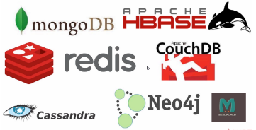
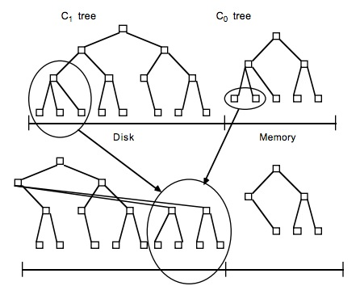

# 1 HBase介绍

官网 https://hbase.apache.org/

## 1.1 关系型数据库与非关系型数据库

**（1）关系型数据库**


​				关系型数据库最典型的数据机构是表，由二维表及其之间的联系所组成的一个数据组织

​				优点：

​						1、易于维护：都是使用表结构，格式一致

​						2、使用方便：SQL语言通用，可用于复杂查询

​						3、复杂操作：支持SQL，可用于一个表以及多个表之间非常复杂的查询

​				缺点：

​						1、读写性能比较差，尤其是海量数据的高效率读写

​						2、固定的表结构，灵活度稍欠

​						3、高并发读写需求，传统关系型数据库，硬盘IO是一个很大的瓶颈

**（2）非关系型数据库**



​				非关系型数据库严格上不是一种数据库，应该是一种数据结构化存储方法的集合，可以是文档或键值对

​				优点：

​						1、格式灵活：存储数据的格式可以是key，value形式、文档形式、图片形式等等，文档形式、图片形式等等，使用灵活，应用场景广泛，而关系型数据库则只支持基础类型。

​						2、速度快：nosql可以使用硬盘或者随机存储器作为载体，而关系型数据库只能使用硬盘

​						3、高扩展性

​						4、成本低：nosql数据库部署简单，基本都是开源软件

​				缺点：

​						1、不提供sql支持，学习和使用成本较高；

​						2、无事务处理

​						3、数据结构相对复杂，复杂查询方面稍欠

## 1.2 HBase简介

```
	Use Apache HBase™ when you need random, realtime read/write access to your Big Data. This project's goal is the hosting of very large tables -- billions of rows X millions of columns -- atop clusters of commodity hardware. Apache HBase is an open-source, distributed, versioned, non-relational database modeled after Google's Bigtable: A Distributed Storage System for Structured Data by Chang et al. Just as Bigtable leverages the distributed data storage provided by the Google File System, Apache HBase provides Bigtable-like capabilities on top of Hadoop and HDFS.
```

​		HBase的全称是Hadoop Database,是一个高可靠性，高性能、面向列、可伸缩、实时读写的分布式数据库。

​		利用Hadoop HDFS作为其文件存储系统，利用Hadoop MapReduce来处理HBase中的海量数据，利用Zookeeper作为其分布式协同服务。

​		主要用来存储非结构化和半结构化数据的松散数据（列存NoSQL数据库）。

​		注意：NoSQL的全称是Not Only SQL，泛指非关系型数据库。

## 1.3 HBase数据模型


**(1)rowkey**

​			（1）决定一行数据，每行记录的唯一标识

​			（2）按照字典序排序

​			（3）RowKey只能存储64K的字节数据					

**(2)Column Family & Qualifier**

​			（1）HBase表中的每个列都归属于某个列族，列族必须作为表模式(schema)定义的一部分预先给出。如 create ‘test’, ‘course’；

​			（2）列名以列族作为前缀，每个“列族”都可以有多个列成员(column)；如course:math, course:english, 新的列族成员（列）可以随后按需、动态加入；

​			（3）权限控制、存储以及调优都是在列族层面进行的；

​			（4）HBase把同一列族里面的数据存储在同一目录下，由几个文件保存。

**(3)TimeStamp时间戳**

​			（1）在HBase每个cell存储单元对同一份数据有多个版本，根据唯一的时间戳来区分每个版本之间的差异，不同版本的数据按照时间倒序排序，最新的数据版本排在最前面。

​			（2）时间戳的类型是 64位整型。

​			（3）时间戳可以由HBase(在数据写入时自动)赋值，此时间戳是精确到毫秒的当前系统时间。

​			（4）时间戳也可以由客户显式赋值，如果应用程序要避免数据版本冲突，就必须自己生成具有唯一性的时间戳。

**(4)Cell**

​			（1）由行和列的坐标交叉决定；

​			（2）单元格是有版本的；

​			（3）单元格的内容是未解析的字节数组；

​					1、由{row key， column( =<family> +<qualifier>)， version} 唯一确定的单元。
​					2、cell中的数据是没有类型的，全部是字节数组形式存贮。

## 1.4 HBase架构


### 1.4.1 角色介绍

**（1）Client**

​			1、包含访问HBase的接口并维护cache来加快对HBase的访问。

**（2）Zookeeper**

​			1、保证任何时候，集群中只有一个活跃master

​			2、存储所有region的寻址入口

​			3、实时监控region server的上线和下线信息，并实时通知master

​			4、存储HBase的schema和table元数据

**（3）Master（主）**

​			1、为region server分配region

​			2、负责region server的负载均衡

​			3、发现失效的region server并重新分配其上的region

​			4、管理用户对table的增删改操作

**（4）RegionServer（从）**

​			1、region server维护region，处理对这些region的IO请求

​			2、region server负责切分在运行过程中变得过大的region

> WAL: Write-Ahead Logging   预写日志系统
>
> 数据库中一种高效的[日志](https://baike.baidu.com/item/日志)算法，对于非[内存数据库](https://baike.baidu.com/item/内存数据库)而言，磁盘I/O操作是数据库效率的一大瓶颈。在相同的数据量下，采用WAL日志的[数据库系统](https://baike.baidu.com/item/数据库系统)在[事务](https://baike.baidu.com/item/事务)提交时，磁盘写操作只有传统的[回滚](https://baike.baidu.com/item/回滚)日志的一半左右，大大提高了数据库磁盘I/O操作的效率，从而提高了数据库的性能。

### 1.4.2 regionserver组件介绍

**（1）region**

​			1、HBase自动把表水平划分成多个区域(region)，每个region会保存一个表里某段连续的数据

​			2、每个表一开始只有一个region，随着数据不断插入表，region不断增大，当增大到一个阈值的时候，region就会等分会两个新的region（裂变）

​			3、当table中的行不断增多，就会有越来越多的region。这样一张完整的表被保存在多个Regionserver 上。

**（2）Memstore与storefile**

​			1、一个region由多个store组成，一个store对应一个CF（列族）

​			2、store包括位于内存中的memstore和位于磁盘的storefile写操作先写入memstore，当memstore中的数据达到某个阈值，hregionserver会启动flashcache进程写入storefile，每次写入形成单独的一个storefile

​			3、当storefile文件的数量增长到一定阈值后，系统会进行合并（minor、major ），在合并过程中会进行版本合并和删除工作（major），形成更大的storefile

​			4、当一个region所有storefile的大小和数量超过一定阈值后，会把当前的region分割为两个，并由hmaster分配到相应的regionserver服务器，实现负载均衡

​			5、客户端检索数据，先在memstore找，找不到去blockcache，找不到再找storefile

**(3) BlockCache**

​	       1、BlockCache是Region Server级别的，一个Region Server只有一个Block Cache

​		   2、BlockCache有LruBlockCache和BucketCache两种实现，LruBlockCache是on heap ,BucketCache是off heap，默认是LruBlockCache

​		   3、LruBlockCache有3种块优先级    

```
1.Single access priority : 第一次从HDFS中加载的block处于该优先级，最容易被淘汰
2.Multi access priority : 如果上一个优先级的block再次被访问，将会变成该优先级，是第二容易被淘汰的级别
3.In-memory access priority : 如果block被设置成in-memory,那么不管它被访问了多少次，它都将是这个优先级,该级别最不容易被淘汰，可通过HColumnDescriptor.setInMemory(true)设置。
```


### 1.4.3 注意问题

​			1、HRegion是HBase中分布式存储和负载均衡的最小单元。最小单元就表示不同的HRegion可以分布在不同的 HRegion server上。

​			2、HRegion由一个或者多个Store组成，每个store保存一个columns family。

​			3、每个Store又由一个memStore和0至多个StoreFile组成。如图：StoreFile以HFile格式保存在HDFS上。

​			

## 1.5 HBase读写流程

**（1）读流程**

​		1、客户端从zookeeper中获取meta表所在的regionserver节点信息

​		2、客户端访问meta表所在的regionserver节点，获取到region所在的regionserver信息

​		3、客户端访问具体的region所在的regionserver，找到对应的region及store

​		4、首先从memstore中读取数据，如果读取到了那么直接将数据返回，如果没有，则去blockcache读取数据

​		5、如果blockcache中读取到数据，则直接返回数据给客户端，如果读取不到，则遍历storefile文件，查找数据

​		6、如果从storefile中读取不到数据，则返回客户端为空，如果读取到数据，那么需要将数据先缓存到blockcache中（方便下一次读取），然后再将数据返回给客户端。

​		7、blockcache是内存空间，如果缓存的数据比较多，满了之后会采用LRU策略，将比较老的数据进行删除。

> LRU是Least Recently Used的缩写，即最近最少使用，是一种常用的[页面置换算法](https://baike.baidu.com/item/页面置换算法/7626091)，选择最近最久未使用的页面予以淘汰。该算法赋予每个[页面](https://baike.baidu.com/item/页面/5544813)一个访问字段，用来记录一个页面自上次被访问以来所经历的时间 t，当须淘汰一个页面时，选择现有页面中其 t 值最大的，即最近最少使用的页面予以淘汰。

**（2）写流程**

​		1、客户端从zookeeper中获取meta表所在的regionserver节点信息

​		2、客户端访问meta表所在的regionserver节点，获取到region所在的regionserver信息

​		3、客户端访问具体的region所在的regionserver，找到对应的region及store

​		4、开始写数据，写数据的时候会先向hlog中写一份数据（方便memstore中数据丢失后能够根据hlog恢复数据，向hlog中写数据的时候也是优先写入内存，后台会有一个线程定期异步刷写数据到hdfs，如果hlog的数据也写入失败，那么数据就会发生丢失）

​		5、hlog写数据完成之后，会先将数据写入到memstore，memstore默认大小是64M，当memstore满了之后会进行统一的溢写操作，将memstore中的数据持久化到hdfs中，

​		6、频繁的溢写会导致产生很多的小文件，因此会进行文件的合并，文件在合并的时候有两种方式，minor和major，minor表示小范围文件的合并，major表示将所有的storefile文件都合并成一个，具体详细的过程，后续会讲解。

# 2 HBase搭建--Standalone HBase

官网  https://hbase.apache.org/2.3/book.html#quickstart

## 2.1 搭建方式说明

```
	the setup of a single-node standalone HBase. A standalone instance has all
HBase daemons — the Master, RegionServers, and ZooKeeper — running in a single JVM persisting to the local filesystem.
```

## 2.2 搭建步骤

1、虚拟机中必须安装JDK，JDK的版本建议使用1.8（如果已经安装了，忽略此步骤）

2、在官网中下载HBase对应的安装包，此次课程使用2.0.5版本

3、理论上可以将HBase上传到任意一台虚拟机，但是因为HBase需要zookeeper担任分布式协作服务的角色，而HBase的安装包中包含了zookeeper，而我们在开启虚拟机之后，一般会将高可用的Hadoop集群准备好，因此集群中已经包含zookeeper的服务，**因此，建议将单节点的HBase配置在没有安装zookeeper的节点上**

4、解压hbase安装包

```
tar xzvf hbase-2.0.5-bin.tar.gz -C /opt/bigdata
cd hbase-2.0.5/
```

5、在/etc/profile文件中配置HBase的环境变量

```
export HBASE_HOME=/opt/bigdata/hbase-2.0.5
将$HBASE_HOME设置到PATH路径中
```

6、进入到/opt/bigdata/hbase-2.0.5/conf目录中，在hbase-env.sh文件中添加JAVA_HOME

```
JAVA_HOME=/usr/java/jdk1.8.0_181-amd64
```

7、进入到/opt/bigdata/hbase-2.0.5/conf目录中，在hbase-site.xml文件中添加hbase相关属性

```xml
<configuration>
  <property>
    <name>hbase.rootdir</name>
    <value>file:///home/testuser/hbase</value>
  </property>
  <property>
    <name>hbase.zookeeper.property.dataDir</name>
    <value>/home/testuser/zookeeper</value>
  </property>
  <property>
    <name>hbase.unsafe.stream.capability.enforce</name>
    <value>false</value>
    <description>
      Controls whether HBase will check for stream capabilities (hflush/hsync).

      Disable this if you intend to run on LocalFileSystem, denoted by a rootdir
      with the 'file://' scheme, but be mindful of the NOTE below.

      WARNING: Setting this to false blinds you to potential data loss and
      inconsistent system state in the event of process and/or node failures. If
      HBase is complaining of an inability to use hsync or hflush it's most
      likely not a false positive.
    </description>
  </property>
</configuration>
```

8、在任意目录下运行hbase shell的命令，进入hbase的命令行进行相关操作。

hbase页面端口

在2.0之前是60010，2.0之后是16010

# 3 HBase搭建--Fully-distributed

## 3.1 搭建方式说明

```
	By default, HBase runs in standalone mode. Both standalone mode and pseudo-distributed mode are provided for the purposes of small-scale testing. For a production environment, distributed mode is advised. In distributed mode, multiple instances of HBase daemons run on multiple servers in the cluster.
```

## 3.2 搭建步骤

1、将集群中的所有节点的hosts文件配置完成

2、将集群中的所有节点的防火墙关闭

3、将集群中的所有节点的时间设置一致

```
yum install ntpdate
ntpdate ntp1.aliyun.com
```

4、将所有的节点设置免密钥登陆

```
ssh-keygen
ssh-copy-id -i /root/.ssh/id_rsa.pub node01(节点名称)
```

5、解压hbase安装包

```
tar xzvf hbase-2.0.5-bin.tar.gz -C /opt/bigdata
cd hbase-2.0.5/
```

6、在/etc/profile文件中配置HBase的环境变量

```
export HBASE_HOME=/opt/bigdata/hbase-2.0.5
将$HBASE_HOME设置到PATH路径中
```

7、进入到/opt/bigdata/hbase-2.0.5/conf目录中，在hbase-env.sh文件中添加JAVA_HOME

```
设置JAVA的环境变量
JAVA_HOME=/usr/java/jdk1.8.0_181-amd64
设置是否使用自己的zookeeper实例
HBASE_MANAGES_ZK=false
```

8、进入到/opt/bigdata/hbase-2.0.5/conf目录中，在hbase-site.xml文件中添加hbase相关属性

```xml
<configuration>
  <property>
    <name>hbase.rootdir</name>
    <value>hdfs://mycluster/hbase</value>
  </property>
  <property>
    <name>hbase.cluster.distributed</name>
    <value>true</value>
  </property>
  <property>
    <name>hbase.zookeeper.quorum</name>
    <value>node02,node03,node04</value>
  </property>
</configuration>
```

9、修改regionservers文件，设置regionserver分布在哪几台节点

```
node02
node03
node04
```

10、如果需要配置Master的高可用，需要在conf目录下创建backup-masters文件，并添加如下内容：

```
node04
```

11、拷贝hdfs-site.xml文件到conf目录下

```
cp /opt/bigdate/hbase-2.6.5/etc/hadoop/hdfs-site.xml /opt/bigdata/hbase-2.0.5/conf
```

12、在任意目录下运行hbase shell的命令，进入hbase的命令行进行相关操作。

# 4 HBase Shell操作

## 4.1 通用命令

```java
//展示regionserver的task列表
hbase(main):000:0>processlist
//展示集群的状态
hbase(main):000:0>status
//table命令的帮助手册
hbase(main):000:0>table_help
//显示hbase的版本
hbase(main):000:0>version
//展示当前hbase的用户
hbase(main):000:0>whoami
```

## 4.2 DDL操作

```java
//修改表的属性
hbase(main):000:0>alter 't1', NAME => 'f1', VERSIONS => 5
//创建表
hbase(main):000:0>create 'test', 'cf'
//查看表描述，只会展示列族的详细信息
hbase(main):000:0>describe 'test'
//禁用表
hbase(main):000:0>disable 'test'
//禁用所有表
hbase(main):000:0>disable_all
//删除表
hbase(main):000:0>drop 'test'
//删除所有表
hbase(main):000:0>drop_all
//启用表
hbase(main):000:0>enable 'test'
//启用所有表
hbase(main):000:0>enable_all
//判断表是否存在
hbase(main):000:0>exists 'test'
//获取表
hbase(main):000:0>get_table 'test'
//判断表是否被禁用
hbase(main):000:0>is_disabled 'test'
//判断表是否被启用
hbase(main):000:0>is_enabled 'test'
//展示所有表
hbase(main):000:0>list
//展示表占用的region
hbase(main):000:0>list_regions
//定位某个rowkey所在的行在哪一个region
hbase(main):000:0>locate_region
//展示所有的过滤器
hbase(main):000:0>show_filters
```

## 4.3 namespace操作

```java
//修改命名空间的属性
hbase(main):000:0>alter_namespace 'my_ns', {METHOD => 'set', 'PROPERTY_NAME' => 'PROPERTY_VALUE'}
//创建命名空间
hbase(main):000:0>create_namespace 'my_ns'
//获取命名空间的描述信息
hbase(main):000:0>describe_namespace 'my_ns'
//删除命名空间
hbase(main):000:0>drop_namespace 'my_ns'
//展示所有的命名空间
hbase(main):000:0>list_namespace
//展示某个命名空间下的所有表
hbase(main):000:0>list_namespace_tables 'my_ns'
```

## 4.4 dml操作

```java
//向表中追加一个具体的值
hbase(main):000:0>append 't1', 'r1', 'c1', 'value', ATTRIBUTES=>{'mykey'=>'myvalue'}
//统计表的记录条数，默认一千条输出一次
hbase(main):000:0>count 'test'
//删除表的某一个值
hbase(main):000:0>delete 't1', 'r1', 'c1', ts1
//删除表的某一个列的所有值
hbase(main):000:0>deleteall 't1', 'r1', 'c1'
//获取表的一行记录
hbase(main):000:0>get 't1', 'r1'
//获取表的一个列的值的个数
hbase(main):000:0>get_counter 't1', 'r1', 'c1'
//获取表的切片
hbase(main):000:0>get_splits 't1'
//增加一个cell对象的值
hbase(main):000:0>incr 't1', 'r1', 'c1'
//向表中的某一个列插入值
hbase(main):000:0>put 't1', 'r1', 'c1', 'value’, ts1
//扫描表的全部数据
hbase(main):000:0>scan 't1'
//清空表的所有数据
hbase(main):000:0>truncate
```

# 5 HBase LSM树存储结构

## 5.1 LSM树的由来

​		在了解LSM树之前，大家需要对hash表和B+树有所了解。

​		hash存储方式支持增、删、改以及随机读取操作，但不支持顺序扫描，对应的存储系统为key-value存储系统。对于key-value的插入以及查询，哈希表的复杂度都是O(1)，明显比树的操作O(n)快,如果不需要有序的遍历数据，哈希表就是最佳选择

​		B+树不仅支持单条记录的增、删、读、改操作，还支持顺序扫描（B+树的叶子节点之间的指针），对应的存储系统就是关系数据库（Mysql等）。但是删除和更新操作比较麻烦

​		正是基于以上结构的分析，LSM树应运而生。

​		LSM树（Log-Structured Merge Tree）存储引擎和B树存储引擎一样，同样支持增、删、读、改、顺序扫描操作。而且通过批量存储技术规避磁盘随机写入问题。当然凡事有利有弊，LSM树和B+树相比，LSM树牺牲了部分读性能，用来大幅提高写性能。

## 5.2 LSM的设计思想和原理

​		LSM树的设计思想非常简单：将对数据的修改增量保持在内存中，达到指定的大小限制后将这些修改操作批量写入磁盘，不过读取的时候稍微麻烦，需要合并磁盘中历史数据和内存中最近修改操作，所以写入性能大大提升，读取时可能需要先看是否命中内存，否则需要访问较多的磁盘文件。极端的说，基于LSM树实现的HBase的写性能比Mysql高了一个数量级，读性能低了一个数量级。

​		LSM树原理把一棵大树拆分成N棵小树，它首先写入内存中，随着小树越来越大，内存中的小树会flush到磁盘中，磁盘中的树定期可以做merge操作，合并成一棵大树，以优化读性能。

​		在hbase中LSM的应用流程对应说下：

​		1、因为小树先写到内存中，为了防止内存数据丢失，写内存的同时需要暂时持久化到磁盘，对应了HBase的MemStore和HLog

​		2、MemStore上的树达到一定大小之后，需要flush到HRegion磁盘中（一般是Hadoop DataNode），这样MemStore就变成了DataNode上的磁盘文件StoreFile，定期HRegionServer对DataNode的数据做merge操作，彻底删除无效空间，多棵小树在这个时机合并成大树，来增强读性能。

3、LSM的原理

​		关于LSM Tree，对于最简单的二层LSM Tree而言，内存中的数据和磁盘中的数据merge操作，如下图：



​		lsm tree，理论上，可以是内存中树的一部分和磁盘中第一层树做merge，对于磁盘中的树直接做update操作有可能会破坏物理block的连续性，但是实际应用中，一般lsm有多层，当磁盘中的小树合并成一个大树的时候，可以重新排好顺序，使得block连续，优化读性能。

​		hbase在实现中，是把整个内存在一定阈值后，flush到disk中，形成一个file，这个file的存储也就是一个小的B+树，因为hbase一般是部署在hdfs上，hdfs不支持对文件的update操作，所以hbase是将整体内存flush，而不是和磁盘中的小树merge update，这个设计也就能讲通了。内存flush到磁盘上的小树，定期也会合并成一个大树。整体上hbase就是用了lsm tree的思路。

# 6 HBase数据读取流程

## 6.1 hbase数据读取流程简单描述

​		一般来说，在描述hbase读取流程的时候，简单的描述如下：

​		1、客户端从zookeeper中获取meta表所在的regionserver节点信息

​		2、客户端访问meta表所在的regionserver节点，获取到region所在的regionserver信息

​		3、客户端访问具体的region所在的regionserver，找到对应的region及store

​		4、首先从memstore中读取数据，如果读取到了那么直接将数据返回，如果没有，则去blockcache读取数据

​		5、如果blockcache中读取到数据，则直接返回数据给客户端，如果读取不到，则遍历storefile文件，查找数据

​		6、如果从storefile中读取不到数据，则返回客户端为空，如果读取到数据，那么需要将数据先缓存到blockcache中（方便下一次读取），然后再将数据返回给客户端。

​		7、blockcache是内存空间，如果缓存的数据比较多，满了之后会采用LRU策略，将比较老的数据进行删除。

​		但是为了加深自己的理解，我们需要对hbase的读取流程有一个更深刻的理解。

## 6.2 hbase读取数据详细解释

​		和写流程相比，HBase读数据是一个更加复杂的操作流程，这主要基于两个方面的原因：其一是因为整个HBase存储引擎基于LSM-Like树实现，因此一次范围查询可能会涉及多个分片、多块缓存甚至多个数据存储文件；其二是因为HBase中更新操作以及删除操作实现都很简单，更新操作并没有更新原有数据，而是使用时间戳属性实现了多版本。删除操作也并没有真正删除原有数据，只是插入了一条打上”deleted”标签的数据，而真正的数据删除发生在系统异步执行Major_Compact的时候。很显然，这种实现套路大大简化了数据更新、删除流程，但是对于数据读取来说却意味着套上了层层枷锁，读取过程需要根据版本进行过滤，同时对已经标记删除的数据也要进行过滤。

​		客户端如果需要访问数据，每次必须要找到对应的region，从客户端发出请求到找到regionserver这个过程比较简单，不需要做多余的赘述，但是当开始读取数据的时候，大家需要注意了，hbase并没有我们想象的那么简单。

### 6.2.1 构建scanner体系

​		scanner体系的核心在于三层scanner：RegionScanner、StoreScanner以及StoreFileScanner。三者是层级的关系，一个RegionScanner由多个StoreScanner构成，一张表由多个列族组成，就有多少个StoreScanner负责该列族的数据扫描。一个StoreScanner又是由多个StoreFileScanner组成。每个Store的数据由内存中的MemStore和磁盘上的StoreFile文件组成，相对应的，StoreScanner对象会雇佣一个MemStoreScanner和N个StoreFileScanner来进行实际的数据读取，每个StoreFile文件对应一个StoreFileScanner，注意：StoreFileScanner和MemstoreScanner是整个scan的最终执行者。

对应于建楼项目，一栋楼通常由好几个单元楼构成（每个单元楼对应于一个Store），每个单元楼会请一个监工（StoreScanner）负责该单元楼的建造。而监工一般不做具体的事情，他负责招募很多工人（StoreFileScanner），这些工人才是建楼的主体。下图是整个构建流程图：


1.  RegionScanner会根据列族构建StoreScanner，有多少列族就构建多少StoreScanner，用于负责该列族的数据检索

​       1.1 构建StoreFileScanner：每个StoreScanner会为当前该Store中每个HFile构造一个StoreFileScanner，用于实际执行对应文件的检索。同时会为对应Memstore构造一个MemstoreScanner，用于执行该Store中Memstore的数据检索。该步骤对应于监工在人才市场招募建楼所需的各种类型工匠。

​       1.2  过滤淘汰StoreFileScanner：根据Time Range以及RowKey Range对StoreFileScanner以及MemstoreScanner进行过滤，淘汰肯定不存在待检索结果的Scanner。上图中StoreFile3因为检查RowKeyRange不存在待检索Rowkey所以被淘汰。该步骤针对具体的建楼方案，裁撤掉部分不需要的工匠，比如这栋楼不需要地暖安装，对应的工匠就可以撤掉。

​       1.3  Seek rowkey：所有StoreFileScanner开始做准备工作，在负责的HFile中定位到满足条件的起始Row。工匠也开始准备自己的建造工具，建造材料，找到自己的工作地点，等待一声命下。就像所有重要项目的准备工作都很核心一样，Seek过程（此处略过Lazy Seek优化）也是一个很核心的步骤，它主要包含下面三步：

- 定位Block Offset：在Blockcache中读取该HFile的索引树结构，根据索引树检索对应RowKey所在的Block Offset和Block Size
- Load Block：根据BlockOffset首先在BlockCache中查找Data Block，如果不在缓存，再在HFile中加载
- Seek Key：在Data Block内部通过二分查找的方式定位具体的RowKey


> HFile， HBase中KeyValue数据的存储格式，HFile是Hadoop的二进制格式文件，实际上StoreFile就是对HFile做了轻量级包装，即StoreFile底层就是HFile
>
> HFile结构：
>
> 　　　　 
>
> Data Block：保存表中的数据，这部分可以被压缩
>
> Meta Block：（可选）保存用户自定义的kv对，可以被压缩。
>
> File Info ：Hfile的meta元信息，不被压缩，定长。
>
> Data Block Index ：Data Block的索引。每个Data块的起始点。
>
> Meta Block Index：（可选的）Meta Block的索引，Meta块的起始点。
>
> Trailer： 定长。保存了每一段的偏移量，读取一个HFile时，会首先读取Trailer，Trailer有指针指向其他数据块的起始点，保存了每个段的起始位置(段的Magic Number用来做安全check)，然后，DataBlock Index会被读取到内存中，这样，当检索某个key时，不需要扫描整个HFile，而只需从内存中找到key所在的block，通过一次磁盘io将整个block读取到内存中，再找到需要的key。DataBlock Index采用LRU机制淘汰。
>
> HFile的Data Block，Meta Block通常采用压缩方式存储。Data Block是HBase I/O的基本单元，每个Data块的大小可以在创建一个Table的时候通过参数指定，大号的Block有利于顺序Scan，小号Block利于随机查询。每个Data块除了开头的Magic以外就是一个个KeyValue对拼接而成, Magic内容就是一些随机数字，目的是防止数据损坏。


​       1.4  StoreFileScanner合并构建最小堆：将该Store中所有StoreFileScanner和MemstoreScanner合并形成一个heap（最小堆），所谓heap是一个优先级队列，队列中元素是所有scanner，排序规则按照scanner seek到的keyvalue大小由小到大进行排序。这里需要重点关注三个问题，首先为什么这些Scanner需要由小到大排序，其次keyvalue是什么样的结构，最后，keyvalue谁大谁小是如何确定的：

- 为什么这些Scanner需要由小到大排序？

  ​		最直接的解释是scan的结果需要由小到大输出给用户，当然，这并不全面，最合理的解释是只有由小到大排序才能使得scan效率最高。举个简单的例子，HBase支持数据多版本，假设用户只想获取最新版本，那只需要将这些数据由最新到最旧进行排序，然后取队首元素返回就可以。那么，如果不排序，就只能遍历所有元素，查看符不符合用户查询条件。这就是排队的意义。

  ​		工匠们也需要排序，先做地板的排前面，做墙体的次之，最后是做门窗户的。做墙体的内部还需要再排序，做内墙的排前面，做外墙的排后面，这样，假如设计师临时决定不做外墙的话，就可以直接跳过外墙部分工作。很显然，如果不排序的话，是没办法临时做决定的，因为这部分工作已经可能做掉了。

- HBase中KeyValue是什么样的结构？

  ​		HBase中KeyValue并不是简单的KV数据对，而是一个具有复杂元素的结构体，其中Key由RowKey，ColumnFamily，Qualifier ，TimeStamp，KeyType等多部分组成，Value是一个简单的二进制数据。Key中元素KeyType表示该KeyValue的类型，取值分别为Put/Delete/Delete Column/Delete Family等。KeyValue可以表示为如下图所示：


​		了解了KeyValue的逻辑结构后，我们不妨再进一步从原理的角度想想HBase的开发者们为什么如此对其设计。这个就得从HBase所支持的数据操作说起了，HBase支持四种主要的数据操作，分别是Get/Scan/Put/Delete，其中Get和Scan代表数据查询，Put操作代表数据插入或更新（如果Put的RowKey不存在则为插入操作、否则为更新操作），特别需要注意的是HBase中更新操作并不是直接覆盖修改原数据，而是生成新的数据，新数据和原数据具有不同的版本（时间戳）；Delete操作执行数据删除，和数据更新操作相同，HBase执行数据删除并不会马上将数据从数据库中永久删除，而只是生成一条删除记录，最后在系统执行文件合并的时候再统一删除。

​        HBase中更新删除操作并不直接操作原数据，而是生成一个新纪录，那问题来了，如何知道一条记录到底是插入操作还是更新操作亦或是删除操作呢？这正是KeyType和Timestamp的用武之地。上文中提到KeyType取值为分别为Put/Delete/Delete Column/Delete Family四种，如果KeyType取值为Put，表示该条记录为插入或者更新操作，而无论是插入或者更新，都可以使用版本号（Timestamp）对记录进行选择；如果KeyType为Delete，表示该条记录为整行删除操作；相应的KeyType为Delete Column和Delete Family分别表示删除某行某列以及某行某列族操作；

- 不同KeyValue之间如何进行大小比较？

  ​        上文提到KeyValue中Key由RowKey，ColumnFamily，Qualifier ，TimeStamp，KeyType等5部分组成，HBase设定Key大小首先比较RowKey，RowKey越小Key就越小；RowKey如果相同就看CF，CF越小Key越小；CF如果相同看Qualifier，Qualifier越小Key越小；Qualifier如果相同再看Timestamp，Timestamp越大表示时间越新，对应的Key越小。如果Timestamp还相同，就看KeyType，KeyType按照DeleteFamily -> DeleteColumn -> Delete -> Put 顺序依次对应的Key越来越大。

2、StoreScanner合并构建最小堆：上文讨论的是一个监工如何构建自己的工匠师团队以及工匠师如何做准备工作、排序工作。实际上，监工也需要进行排序，比如一单元的监工排前面，二单元的监工排之后… StoreScanner一样，列族小的StoreScanner排前面，列族大的StoreScanner排后面。

### 6.2.2 scan查询

​		构建Scanner体系是为了更好地执行scan查询，就像组建工匠师团队就是为了盖房子一样。scan查询总是一行一行查询的，先查第一行的所有数据，再查第二行的所有数据，但每一行的查询流程却没有什么本质区别。盖房子也一样，无论是盖8层还是盖18层，都需要一层一层往上盖，而且每一层的盖法并没有什么区别。所以实际上我们只需要关注其中一行数据是如何查询的就可以。

​		对于一行数据的查询，又可以分解为多个列族的查询，比如RowKey=row1的一行数据查询，首先查询列族1上该行的数据集合，再查询列族2里该行的数据集合。同样是盖第一层房子，先盖一单元的一层，再改二单元的一层，盖完之后才算一层盖完，接着开始盖第二层。所以我们也只需要关注某一行某个列族的数据是如何查询的就可以。

​		还记得Scanner体系构建的最终结果是一个由StoreFileScanner和MemstoreScanner组成的heap（最小堆）么，这里就派上用场了。下图是一张表的逻辑视图，该表有两个列族cf1和cf2（我们只关注cf1），cf1只有一个列name，表中有5行数据，其中每个cell基本都有多个版本。cf1的数据假如实际存储在三个区域，memstore中有r2和r4的最新数据，hfile1中是最早的数据。现在需要查询RowKey=r2的数据，按照上文的理论对应的Scanner指向就如图所示：


 	这三个Scanner组成的heap为<MemstoreScanner，StoreFileScanner2,   StoreFileScanner1>，Scanner由小到大排列。查询的时候首先pop出heap的堆顶元素，即MemstoreScanner，得到keyvalue  = r2:cf1:name:v3:name23的数据，拿到这个keyvalue之后，需要进行如下判定：  

1.  检查该KeyValue的KeyType是否是Deleted/DeletedCol等，如果是就直接忽略该列所有其他版本，跳到下列（列族） 	
2.  检查该KeyValue的Timestamp是否在用户设定的Timestamp Range范围，如果不在该范围，忽略 	
3.  检查该KeyValue是否满足用户设置的各种filter过滤器，如果不满足，忽略 	
4.  检查该KeyValue是否满足用户查询中设定的版本数，比如用户只查询最新版本，则忽略该cell的其他版本；反正如果用户查询所有版本，则还需要查询该cell的其他版本。 

 现在假设用户查询所有版本而且该keyvalue检查通过，此时当前的堆顶元素需要执行next方法去检索下一个值，并重新组织最小堆。即图中MemstoreScanner将会指向r4，重新组织最小堆之后最小堆将会变为<StoreFileScanner2,  StoreFileScanner1,  MemstoreScanner>，堆顶元素变为StoreFileScanner2，得到keyvalue＝r2:cf1:name:v2:name22，进行一系列判定，再next，再重新组织最小堆… 		

# 7 HBase API

官网 https://hbase.apache.org/2.3/book.html#hbase_apis

```java
//创建配置文件对象
Configuration conf = HBaseConfiguration.create();
//加载zookeeper的配置
conf.set("hbase.zookeeper.quorum","node02,node03,node04");
//获取连接
Connection conn = ConnectionFactory.createConnection(conf);
//获取对象
Admin admin = conn.getAdmin();
//获取数据操作对象
Table table = conn.getTable(tableName);
TableName tableName = TableName.valueOf("phone");
```

## 7.1 创建表

```java
//定义表描述对象
TableDescriptorBuilder tableDescriptorBuilder = TableDescriptorBuilder.newBuilder(tableName);
//定义列族描述对象
ColumnFamilyDescriptorBuilder columnFamilyDescriptorBuilder = ColumnFamilyDescriptorBuilder.newBuilder("cf".getBytes());
//添加列族信息给表
tableDescriptorBuilder.setColumnFamily(columnFamilyDescriptorBuilder.build());
if(admin.tableExists(tableName)){
    //禁用表
    admin.disableTable(tableName);
    admin.deleteTable(tableName);
}
//创建表
admin.createTable(tableDescriptorBuilder.build());
```

## 7.2 插入数据

```java
String rowKey = "2222";
Put put = new Put(Bytes.toBytes(rowKey));
put.addColumn(Bytes.toBytes("cf"),Bytes.toBytes("name"),Bytes.toBytes("lisi"));
put.addColumn(Bytes.toBytes("cf"),Bytes.toBytes("age"),Bytes.toBytes("341"));
put.addColumn(Bytes.toBytes("cf"),Bytes.toBytes("sex"),Bytes.toBytes("women"));
table.put(put);
```

## 7.3 通过Get查询数据

```java
String rowKey = "2222";
Get get = new Get(Bytes.toBytes(rowKey));
//在服务端做数据过滤，挑选出符合需求的列
get.addColumn(Bytes.toBytes("cf"),Bytes.toBytes("name"));
get.addColumn(Bytes.toBytes("cf"),Bytes.toBytes("age"));
get.addColumn(Bytes.toBytes("cf"),Bytes.toBytes("sex"));
Result result = table.get(get);
Cell cell1 = result.getColumnLatestCell(Bytes.toBytes("cf"),Bytes.toBytes("name"));
Cell cell2 = result.getColumnLatestCell(Bytes.toBytes("cf"),Bytes.toBytes("age"));
Cell cell3 = result.getColumnLatestCell(Bytes.toBytes("cf"),Bytes.toBytes("sex"));
String name = Bytes.toString(CellUtil.cloneValue(cell1));
String age = Bytes.toString(CellUtil.cloneValue(cell2));
String sex = Bytes.toString(CellUtil.cloneValue(cell3));
```

## 7.4 通过Scan查询数据

```java
Scan scan = new Scan();
String startRow = "15883348450_"+(Long.MAX_VALUE-sdf.parse("20190331000000").getTime());
String stopRow = "15883348450_"+(Long.MAX_VALUE-sdf.parse("20190301000000").getTime());
scan.withStartRow(Bytes.toBytes(startRow));
scan.withStopRow(Bytes.toBytes(stopRow));
ResultScanner rss = table.getScanner(scan);
    Cell cell1 = rs.getColumnLatestCell(Bytes.toBytes("cf"),Bytes.toBytes("name"));
    Cell cell2 = rs.getColumnLatestCell(Bytes.toBytes("cf"),Bytes.toBytes("age"));
    Cell cell3 = rs.getColumnLatestCell(Bytes.toBytes("cf"),Bytes.toBytes("sex"));
    String name = Bytes.toString(CellUtil.cloneValue(cell1));
    String age = Bytes.toString(CellUtil.cloneValue(cell2));
    String sex = Bytes.toString(CellUtil.cloneValue(cell3));
}
```

## 7.5 HBase MapReduce

Hbase可以与MapReduce整合，作为MapReduce的输入或者输出。

官网  https://hbase.apache.org/2.3/book.html#mapreduce

​         https://hbase.apache.org/2.3/book.html#mapreduce.example

### 7.5.1 HBase作为输入

当需要从hbase读取数据的时候，必须使用TableMapReduceUtil.initTableMapperJob()

```java
Configuration config = HBaseConfiguration.create();
Job job = new Job(config, "ExampleRead");
job.setJarByClass(MyReadJob.class);     // class that contains mapper

Scan scan = new Scan();
scan.setCaching(500);        // 1 is the default in Scan, which will be bad for MapReduce jobs
scan.setCacheBlocks(false);  // don't set to true for MR jobs
// set other scan attrs
...

TableMapReduceUtil.initTableMapperJob(
  tableName,        // input HBase table name
  scan,             // Scan instance to control CF and attribute selection
  MyMapper.class,   // mapper
  null,             // mapper output key
  null,             // mapper output value
  job);
job.setOutputFormatClass(NullOutputFormat.class);   // because we aren't emitting anything from mapper

boolean b = job.waitForCompletion(true);
if (!b) {
  throw new IOException("error with job!");
}
```

自定义的Mapper需要继承TableMapper类

```java
public static class MyMapper extends TableMapper<Text, Text> {

  public void map(ImmutableBytesWritable row, Result value, Context context) throws InterruptedException, IOException {
    // process data for the row from the Result instance.
   }
}
```

### 7.5.2 HBase作为输出

```java
Configuration config = HBaseConfiguration.create();
Job job = new Job(config,"ExampleWrite");
job.setJarByClass(MyWriteJob.class);     // class that contains mapper and reducer

//设置mapper类
job.setMapperClass(WCMapper.class);
job.setMapOutputKeyClass(Text.class);
job.setMapOutputValueClass(IntWritable.class);
//指定hdfs存储数据的目录
FileInputFormat.addInputPath(job,new Path(path));

TableMapReduceUtil.initTableReducerJob(tableName,MyReducer.class,job,null,null,null,null,false);
job.setOutputKeyClass(NullWritable.class);
job.setOutputValueClass(Put.class);

boolean b = job.waitForCompletion(true);
if (!b) {
  throw new IOException("error with job!");
}
```

自定义的Reducer需要继承TableReducer类

```java
public class MyReducer extends TableReducer<Text,IntWritable,ImmutableBytesWritable> {
    @Override
    protected void reduce(Text key, Iterable<IntWritable> values, Context context) throws IOException, InterruptedException {
        int sum = 0;
        for (IntWritable i: values) {
            sum+=i.get();
        }
        Put put = new Put(Bytes.toBytes(key.toString()));
        put.addColumn(Bytes.toBytes("cf"),Bytes.toBytes("ct"),Bytes.toBytes(String.valueOf(sum)));
        context.write(null,put);
    }
}
```

### 7.5.3 HBase作为输入和输出

```java
Configuration config = HBaseConfiguration.create();
Job job = new Job(config,"ExampleReadWrite");
job.setJarByClass(MyReadWriteJob.class);    // class that contains mapper

Scan scan = new Scan();
scan.setCaching(500);        // 1 is the default in Scan, which will be bad for MapReduce jobs
scan.setCacheBlocks(false);  // don't set to true for MR jobs
// set other scan attrs

TableMapReduceUtil.initTableMapperJob(
  sourceTable,      // input table
  scan,             // Scan instance to control CF and attribute selection
  MyMapper.class,   // mapper class
  null,             // mapper output key
  null,             // mapper output value
  job);
TableMapReduceUtil.initTableReducerJob(
  targetTable,      // output table
  null,             // reducer class
  job);
job.setNumReduceTasks(0);

boolean b = job.waitForCompletion(true);
if (!b) {
    throw new IOException("error with job!");
}
```

```java
public static class MyMapper extends TableMapper<ImmutableBytesWritable, Put>  {

  public void map(ImmutableBytesWritable row, Result value, Context context) throws IOException, InterruptedException {
    // this example is just copying the data from the source table...
      context.write(row, resultToPut(row,value));
    }

    private static Put resultToPut(ImmutableBytesWritable key, Result result) throws IOException {
      Put put = new Put(key.get());
      for (Cell cell : result.listCells()) {
        put.add(cell);
      }
      return put;
    }
}
```

[TableOutputFormat](https://hbase.apache.org/apidocs/org/apache/hadoop/hbase/mapreduce/TableOutputFormat.html) 作为 outputFormat class，TableInputFormat作为inputFormat  class，这是在TableMapReduceUtil 工具类方法内部指定的。

# 8 HBase优化设计

## 8.1 表的设计

### 8.1.1 Pre-Creating Regions 预分区

​		默认情况下，在创建HBase表的时候会自动创建一个region分区，当导入数据的时候，所有的HBase客户端都向这一个region写数据，直到这个region足够大了才进行切分。一种可以加快批量写入速度的方法是通过预先创建一些空的regions，这样当数据写入HBase时，会按照region分区情况，在集群内做数据的负载均衡。	

```java
//第一种实现方式是使用admin对象的切分策略
byte[] startKey = ...;      // your lowest key
byte[] endKey = ...;        // your highest key
int numberOfRegions = ...;  // # of regions to create
admin.createTable(table, startKey, endKey, numberOfRegions);
//第二种实现方式是用户自定义切片
byte[][] splits = ...;   // create your own splits
/*
byte[][] splits = new byte[][] { Bytes.toBytes("100"),
                Bytes.toBytes("200"), Bytes.toBytes("400"),
                Bytes.toBytes("500") };
*/
admin.createTable(table, splits);
```

### 8.1.2 Rowkey设计

​		HBase中row key用来检索表中的记录，支持以下三种方式：

​			1、通过单个row key访问：即按照某个row key键值进行get操作；

​			2、通过row key的range进行scan：即通过设置startRowKey和endRowKey，在这个范围内进行扫描；

​			3、全表扫描：即直接扫描整张表中所有行记录。

​		在HBase中，rowkey可以是任意字符串，最大长度64KB，实际应用中一般为10~100bytes，存为byte[]字节数组，一般设计成定长的。
​		rowkey是按照字典序存储，因此，设计row key时，要充分利用这个排序特点，将经常一起读取的数据存储到一块，将最近可能会被访问的数据放在一块。

​		**Rowkey设计原则：**

​		**1、越短越好，提高效率**

​		（1）数据的持久化文件HFile中是按照KeyValue存储的，如果rowkey过长，比如操作100字节，1000万行数据，单单是存储rowkey的数据就要占用10亿个字节，将近1G数据，这样会影响HFile的存储效率。

​		（2）HBase中包含缓存机制，每次会将查询的结果暂时缓存到HBase的内存中，如果rowkey字段过长，内存的利用率就会降低，系统不能缓存更多的数据，这样会降低检索效率。

​		**2、散列原则--实现负载均衡**

​		如果Rowkey是按时间戳的方式递增，不要将时间放在二进制码的前面，建议将Rowkey的高位作为散列字段，由程序循环生成，低位放时间字段，这样将提高数据均衡分布在每个Regionserver实现负载均衡的几率。如果没有散列字段，首字段直接是时间信息将产生所有新数据都在一个 RegionServer上堆积的热点现象，这样在做数据检索的时候负载将会集中在个别RegionServer，降低查询效率。

​		（1）加盐：添加随机值

​		（2）hash：采用md5散列算法取前4位做前缀

​		（3）反转：将手机号反转

​		**3、唯一原则--字典序排序存储**

​		必须在设计上保证其唯一性，rowkey是按照字典顺序排序存储的，因此，设计rowkey的时候，要充分利用这个排序的特点，将经常读取的数据存储到一块，将最近可能会被访问的数据放到一块。		

### 8.1.3 列族的设计

​		**不要在一张表里定义太多的column family**。目前Hbase并不能很好的处理超过2~3个column family的表。因为某个column family在flush的时候，它邻近的column family也会因关联效应被触发flush，最终导致系统产生更多的I/O。	

​		原因：

​		1、当开始向hbase中插入数据的时候，数据会首先写入到memstore，而memstore是一个内存结构，每个列族对应一个memstore，当包含更多的列族的时候，会导致存在多个memstore，每一个memstore在flush的时候会对应一个hfile的文件，因此会产生很多的hfile文件，更加严重的是，flush操作是region级别，当region中的某个memstore被flush的时候，同一个region的其他memstore也会进行flush操作，当某一张表拥有很多列族的时候，且列族之间的数据分布不均匀的时候，会产生更多的磁盘文件。

​		2、当hbase表的某个region过大，会被拆分成两个，如果我们有多个列族，且这些列族之间的数据量相差悬殊的时候，region的split操作会导致原本数据量小的文件被进一步的拆分，而产生更多的小文件

​		3、与 Flush 操作一样，目前 HBase 的 Compaction 操作也是 Region 级别的，过多的列族也会产生不必要的 IO。					

​		4、HDFS 其实对一个目录下的文件数有限制的（`dfs.namenode.fs-limits.max-directory-items`）。如果我们有 N 个列族，M 个 Region，那么我们持久化到 HDFS 至少会产生 N*M 个文件；而每个列族对应底层的 HFile 文件往往不止一个，我们假设为 K 个，那么最终表在 HDFS 目录下的文件数将是 N*M*K，这可能会操作 HDFS 的限制。

### 8.1.4 in memory

​		hbase在LRU缓存基础之上采用了分层设计，整个blockcache分成了三个部分，分别是single、multi和inMemory。

​		三者区别如下：
​		single：如果一个block第一次被访问，放在该优先队列中；
​		multi：如果一个block被多次访问，则从single队列转移到multi队列
​		inMemory：优先级最高，常驻cache，因此一般只有hbase系统的元数据，如meta表之类的才会放到inMemory队列中。

### 8.1.5 Max Version

​		创建表的时候，可以通过ColumnFamilyDescriptorBuilder.setMaxVersions(int maxVersions)设置表中数据的最大版本，如果只需要保存最新版本的数据，那么可以设置setMaxVersions(1)，保留更多的版本信息会占用更多的存储空间。

### 8.1.6 Time to Live

​		创建表的时候，可以通过ColumnFamilyDescriptorBuilder.setTimeToLive(int timeToLive)设置表中数据的存储生命期，过期数据将自动被删除，例如如果只需要存储最近两天的数据，那么可以设置setTimeToLive(2 * 24 * 60 * 60)。

### 8.1.7 Compaction

​		在HBase中，数据在更新时首先写入WAL 日志(HLog)和内存(MemStore)中，MemStore中的数据是排序的，当MemStore累计到一定阈值时，就会创建一个新的MemStore，并且将老的MemStore添加到flush队列，由单独的线程flush到磁盘上，成为一个StoreFile。于此同时， 系统会在zookeeper中记录一个redo point，表示这个时刻之前的变更已经持久化了**(minor compact)**。

​		StoreFile是只读的，一旦创建后就不可以再修改。因此Hbase的更新其实是不断追加的操作。当一个Store中的StoreFile达到一定的阈值后，就会进行一次合并**(major compact)**，将对同一个key的修改合并到一起，形成一个大的StoreFile，当StoreFile的大小达到一定阈值后，又会对 StoreFile进行分割**(split)**，等分为两个StoreFile。

​		由于对表的更新是不断追加的，处理读请求时，需要访问Store中全部的StoreFile和MemStore，将它们按照row key进行合并，由于StoreFile和MemStore都是经过排序的，并且StoreFile带有内存中索引，通常合并过程还是比较快的。

​		实际应用中，可以考虑必要时手动进行major compact，将同一个row key的修改进行合并形成一个大的StoreFile。同时，可以将StoreFile设置大些，减少split的发生。

​		hbase为了防止小文件（被刷到磁盘的menstore）过多，以保证保证查询效率，hbase需要在必要的时候将这些小的store file合并成相对较大的store file，这个过程就称之为compaction。在hbase中，主要存在两种类型的compaction：minor  compaction和major compaction。

​		1、minor compaction:的是较小、很少文件的合并。

​		minor compaction的运行机制要复杂一些，它由一下几个参数共同决定：

​				hbase.hstore.compaction.min :默认值为 3，表示至少需要三个满足条件的store file时，minor compaction才会启动

​				hbase.hstore.compaction.max 默认值为10，表示一次minor compaction中最多选取10个store file

​				hbase.hstore.compaction.min.size 表示文件大小小于该值的store file 一定会加入到minor compaction的store file中

​				hbase.hstore.compaction.max.size 表示文件大小大于该值的store file 一定不会被添加到minor compaction

​				hbase.hstore.compaction.ratio ：将 StoreFile 按照文件年龄排序，minor compaction 总是从 older store file 开始选择，如果该文件的 size 小于后面 hbase.hstore.compaction.max 个 store file size 之和乘以 ratio 的值，那么该 store file 将加入到 minor compaction 中。如果满足 minor compaction 条件的文件数量大于 hbase.hstore.compaction.min，才会启动。

​		2、major compaction 的功能是将所有的store file合并成一个，触发major compaction的可能条件有：

​			1、major_compact 命令、

​			2、majorCompact() API、

​			3、region server自动运行

​				（1）hbase.hregion.majorcompaction 默认为24 小时

​				（2）hbase.hregion.majorcompaction.jetter 默认值为0.2 防止region server 在同一时间进行major compaction）。

​					hbase.hregion.majorcompaction.jetter参数的作用是：对参数hbase.hregion.majorcompaction 规定的值起到浮动的作用，假如两个参数都为默认值24和0,2，那么major compact最终使用的数值为：19.2~28.8 这个范围。

## 8.2 hbase写表操作		

### 8.2.1 是否需要写WAL？WAL是否需要同步写入？

优化原理：

​		数据写入流程可以理解为一次顺序写WAL+一次写缓存，通常情况下写缓存延迟很低，因此提升写性能就只能从WAL入手。WAL机制一方面是为了确保数据即使写入缓存丢失也可以恢复，另一方面是为了集群之间异步复制。默认WAL机制开启且使用同步机制写入WAL。首先考虑业务是否需要写WAL，通常情况下大多数业务都会开启WAL机制（默认），但是对于部分业务可能并不特别关心异常情况下部分数据的丢失，而更关心数据写入吞吐量，比如某些推荐业务，这类业务即使丢失一部分用户行为数据可能对推荐结果并不构成很大影响，但是对于写入吞吐量要求很高，不能造成数据队列阻塞。这种场景下可以考虑关闭WAL写入，写入吞吐量可以提升2x~3x。退而求其次，有些业务不能接受不写WAL，但可以接受WAL异步写入，也是可以考虑优化的，通常也会带来1x～2x的性能提升。 

优化推荐：

​		根据业务关注点在WAL机制与写入吞吐量之间做出选择  

### 8.2.2 Put是否可以同步批量提交？

优化原理：

​		HBase分别提供了单条put以及批量put的API接口，使用批量put接口可以减少客户端到RegionServer之间的RPC连接数，提高写入性能。另外需要注意的是，批量put请求要么全部成功返回，要么抛出异常。

优化建议：

​		使用批量put进行写入请求

### 8.2.3 Put是否可以异步批量提交？

优化原理：

​		业务如果可以接受异常情况下少量数据丢失的话，还可以使用异步批量提交的方式提交请求。提交分为两阶段执行：用户提交写请求之后，数据会写入客户端缓存，并返回用户写入成功；当客户端缓存达到阈值（默认2M）之后批量提交给RegionServer。需要注意的是，在某些情况下客户端异常的情况下缓存数据有可能丢失。

优化建议：

​		在业务可以接受的情况下开启异步批量提交

使用方式：

​		setAutoFlush(false)

### 8.2.4 Region是否太少？

优化原理：

​		当前集群中表的Region个数如果小于RegionServer个数，即Num(Region of Table) < Num(RegionServer)，可以考虑切分Region并尽可能分布到不同RegionServer来提高系统请求并发度，如果Num(Region of Table) > Num(RegionServer)，再增加Region个数效果并不明显。

优化建议：

​		在Num(Region of Table) < Num(RegionServer)的场景下切分部分请求负载高的Region并迁移到其他RegionServer；

### 8.2.5 写入请求是否不均衡？

优化原理：

​		另一个需要考虑的问题是写入请求是否均衡，如果不均衡，一方面会导致系统并发度较低，另一方面也有可能造成部分节点负载很高，进而影响其他业务。分布式系统中特别害怕一个节点负载很高的情况，一个节点负载很高可能会拖慢整个集群，这是因为很多业务会使用Mutli批量提交读写请求，一旦其中一部分请求落到该节点无法得到及时响应，就会导致整个批量请求超时。因此不怕节点宕掉，就怕节点奄奄一息！

优化建议：

​		检查RowKey设计以及预分区策略，保证写入请求均衡。

### 8.2.6 写入KeyValue数据是否太大？

​		KeyValue大小对写入性能的影响巨大，一旦遇到写入性能比较差的情况，需要考虑是否由于写入KeyValue数据太大导致。KeyValue大小对写入性能影响曲线图如下：


​		图中横坐标是写入的一行数据（每行数据10列）大小，左纵坐标是写入吞吐量，右坐标是写入平均延迟（ms）。可以看出随着单行数据大小不断变大，写入吞吐量急剧下降，写入延迟在100K之后急剧增大。

### 8.2.7 Utilize Flash storage for WAL(HBASE-12848)

​		这个特性意味着可以将WAL单独置于SSD上，这样即使在默认情况下（WALSync），写性能也会有很大的提升。需要注意的是，该特性建立在HDFS 2.6.0+的基础上，HDFS以前版本不支持该特性。具体可以参考官方jira：https://issues.apache.org/jira/browse/HBASE-12848

### 8.2.8 Multiple WALs(HBASE-14457)

​		该特性也是对WAL进行改造，当前WAL设计为一个RegionServer上所有Region共享一个WAL，可以想象在写入吞吐量较高的时候必然存在资源竞争，降低整体性能。针对这个问题，社区小伙伴（阿里巴巴大神）提出Multiple WALs机制，管理员可以为每个Namespace下的所有表设置一个共享WAL，通过这种方式，写性能大约可以提升20%～40%左右。具体可以参考官方jira：https://issues.apache.org/jira/browse/HBASE-14457

## 8.3 hbase读表优化

### 8.3.1 scan缓存是否设置合理？

优化原理：

​		在解释这个问题之前，首先需要解释什么是scan缓存，通常来讲一次scan会返回大量数据，因此客户端发起一次scan请求，实际并不会一次就将所有数据加载到本地，而是分成多次RPC请求进行加载，这样设计一方面是因为大量数据请求可能会导致网络带宽严重消耗进而影响其他业务，另一方面也有可能因为数据量太大导致本地客户端发生OOM。在这样的设计体系下用户会首先加载一部分数据到本地，然后遍历处理，再加载下一部分数据到本地处理，如此往复，直至所有数据都加载完成。数据加载到本地就存放在scan缓存中，默认100条数据大小。

通常情况下，默认的scan缓存设置就可以正常工作的。但是在一些大scan（一次scan可能需要查询几万甚至几十万行数据）来说，每次请求100条数据意味着一次scan需要几百甚至几千次RPC请求，这种交互的代价无疑是很大的。因此可以考虑将scan缓存设置增大，比如设为500或者1000就可能更加合适。笔者之前做过一次试验，在一次scan扫描10w+条数据量的条件下，将scan缓存从100增加到1000，可以有效降低scan请求的总体延迟，延迟基本降低了25%左右。

优化建议：

​		大scan场景下将scan缓存从100增大到500或者1000，用以减少RPC次数

### 8.3.2 get请求是否可以使用批量请求？

优化原理：

​		HBase分别提供了单条get以及批量get的API接口，使用批量get接口可以减少客户端到RegionServer之间的RPC连接数，提高读取性能。另外需要注意的是，批量get请求要么成功返回所有请求数据，要么抛出异常。

优化建议：

​		使用批量get进行读取请求

### 8.3.3 请求是否可以显示指定列族或者列？

优化原理：

​		HBase是典型的列族数据库，意味着同一列族的数据存储在一起，不同列族的数据分开存储在不同的目录下。如果一个表有多个列族，只是根据Rowkey而不指定列族进行检索的话不同列族的数据需要独立进行检索，性能必然会比指定列族的查询差很多，很多情况下甚至会有2倍～3倍的性能损失。

优化建议：

​		可以指定列族或者列进行精确查找的尽量指定查找

### 8.3.4 离线批量读取请求是否设置禁止缓存？ 

优化原理：

​		通常离线批量读取数据会进行一次性全表扫描，一方面数据量很大，另一方面请求只会执行一次。这种场景下如果使用scan默认设置，就会将数据从HDFS加载出来之后放到缓存。可想而知，大量数据进入缓存必将其他实时业务热点数据挤出，其他业务不得不从HDFS加载，进而会造成明显的读延迟

优化建议：

​		离线批量读取请求设置禁用缓存，scan.setBlockCache(false)

### 8.3.5 读请求是否均衡？

优化原理：

​		极端情况下假如所有的读请求都落在一台RegionServer的某几个Region上，这一方面不能发挥整个集群的并发处理能力，另一方面势必造成此台RegionServer资源严重消耗（比如IO耗尽、handler耗尽等），落在该台RegionServer上的其他业务会因此受到很大的波及。可见，读请求不均衡不仅会造成本身业务性能很差，还会严重影响其他业务。当然，写请求不均衡也会造成类似的问题，可见负载不均衡是HBase的大忌。

观察确认：

​		观察所有RegionServer的读请求QPS曲线，确认是否存在读请求不均衡现象

优化建议：

​		RowKey必须进行散列化处理（比如MD5散列），同时建表必须进行预分区处理

### 8.3.6 BlockCache是否设置合理？

优化原理：

​		BlockCache作为读缓存，对于读性能来说至关重要。默认情况下BlockCache和Memstore的配置相对比较均衡（各占40%），可以根据集群业务进行修正，比如读多写少业务可以将BlockCache占比调大。另一方面，BlockCache的策略选择也很重要，不同策略对读性能来说影响并不是很大，但是对GC的影响却相当显著，尤其BucketCache的offheap模式下GC表现很优越。另外，HBase 2.0对offheap的改造（HBASE-11425）将会使HBase的读性能得到2～4倍的提升，同时GC表现会更好！

观察确认：

​		观察所有RegionServer的缓存未命中率、配置文件相关配置项一级GC日志，确认BlockCache是否可以优化

优化建议：

​		JVM内存配置量 < 20G，BlockCache策略选择LRUBlockCache；否则选择BucketCache策略的offheap模式；

### 8.3.7 HFile文件是否太多？

优化原理：

​		HBase读取数据通常首先会到Memstore和BlockCache中检索（读取最近写入数据&热点数据），如果查找不到就会到文件中检索。HBase的类LSM结构会导致每个store包含多数HFile文件，文件越多，检索所需的IO次数必然越多，读取延迟也就越高。文件数量通常取决于Compaction的执行策略，一般和两个配置参数有关：hbase.hstore.compaction.min和hbase.hstore.compaction.max.size，前者表示一个store中的文件数超过多少就应该进行合并，后者表示参数合并的文件大小最大是多少，超过此大小的文件不能参与合并。这两个参数不能设置太’松’（前者不能设置太大，后者不能设置太小），导致Compaction合并文件的实际效果不明显，进而很多文件得不到合并。这样就会导致HFile文件数变多。

观察确认：

​		观察RegionServer级别以及Region级别的storefile数，确认HFile文件是否过多

优化建议：

​		hbase.hstore.compaction.min设置不能太大，默认是3个；设置需要根据Region大小确定，通常可以简单的认为hbase.hstore.compaction.max.size = RegionSize / hbase.hstore.compaction.min

### 8.3.8 Compaction是否消耗系统资源过多？

优化原理：

​		Compaction是将小文件合并为大文件，提高后续业务随机读性能，但是也会带来IO放大以及带宽消耗问题（数据远程读取以及三副本写入都会消耗系统带宽）。正常配置情况下Minor Compaction并不会带来很大的系统资源消耗，除非因为配置不合理导致Minor Compaction太过频繁，或者Region设置太大情况下发生Major Compaction。

观察确认：

​		观察系统IO资源以及带宽资源使用情况，再观察Compaction队列长度，确认是否由于Compaction导致系统资源消耗过多

优化建议：

​		（1）Minor Compaction设置：hbase.hstore.compaction.min设置不能太小，又不能设置太大，因此建议设置为5～6；hbase.hstore.compaction.max.size = RegionSize / hbase.hstore.compaction.min

​		（2）Major Compaction设置：大Region读延迟敏感业务（ 100G以上）通常不建议开启自动Major Compaction，手动低峰期触发。小Region或者延迟不敏感业务可以开启Major Compaction，但建议限制流量

### 8.3.9 数据本地率是否太低？

数据本地率：HDFS数据通常存储三份，假如当前RegionA处于Node1上，数据a写入的时候三副本为(Node1,Node2,Node3)，数据b写入三副本是(Node1,Node4,Node5)，数据c写入三副本(Node1,Node3,Node5)，可以看出来所有数据写入本地Node1肯定会写一份，数据都在本地可以读到，因此数据本地率是100%。现在假设RegionA被迁移到了Node2上，只有数据a在该节点上，其他数据（b和c）读取只能远程跨节点读，本地率就为33%（假设a，b和c的数据大小相同）。

优化原理：

​		数据本地率太低很显然会产生大量的跨网络IO请求，必然会导致读请求延迟较高，因此提高数据本地率可以有效优化随机读性能。数据本地率低的原因一般是因为Region迁移（自动balance开启、RegionServer宕机迁移、手动迁移等）,因此一方面可以通过避免Region无故迁移来保持数据本地率，另一方面如果数据本地率很低，也可以通过执行major_compact提升数据本地率到100%。

优化建议：

​		避免Region无故迁移，比如关闭自动balance、RS宕机及时拉起并迁回飘走的Region等；在业务低峰期执行major_compact提升数据本地率

# 9 Protobuf简介

​		什么是 Google Protocol Buffer？ 假如您在网上搜索，应该会得到类似这样的文字介绍：

​		Google Protocol Buffer( 简称 Protobuf) 是 Google 公司内部的混合语言数据标准，目前已经正在使用的有超过 48,162 种报文格式定义和超过 12,183 个 .proto 文件。他们用于 RPC 系统和持续数据存储系统。

​		Protocol Buffers 是一种轻便高效的结构化数据存储格式，可以用于结构化数据串行化，或者说序列化。它很适合做数据存储或 RPC 数据交换格式。可用于通讯协议、数据存储等领域的语言无关、平台无关、可扩展的序列化结构数据格式。目前提供了 C++、Java、Python 三种语言的 API。

​		或许您和我一样，在第一次看完这些介绍后还是不明白 Protobuf 究竟是什么，那么我想一个简单的例子应该比较有助于理解它。

## 9.1 一个简单的例子

### 9.1.1 安装 Google Protocol Buffer

​		在网站 http://code.google.com/p/protobuf/downloads/list上可以下载 Protobuf 的源代码。然后解压编译安装便可以使用它了。

```
安装步骤如下所示：
 tar -xzf protobuf-2.1.0.tar.gz 
 cd protobuf-2.1.0 
 ./configure --prefix=$INSTALL_DIR 
 make 
 make check 
 make install
```

### 9.1.2 关于简单例子的描述

​		我打算使用 Protobuf 和 C++ 开发一个十分简单的例子程序。

​		该程序由两部分组成。第一部分被称为 Writer，第二部分叫做 Reader。

​		Writer 负责将一些结构化的数据写入一个磁盘文件，Reader 则负责从该磁盘文件中读取结构化数据并打印到屏幕上。

​		准备用于演示的结构化数据是 HelloWorld，它包含两个基本数据：		

```
ID，为一个整数类型的数据
Str，这是一个字符串
```

### 9.1.3 书写 .proto 文件

​	首先我们需要编写一个 proto 文件，定义我们程序中需要处理的结构化数据，在 protobuf 的术语中，结构化数据被称为 Message。proto 文件非常类似 java 或者 C 语言的数据定义。代码清单 1 显示了例子应用中的 proto 文件内容。

```c
//清单 1. proto 文件
 package lm; 
 message helloworld 
 { 
 	required int32     id = 1;  // ID 
 	required string    str = 2;  // str 
 	optional int32     opt = 3;  //optional field
 }
```

​		一个比较好的习惯是认真对待 proto 文件的文件名。比如将命名规则定于如下：

​		packageName.MessageName.proto

​		在上例中，package 名字叫做 lm，定义了一个消息 helloworld，该消息有三个成员，类型为 int32 的 id，另一个为类型为 string 的成员 str。opt 是一个可选的成员，即消息中可以不包含该成员。

### 9.1.4 编译 .proto 文件

​		写好 proto 文件之后就可以用 Protobuf 编译器将该文件编译成目标语言了。

​		本例中我们将使用 C++。

​		假设您的 proto 文件存放在 $SRC_DIR 下面，您也想把生成的文件放在同一个目录下，则可以使用如下命令：

```
 protoc -I=$SRC_DIR --cpp_out=$DST_DIR $SRC_DIR/addressbook.proto
```

​		命令将生成两个文件：

​			lm.helloworld.pb.h ， 定义了 C++ 类的头文件

​			lm.helloworld.pb.cc ， C++ 类的实现文件

​		在生成的头文件中，定义了一个 C++ 类 helloworld，后面的 Writer 和 Reader 将使用这个类来对消息进行操作。诸如对消息的成员进行赋值，将消息序列化等等都有相应的方法。

### 9.1.5 编写 writer 和 Reader

​		如前所述，Writer 将把一个结构化数据写入磁盘，以便其他人来读取。假如我们不使用 Protobuf，其实也有许多的选择。一个可能的方法是将数据转换为字符串，然后将字符串写入磁盘。转换为字符串的方法可以使用 sprintf()，这非常简单。数字 123 可以变成字符串”123”。

​		这样做似乎没有什么不妥，但是仔细考虑一下就会发现，这样的做法对写 Reader 的那个人的要求比较高，Reader 的作者必须了 Writer 的细节。比如”123”可以是单个数字 123，但也可以是三个数字 1,2 和 3，等等。这么说来，我们还必须让 Writer 定义一种分隔符一样的字符，以便 Reader 可以正确读取。但分隔符也许还会引起其他的什么问题。最后我们发现一个简单的 Helloworld 也需要写许多处理消息格式的代码。

​		如果使用 Protobuf，那么这些细节就可以不需要应用程序来考虑了。

​		使用 Protobuf，Writer 的工作很简单，需要处理的结构化数据由 .proto 文件描述，经过上一节中的编译过程后，该数据化结构对应了一个 C++ 的类，并定义在 lm.helloworld.pb.h 中。对于本例，类名为 lm::helloworld。

​		Writer 需要 include 该头文件，然后便可以使用这个类了。

​		现在，在 Writer 代码中，将要存入磁盘的结构化数据由一个 lm::helloworld 类的对象表示，它提供了一系列的 get/set 函数用来修改和读取结构化数据中的数据成员，或者叫 field。

​		当我们需要将该结构化数据保存到磁盘上时，类 lm::helloworld 已经提供相应的方法来把一个复杂的数据变成一个字节序列，我们可以将这个字节序列写入磁盘。

​		对于想要读取这个数据的程序来说，也只需要使用类 lm::helloworld 的相应反序列化方法来将这个字节序列重新转换会结构化数据。这同我们开始时那个“123”的想法类似，不过 Protobuf 想的远远比我们那个粗糙的字符串转换要全面，因此，我们不如放心将这类事情交给 Protobuf 吧。

​		程序清单 2 演示了 Writer 的主要代码，您一定会觉得很简单吧？

```c
//清单 2. Writer 的主要代码
 \#include "lm.helloworld.pb.h"
 int main(void) 
 { 
  lm::helloworld msg1; 
  msg1.set_id(101); 
  msg1.set_str(“hello”); 
  // Write the new address book back to disk. 
  fstream output("./log", ios::out | ios::trunc | ios::binary); 
  if (!msg1.SerializeToOstream(&output)) { 
     cerr << "Failed to write msg." << endl; 
	 return -1; 
  }         
  return 0; 
 }
```

​		Msg1 是一个 helloworld 类的对象，set_id() 用来设置 id 的值。SerializeToOstream 将对象序列化后写入一个 fstream 流。

​		代码清单 3 列出了 reader 的主要代码。

```c
//清单 3. Reader
 \#include "lm.helloworld.pb.h" 
 void ListMsg(const lm::helloworld & msg) { 
  cout << msg.id() << endl; 
  cout << msg.str() << endl; 
 } 
 int main(int argc, char* argv[]) { 
  lm::helloworld msg1; 
  { 
    fstream input("./log", ios::in | ios::binary); 
    if (!msg1.ParseFromIstream(&input)) { 
      cerr << "Failed to parse address book." << endl; 
      return -1; 
    } 
  }  
  ListMsg(msg1); 
  … 
 }
```

​		同样，Reader 声明类 helloworld 的对象 msg1，然后利用 ParseFromIstream 从一个 fstream 流中读取信息并反序列化。此后，ListMsg 中采用 get 方法读取消息的内部信息，并进行打印输出操作。

​		运行结果

```c
//运行 Writer 和 Reader 的结果如下：
 \>writer 
 \>reader 
 101 
 Hello
```

​		Reader 读取文件 log 中的序列化信息并打印到屏幕上。本文中所有的例子代码都可以在附件中下载。您可以亲身体验一下。

​		这个例子本身并无意义，但只要您稍加修改就可以将它变成更加有用的程序。比如将磁盘替换为网络 socket，那么就可以实现基于网络的数据交换任务。而存储和交换正是 Protobuf 最有效的应用领域。

## 9.2 和其他类似技术的比较

​		看完这个简单的例子之后，希望您已经能理解 Protobuf 能做什么了，那么您可能会说，世上还有很多其他的类似技术啊，比如 XML，JSON，Thrift 等等。和他们相比，Protobuf 有什么不同呢？

​		简单说来 Protobuf 的主要优点就是：简单，快。

​		这有测试为证，项目 thrift-protobuf-compare 比较了这些类似的技术，图 1 显示了该项目的一项测试结果，Total Time.

图 1. 性能测试结果


Total Time 指一个对象操作的整个时间，包括创建对象，将对象序列化为内存中的字节序列，然后再反序列化的整个过程。从测试结果可以看到 Protobuf 的成绩很好，感兴趣的读者可以自行到网站 http://code.google.com/p/thrift-protobuf-compare/wiki/Benchmarking上了解更详细的测试结果。

### 9.2.1 Protobuf 的优点

​		Protobuf 有如 XML，不过它更小、更快、也更简单。你可以定义自己的数据结构，然后使用代码生成器生成的代码来读写这个数据结构。你甚至可以在无需重新部署程序的情况下更新数据结构。只需使用 Protobuf 对数据结构进行一次描述，即可利用各种不同语言或从各种不同数据流中对你的结构化数据轻松读写。

​		它有一个非常棒的特性，即“向后”兼容性好，人们不必破坏已部署的、依靠“老”数据格式的程序就可以对数据结构进行升级。这样您的程序就可以不必担心因为消息结构的改变而造成的大规模的代码重构或者迁移的问题。因为添加新的消息中的 field 并不会引起已经发布的程序的任何改变。

​		Protobuf 语义更清晰，无需类似 XML 解析器的东西（因为 Protobuf 编译器会将 .proto 文件编译生成对应的数据访问类以对 Protobuf 数据进行序列化、反序列化操作）。

​		使用 Protobuf 无需学习复杂的文档对象模型，Protobuf 的编程模式比较友好，简单易学，同时它拥有良好的文档和示例，对于喜欢简单事物的人们而言，Protobuf 比其他的技术更加有吸引力。

### 9.2.2 Protobuf 的不足

​		Protbuf 与 XML 相比也有不足之处。它功能简单，无法用来表示复杂的概念。

​		XML 已经成为多种行业标准的编写工具，Protobuf 只是 Google 公司内部使用的工具，在通用性上还差很多。

​		由于文本并不适合用来描述数据结构，所以 Protobuf 也不适合用来对基于文本的标记文档（如 HTML）建模。另外，由于 XML 具有某种程度上的自解释性，它可以被人直接读取编辑，在这一点上 Protobuf 不行，它以二进制的方式存储，除非你有 .proto 定义，否则你没法直接读出 Protobuf 的任何内容。

## 9.3 高级应用话题

### 9.3.1 更复杂的 Message

​		到这里为止，我们只给出了一个简单的没有任何用处的例子。在实际应用中，人们往往需要定义更加复杂的 Message。我们用“复杂”这个词，不仅仅是指从个数上说有更多的 fields 或者更多类型的 fields，而是指更加复杂的数据结构：

​		嵌套 Message

​		嵌套是一个神奇的概念，一旦拥有嵌套能力，消息的表达能力就会非常强大。

​		代码清单 4 给出一个嵌套 Message 的例子。

```C
//清单 4. 嵌套 Message 的例子
 message Person { 
  required string name = 1; 
  required int32 id = 2;        // Unique ID number for this person. 
  optional string email = 3; 
  enum PhoneType { 
    MOBILE = 0; 
    HOME = 1; 
    WORK = 2; 
  } 
  message PhoneNumber { 
    required string number = 1; 
    optional PhoneType type = 2 [default = HOME]; 
  } 
  repeated PhoneNumber phone = 4; 
 }
```

​		在 Message Person 中，定义了嵌套消息 PhoneNumber，并用来定义 Person 消息中的 phone 域。这使得人们可以定义更加复杂的数据结构。

### 9.3.2 Import Message

​		在一个 .proto 文件中，还可以用 Import 关键字引入在其他 .proto 文件中定义的消息，这可以称做 Import Message，或者 Dependency Message。

​		比如下例：

```c
//清单 5. 代码
 import common.header; 
 message youMsg{ 
  required common.info_header header = 1; 
  required string youPrivateData = 2; 
 }
```

​		其中,common.info_header定义在common.header包内。

​		Import Message 的用处主要在于提供了方便的代码管理机制，类似 C 语言中的头文件。您可以将一些公用的 Message 定义在一个 package 中，然后在别的 .proto 文件中引入该 package，进而使用其中的消息定义。

​		Google Protocol Buffer 可以很好地支持嵌套 Message 和引入 Message，从而让定义复杂的数据结构的工作变得非常轻松愉快。

### 9.3.3 动态编译

​		一般情况下，使用 Protobuf 的人们都会先写好 .proto 文件，再用 Protobuf 编译器生成目标语言所需要的源代码文件。将这些生成的代码和应用程序一起编译。

​		可是在某且情况下，人们无法预先知道 .proto 文件，他们需要动态处理一些未知的 .proto 文件。比如一个通用的消息转发中间件，它不可能预知需要处理怎样的消息。这需要动态编译 .proto 文件，并使用其中的 Message。

​		Protobuf 提供了 google::protobuf::compiler 包来完成动态编译的功能。主要的类叫做 importer，定义在 importer.h 中。使用 Importer 非常简单，下图展示了与 Import 和其它几个重要的类的关系。

图 2. Importer 类


​		Import 类对象中包含三个主要的对象，分别为处理错误的 MultiFileErrorCollector 类，定义 .proto 文件源目录的 SourceTree 类。

​		下面还是通过实例说明这些类的关系和使用吧。

​		对于给定的 proto 文件，比如 lm.helloworld.proto，在程序中动态编译它只需要很少的一些代码。如代码清单 6 所示。

```c
//清单 6. 代码
 google::protobuf::compiler::MultiFileErrorCollector errorCollector；
 google::protobuf::compiler::DiskSourceTree sourceTree; 
 google::protobuf::compiler::Importer importer(&sourceTree, &errorCollector); 
 sourceTree.MapPath("", protosrc); 
 importer.import(“lm.helloworld.proto”);
```

​		首先构造一个 importer 对象。构造函数需要两个入口参数，一个是 source Tree 对象，该对象指定了存放 .proto 文件的源目录。第二个参数是一个 error collector 对象，该对象有一个 AddError 方法，用来处理解析 .proto 文件时遇到的语法错误。

​		之后，需要动态编译一个 .proto 文件时，只需调用 importer 对象的 import 方法。非常简单。

​		那么我们如何使用动态编译后的 Message 呢？我们需要首先了解几个其他的类

​		Package google::protobuf::compiler 中提供了以下几个类，用来表示一个 .proto 文件中定义的 message，以及 Message 中的 field，如图所示。

图 3. 各个 Compiler 类之间的关系


​		类 FileDescriptor 表示一个编译后的 .proto 文件；类 Descriptor 对应该文件中的一个 Message；类 FieldDescriptor 描述一个 Message 中的一个具体 Field。

​		比如编译完 lm.helloworld.proto 之后，可以通过如下代码得到 lm.helloworld.id 的定义：

```c
//清单 7. 得到 lm.helloworld.id 的定义的代码
const protobuf::Descriptor *desc = 
importer_.pool()->FindMessageTypeByName(“lm.helloworld”); 
const protobuf::FieldDescriptor* field = 
desc->pool()->FindFileByName (“id”);
```

​		通过 Descriptor，FieldDescriptor 的各种方法和属性，应用程序可以获得各种关于 Message 定义的信息。比如通过 field->name() 得到 field 的名字。这样，您就可以使用一个动态定义的消息了。

### 9.3.4 编写新的 proto 编译器

​		随 Google Protocol Buffer 源代码一起发布的编译器 protoc 支持 3 种编程语言：C++，java 和 Python。但使用 Google Protocol Buffer 的 Compiler 包，您可以开发出支持其他语言的新的编译器。

​		类 CommandLineInterface 封装了 protoc 编译器的前端，包括命令行参数的解析，proto 文件的编译等功能。您所需要做的是实现类 CodeGenerator 的派生类，实现诸如代码生成等后端工作：

​		程序的大体框架如图所示：

图 4. XML 编译器框图


​		在 main() 函数内，生成 CommandLineInterface 的对象 cli，调用其 RegisterGenerator() 方法将新语言的后端代码生成器 yourG 对象注册给 cli 对象。然后调用 cli 的 Run() 方法即可。

​		这样生成的编译器和 protoc 的使用方法相同，接受同样的命令行参数，cli 将对用户输入的 .proto 进行词法语法等分析工作，最终生成一个语法树。该树的结构如图所示。

图 5. 语法树


​		其根节点为一个 FileDescriptor 对象（请参考“动态编译”一节），并作为输入参数被传入 yourG 的 Generator() 方法。在这个方法内，您可以遍历语法树，然后生成对应的您所需要的代码。简单说来，要想实现一个新的 compiler，您只需要写一个 main 函数，和一个实现了方法 Generator() 的派生类即可。

​		在本文的下载附件中，有一个参考例子，将 .proto 文件编译生成 XML 的 compiler，可以作为参考。

## 9.4 Protobuf 的更多细节

​		人们一直在强调，同 XML 相比， Protobuf 的主要优点在于性能高。它以高效的二进制方式存储，比 XML 小 3 到 10 倍，快 20 到 100 倍。

​		对于这些 “小 3 到 10 倍”,“快 20 到 100 倍”的说法，严肃的程序员需要一个解释。因此在本文的最后，让我们稍微深入 Protobuf 的内部实现吧。

​		有两项技术保证了采用 Protobuf 的程序能获得相对于 XML 极大的性能提高。

​		第一点，我们可以考察 Protobuf 序列化后的信息内容。您可以看到 Protocol Buffer 信息的表示非常紧凑，这意味着消息的体积减少，自然需要更少的资源。比如网络上传输的字节数更少，需要的 IO 更少等，从而提高性能。

​		第二点我们需要理解 Protobuf 封解包的大致过程，从而理解为什么会比 XML 快很多。

### 9.4.1 Google Protocol Buffer 的 Encoding

​		Protobuf 序列化后所生成的二进制消息非常紧凑，这得益于 Protobuf 采用的非常巧妙的 Encoding 方法。

​		考察消息结构之前，让我首先要介绍一个叫做 Varint 的术语。

​		Varint 是一种紧凑的表示数字的方法。它用一个或多个字节来表示一个数字，值越小的数字使用越少的字节数。这能减少用来表示数字的字节数。

​		比如对于 int32 类型的数字，一般需要 4 个 byte 来表示。但是采用 Varint，对于很小的 int32 类型的数字，则可以用 1 个 byte 来表示。当然凡事都有好的也有不好的一面，采用 Varint 表示法，大的数字则需要 5 个 byte 来表示。从统计的角度来说，一般不会所有的消息中的数字都是大数，因此大多数情况下，采用 Varint 后，可以用更少的字节数来表示数字信息。下面就详细介绍一下 Varint。

​		Varint 中的每个 byte 的最高位 bit 有特殊的含义，如果该位为 1，表示后续的 byte 也是该数字的一部分，如果该位为 0，则结束。其他的 7 个 bit 都用来表示数字。因此小于 128 的数字都可以用一个 byte 表示。大于 128 的数字，比如 300，会用两个字节来表示：1010 1100 0000 0010

​		下图演示了 Google Protocol Buffer 如何解析两个 bytes。注意到最终计算前将两个 byte 的位置相互交换过一次，这是因为 Google Protocol Buffer 字节序采用 little-endian 的方式。

图 6. Varint 编码


​		消息经过序列化后会成为一个二进制数据流，该流中的数据为一系列的 Key-Value 对。如下图所示：

图 7. Message Buffer


​		采用这种 Key-Pair 结构无需使用分隔符来分割不同的 Field。对于可选的 Field，如果消息中不存在该 field，那么在最终的 Message Buffer 中就没有该 field，这些特性都有助于节约消息本身的大小。

以代码清单 1 中的消息为例。假设我们生成如下的一个消息 Test1:

```
Test1.id = 10; 
Test1.str = “hello”；
```

​		则最终的 Message Buffer 中有两个 Key-Value 对，一个对应消息中的 id；另一个对应 str。

​		Key 用来标识具体的 field，在解包的时候，Protocol Buffer 根据 Key 就可以知道相应的 Value 应该对应于消息中的哪一个 field。

Key 的定义如下：

```
 (field_number << 3) | wire_type
```

​		可以看到 Key 由两部分组成。第一部分是 field_number，比如消息 lm.helloworld 中 field id 的 field_number 为 1。第二部分为 wire_type。表示 Value 的传输类型。

​		Wire Type 可能的类型如下表所示：

表 1. Wire Type

| **Type** | **Meaning**   | **Used For**                                             |
| -------- | ------------- | -------------------------------------------------------- |
| 0        | Varint        | int32, int64, uint32, uint64, sint32, sint64, bool, enum |
| 1        | 64-bit        | fixed64, sfixed64, double                                |
| 2        | Length-delimi | string, bytes, embedded messages, packed repeated fields |
| 3        | Start group   | Groups (deprecated)                                      |
| 4        | End group     | Groups (deprecated)                                      |
| 5        | 32-bit        | fixed32, sfixed32, float                                 |

​		在我们的例子当中，field id 所采用的数据类型为 int32，因此对应的 wire type 为 0。细心的读者或许会看到在 Type 0 所能表示的数据类型中有 int32 和 sint32 这两个非常类似的数据类型。Google Protocol Buffer 区别它们的主要意图也是为了减少 encoding 后的字节数。

​		在计算机内，一个负数一般会被表示为一个很大的整数，因为计算机定义负数的符号位为数字的最高位。如果采用 Varint 表示一个负数，那么一定需要 5 个 byte。为此 Google Protocol Buffer 定义了 sint32 这种类型，采用 zigzag 编码。

​		Zigzag 编码用无符号数来表示有符号数字，正数和负数交错，这就是 zigzag 这个词的含义了。

​		如图所示：

图 8. ZigZag 编码


​		使用 zigzag 编码，绝对值小的数字，无论正负都可以采用较少的 byte 来表示，充分利用了 Varint 这种技术。

​		其他的数据类型，比如字符串等则采用类似数据库中的 varchar 的表示方法，即用一个 varint 表示长度，然后将其余部分紧跟在这个长度部分之后即可。

​		通过以上对 protobuf Encoding 方法的介绍，想必您也已经发现 protobuf 消息的内容小，适于网络传输。假如您对那些有关技术细节的描述缺乏耐心和兴趣，那么下面这个简单而直观的比较应该能给您更加深刻的印象。

​		对于代码清单 1 中的消息，用 Protobuf 序列化后的字节序列为：

```
 08 65 12 06 48 65 6C 6C 6F 77
```

​		而如果用 XML，则类似这样：

```
31 30 31 3C 2F 69 64 3E 3C 6E 61 6D 65 3E 68 65 
6C 6C 6F 3C 2F 6E 61 6D 65 3E 3C 2F 68 65 6C 6C
6F 77 6F 72 6C 64 3E  
```

​		一共 55 个字节，这些奇怪的数字需要稍微解释一下，其含义用 ASCII 表示如下：

```
<helloworld> 
    <id>101</id> 
    <name>hello</name> 
</helloworld>
```

### 9.4.2 封解包的速度

​		首先我们来了解一下 XML 的封解包过程。XML 需要从文件中读取出字符串，再转换为 XML 文档对象结构模型。之后，再从 XML 文档对象结构模型中读取指定节点的字符串，最后再将这个字符串转换成指定类型的变量。这个过程非常复杂，其中将 XML 文件转换为文档对象结构模型的过程通常需要完成词法文法分析等大量消耗 CPU 的复杂计算。

​		反观 Protobuf，它只需要简单地将一个二进制序列，按照指定的格式读取到 C++ 对应的结构类型中就可以了。从上一节的描述可以看到消息的 decoding 过程也可以通过几个位移操作组成的表达式计算即可完成。速度非常快。

​		为了说明这并不是我拍脑袋随意想出来的说法，下面让我们简单分析一下 Protobuf 解包的代码流程吧。

​		以代码清单 3 中的 Reader 为例，该程序首先调用 msg1 的 ParseFromIstream 方法，这个方法解析从文件读入的二进制数据流，并将解析出来的数据赋予 helloworld 类的相应数据成员。

​		该过程可以用下图表示：

图 9. 解包流程图


​		整个解析过程需要 Protobuf 本身的框架代码和由 Protobuf 编译器生成的代码共同完成。Protobuf 提供了基类 Message 以及 Message_lite 作为通用的 Framework，，CodedInputStream 类，WireFormatLite 类等提供了对二进制数据的 decode 功能，从 5.1 节的分析来看，Protobuf 的解码可以通过几个简单的数学运算完成，无需复杂的词法语法分析，因此 ReadTag() 等方法都非常快。 在这个调用路径上的其他类和方法都非常简单，感兴趣的读者可以自行阅读。 相对于 XML 的解析过程，以上的流程图实在是非常简单吧？这也就是 Protobuf 效率高的第二个原因了。

# 10 Hbase整合Hive

## 10.1 基本用法

**1. 在源构建环境中使用CLI**

```shell
在hbase单节点上运行时 
hive --auxpath $HIVE_SRC/build/dist/lib/hive-hbase-handler-0.9.0.jar,$HIVE_SRC/build/dist/lib/hbase-0.92.0.jar,$HIVE_SRC/build/dist/lib/zookeeper-3.3.4.jar,$HIVE_SRC/build/dist/lib/guava-r09.jar --hiveconf hbase.master=hbase.yoyodyne.com:60000

在hbase分布式上运行时 
$HIVE_SRC/build/dist/bin/hive --auxpath $HIVE_SRC/build/dist/lib/hive-hbase-handler-0.9.0.jar,$HIVE_SRC/build/dist/lib/hbase-0.92.0.jar,$HIVE_SRC/build/dist/lib/zookeeper-3.3.4.jar,$HIVE_SRC/build/dist/lib/guava-r09.jar --hiveconf hbase.zookeeper.quorum=zk1.yoyodyne.com,zk2.yoyodyne.com,zk3.yoyodyne.com
```

**2. 创建表**

```sql
将会在hive和hbase同时创建表，在hive中创建hbase_table_1表，hbase中创建xyz表

CREATE TABLE hbase_table_1(key int, value string) 
STORED BY 'org.apache.hadoop.hive.hbase.HBaseStorageHandler'
WITH SERDEPROPERTIES ("hbase.columns.mapping" = ":key,cf1:val")
TBLPROPERTIES ("hbase.table.name" = "xyz", "hbase.mapred.output.outputtable" = "xyz");


如果Hive需要访问已有的HBase表，请使用CREATE EXTERNAL table

CREATE EXTERNAL TABLE hbase_table_2(key int, value string) 
STORED BY 'org.apache.hadoop.hive.hbase.HBaseStorageHandler'
WITH SERDEPROPERTIES ("hbase.columns.mapping" = "cf1:val")
TBLPROPERTIES("hbase.table.name" = "some_existing_table", "hbase.mapred.output.outputtable" = "some_existing_table");
```

## 10.2 Column Mapping

有两个SERDEPROPERTIES控制HBase列到Hive的映射

- `hbase.columns.mapping`
- `hbase.table.default.storage.type`:  可以有一个值字符串(默认)或二进制

### 10.2.1 Multiple Columns and Families

```
CREATE TABLE hbase_table_1(key int, value1 string, value2 int, value3 int) 
STORED BY 'org.apache.hadoop.hive.hbase.HBaseStorageHandler'
WITH SERDEPROPERTIES (
"hbase.columns.mapping" = ":key,a:b,a:c,d:e"
);
INSERT OVERWRITE TABLE hbase_table_1 SELECT foo, bar, foo+1, foo+2 
FROM pokes WHERE foo=98 OR foo=100;
```

### 10.2.2 Hive MAP to HBase Column Family

使用Hive MAP数据类型来访问整个列族，Map的key必须是string类型

```
CREATE TABLE hbase_table_1(value map<string,int>, row_key int) 
STORED BY 'org.apache.hadoop.hive.hbase.HBaseStorageHandler'
WITH SERDEPROPERTIES (
"hbase.columns.mapping" = "cf:,:key"
);
INSERT OVERWRITE TABLE hbase_table_1 SELECT map(bar, foo), foo FROM pokes 
WHERE foo=98 OR foo=100;
```

### 10.2.3 Hive MAP to HBase Column Prefix

从Hive 0.12开始，通配符也可以用来匹配列，下面将会匹配col_prefix为前缀的列

```
CREATE TABLE hbase_table_1(value map<string,int>, row_key int) 
STORED BY 'org.apache.hadoop.hive.hbase.HBaseStorageHandler'
WITH SERDEPROPERTIES (
"hbase.columns.mapping" = "cf:col_prefix.*,:key"
);
```

该方式有两个限制：

1. Map的key必须是string类型
2. 给定前缀下的所有值都应该是相同类型的

创建的hive

```
CREATE TABLE hbase_table_1(tags map<string,int>, row_key string) 
STORED BY 'org.apache.hadoop.hive.hbase.HBaseStorageHandler'
WITH SERDEPROPERTIES (
"hbase.columns.mapping" = "cf:tag_.*,:key",
"hbase.columns.mapping.prefix.hide" = "true"
);
```

