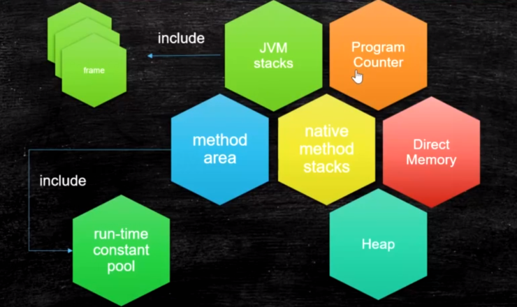

# 1：JVM基础知识

1. 什么是JVM

   JVM是Java Virtual Machine（Java[虚拟机](https://baike.baidu.com/item/虚拟机)）的缩写，jvm能运行多种语言，只要能编译成class文件，jvm就能运行

   1. jvm是一个跨语言的平台

     2. JVM是一种用于计算设备的规范

     3. jvm是虚拟出来的计算机

        字节码指令集（汇编语言）

        内存管理 ：栈 堆 方法区等

2. 常见的JVM

   Hotspot   oracle官方，我们做实验用的JVM

   Jrockit  BEA，曾经号称世界上最快的JVM，被Oracle收购，合并于hotspot

   J9 - IBM

   Microsoft  VM

   TabaoVM   hotspot深度定制版

   Liquid VM  直接针对硬件

   azul zing  最新垃圾回收的业界标杆 www.azul.com

   

   
   
   
   
   java从编译到执行
   
   

# 2：ClassFileFormat

1. class文件是二进制字节流

2. 数据类型： u1 u2 u4 u8和_info（表类型）

   _info的来源是hotspot源码中的写法 

3. 查看16进制格式的ClassFile

   sublime   notepad

   IDEA插件   BinEd

4. 有很多可以观察ByteCode的方法

   javap   	 javap -v 路径 查看class文件详细信息

   JBE  可以直接修改

   jClassLib  - IDEA插件之一

     view -> show Bytecode With JclassLib   进行查看

5. classfile构成      详见马士兵教育 java1.8类文件格式第一版.png图片

   常量池从1开始，0是jvm预留的，表示没有任何引用指向

   ```
   classFile{
   	u4 magic;
   	u2 minor_version;
   	u2 major_version;
   	u2 constant_pool_count;
   	cp_info constant_pool[constant_pool_count-1];
   	u2
   }
   ```
   
   

# 3：类编译-加载-初始化


verifcation 检验class是否符合class文件标准

preparation 把class静态变量赋默认值

resolution class文件中常量池用到的符号引用转化为内存地址，可以直接访问的

initializing 静态变量赋值为初始值

## 1. Loading

 将class文件加载到内存

### 双亲委派

双亲委派主要是为了安全问题，防止自定义加载器篡改核心类库实现


类加载器范围

​	sun.boot.class.path   	Bootstrap ClassLoad加载路径

​	java.ext.dir					   Extension ClassLoader加载路径

​	java.class.path				 AppClassLoader加载路径

### LazyLoading 五种情况

严格来说是lazyInitializing

jvm规范并没有规定何时加载

但是严格规定了什么时候必须初始化

1. new getstatic pustatic invokestatic指令，访问final变量除外
2. java.lang.reflect对类进行反射调用
3. 初始化子类的时候，父类首先初始化
4. 虚拟机启动时，被执行的主类必须初始化
5. 动态语言支持java.lang.invoke.MethodHandle解析的结果为REF_getstatic REF_putstatic REF_invokestatic的方法句柄时，该类必须初始化

### ClassLoader的源码

1. findInCache -> parent.loadClass -> findClass()

### 自定义类加载器

自定义只需继承ClassLoader类，重写findClass方法。其中可使用defineClass方法将class文件的二进制byte数组转化为class类

自定义类加载器加载自加密的class，可防止反编译，防止篡改

1. <font color=red>第一节课遗留问题：parent是如何指定的，打破双亲委派，学生问题桌面图片</font>
   1. 用super(parent)指定
   2. 双亲委派的打破
      1. 如何打破：重写loadClass（）
      2. 何时打破过？
         1. JDK1.2之前，自定义ClassLoader都必须重写loadClass()
         2. ThreadContextClassLoader可以实现基础类调用实现类代码，通过thread.setContextClassLoader指定
         3. 热启动，热部署
            1. osgi tomcat 都有自己的模块指定classloader（可以加载同一类库的不同版本）

### 混合执行 编译执行 解释执行

-Xmixed 默认为混合模式     开始解释执行，启动速度较快，对热点代码实行检测和编译

​	混合模式是使用解释器（bytecode intepreter）+热点代码编译

​	起始阶段采用解释执行

​	热点代码检测     -XX:CompileThreshold = 10000

		- 多次被调用的方法（方法计数器： 监测方法执行频率）
		- 多次被调用的循环（循环计数器：监测循环执行频率） 
		- 进行编译

​    当某部分代码或者方法执行频率很高时，jvm会讲这一部分进行编译，生成本地执行文件，下次需要执行时直接执行本地文件

-Xint 使用解释模式 ，启动很快，执行稍慢

-Xcomp 使用纯编译模式，执行很快，启动很慢

## 2. Linking 

1. Verification
   1. 验证文件是否符合JVM规定
2. Preparation
   1. 静态成员变量赋默认值
3. Resolution
   1. 将类、方法、属性等符号引用解析为直接引用
      常量池中的各种符号引用解析为指针、偏移量等内存地址的直接引用

## 3. Initializing

1. 调用类初始化代码 <clinit>，给静态成员变量赋初始值

# 4：JMM

## 硬件层数据一致性

java并发内存模型


协议很多

intel 用MESI

https://www.cnblogs.com/z00377750/p/9180644.html

现代CPU的数据一致性实现 = 缓存锁(MESI ...) + 总线锁

读取缓存以cache line为基本单位，目前64bytes

位于同一缓存行的两个不同数据，被两个不同CPU锁定，产生互相影响的伪共享问题

伪共享问题：JUC/c_028_FalseSharing

使用缓存行的对齐能够提高效率

## 乱序问题

CPU为了提高指令执行效率，会在一条指令执行过程中（比如去内存读数据（慢100倍）），去同时执行另一条指令，前提是，两条指令没有依赖关系

https://www.cnblogs.com/liushaodong/p/4777308.html

写操作也可以进行合并

https://www.cnblogs.com/liushaodong/p/4777308.html

JUC/029_WriteCombining

乱序执行的证明：JVM/jmm/Disorder.java

原始参考：https://preshing.com/20120515/memory-reordering-caught-in-the-act/

## 如何保证特定情况下不乱序

硬件内存屏障 X86

>  sfence:  store| 在sfence指令前的写操作当必须在sfence指令后的写操作前完成。
>  lfence：load | 在lfence指令前的读操作当必须在lfence指令后的读操作前完成。
>  mfence：modify/mix | 在mfence指令前的读写操作当必须在mfence指令后的读写操作前完成。

> 原子指令，如x86上的”lock …” 指令是一个Full Barrier，执行时会锁住内存子系统来确保执行顺序，甚至跨多个CPU。Software Locks通常使用了内存屏障或原子指令来实现变量可见性和保持程序顺序

JVM级别如何规范（JSR133）

> LoadLoad屏障：
> 	对于这样的语句Load1; LoadLoad; Load2， 
>
> 	在Load2及后续读取操作要读取的数据被访问前，保证Load1要读取的数据被读取完毕。
>
> StoreStore屏障：
>
> 	对于这样的语句Store1; StoreStore; Store2，
> 	
> 	在Store2及后续写入操作执行前，保证Store1的写入操作对其它处理器可见。
>
> LoadStore屏障：
>
> 	对于这样的语句Load1; LoadStore; Store2，
> 	
> 	在Store2及后续写入操作被刷出前，保证Load1要读取的数据被读取完毕。
>
> StoreLoad屏障：
> 	对于这样的语句Store1; StoreLoad; Load2，
>
> ​	 在Load2及后续所有读取操作执行前，保证Store1的写入对所有处理器可见。

### volatile的实现细节

1. 字节码层面
   ACC_VOLATILE     access flags 加上volatile标识

2. JVM层面
   volatile内存区的读写 都加屏障

   > StoreStoreBarrier
   >
   > volatile 写操作
   >
   > StoreLoadBarrier

   > LoadLoadBarrier
   >
   > volatile 读操作
   >
   > LoadStoreBarrier

3. OS和硬件层面
   https://blog.csdn.net/qq_26222859/article/details/52235930
   hsdis - HotSpot Dis Assembler
   windows lock 指令实现 | MESI实现

### synchronized实现细节

1. 字节码层面
   synchronized方法 ：  	ACC_SYNCHRONIZED
   
   
   
   synchronized代码块：  monitorenter monitorexit
   
   
   
2. JVM层面
   C C++ 调用了操作系统提供的同步机制

3. OS和硬件层面
   X86 : lock cmpxchg 实现
   [https](https://blog.csdn.net/21aspnet/article/details/88571740)[://blog.csdn.net/21aspnet/article/details/](https://blog.csdn.net/21aspnet/article/details/88571740)[88571740](https://blog.csdn.net/21aspnet/article/details/88571740)


# 5：对象

## 对象的创建过程

1. class loading 将class 加载到内存

2. class linking(verificaton,preparation,resolution)

3. class initalizing  将静态变量赋为初始值，并执行静态语句块

4. 申请对象内存

5. 成员变量赋默认值

6. 调用构造方法<init>，调用构造方法时，会首先调用父类的构造方法

   1.成员变量顺序赋初始值

   2.执行构造方法语句

## 对象在内存中的存储布局

### 普通对象

1. 对象头：在hotspot中称为 markword ， 8字节

2. ClassPointer指针：指向class对象

   -XX:+UseCompressedClassPointers 为4字节 

   -XX:-UseCompressedClassPointers，不开启为8字节

3. 实例数据， 就是成员变量

   1. 引用类型：-XX:+UseCompressedOops 为4字节 不开启为8字节 
      Oops Ordinary Object Pointers   普通对象的指针

4. Padding对齐，8的倍数，内存是按块来读，一次读64位，既8字节，要求对象大小为8的倍数，不足则补齐

### 数组对象

1. 对象头：markword 8字节
2. ClassPointer指针同上
3. 数组长度：4字节
4. 数组数据
5. 对齐 8的倍数

## 使用JavaAgent测试Object的大小

### 观察虚拟机配置

java -XX:+PrintCommandLineFlags -version

### 实验

1. 新建项目ObjectSize （1.8）

2. 创建文件ObjectSizeAgent

   ```java
   package com.mashibing.jvm.agent;
   
   import java.lang.instrument.Instrumentation;
   
   public class ObjectSizeAgent {
       private static Instrumentation inst;
   
       public static void premain(String agentArgs, Instrumentation _inst) {
           inst = _inst;
       }
   
       public static long sizeOf(Object o) {
           return inst.getObjectSize(o);
       }
   }
   ```

3. src目录下创建META-INF/MANIFEST.MF

   ```java
   Manifest-Version: 1.0
   Created-By: mashibing.com
   Premain-Class: com.mashibing.jvm.agent.ObjectSizeAgent
   ```

   注意Premain-Class这行必须是新的一行（回车 + 换行），确认idea不能有任何错误提示

4. 打包jar文件

5. 在需要使用该Agent Jar的项目中引入该Jar包
   project structure - project settings - library 添加该jar包

6. 运行时需要该Agent Jar的类，加入参数：

   ```java
   -javaagent:C:\work\ijprojects\ObjectSize\out\artifacts\ObjectSize_jar\ObjectSize.jar
   ```

7. 如何使用该类：

   ```java
   ​```java
      package com.mashibing.jvm.c3_jmm;
      
      import com.mashibing.jvm.agent.ObjectSizeAgent;
      
      public class T03_SizeOfAnObject {
          public static void main(String[] args) {
              System.out.println(ObjectSizeAgent.sizeOf(new Object()));
              System.out.println(ObjectSizeAgent.sizeOf(new int[] {}));
              System.out.println(ObjectSizeAgent.sizeOf(new P()));
          }
      
          private static class P {
                              //8 _markword
                              //4 _oop指针
              int id;         //4
              String name;    //4
              int age;        //4
      
              byte b1;        //1
              byte b2;        //1
      
              Object o;       //4
              byte b3;        //1
      
          }
      }
   ```

## Hotspot开启内存压缩的规则（64位机）

1. 4G以下，直接砍掉高32位
2. 4G - 32G，默认开启内存压缩 ClassPointers Oops
3. 32G，压缩无效，使用64位
   内存并不是越大越好（^-^）

## IdentityHashCode的问题

当一个对象计算过identityHashCode之后，不能进入偏向锁状态

https://cloud.tencent.com/developer/article/1480590
 https://cloud.tencent.com/developer/article/1484167

https://cloud.tencent.com/developer/article/1485795

https://cloud.tencent.com/developer/article/1482500

## 对象定位

•https://blog.csdn.net/clover_lily/article/details/80095580

1：句柄池 （指针池）间接指针，节省内存
2：直接指针，访问速度快，hotspot采用方式

# 5: 运行时数据区Runtime Data Area



**PC 程序计数器**

PC 寄存器，也叫程序计数器。JVM支持多个线程同时运行，每个线程都有自己的程序计数器。倘若当前执行的是 JVM 的方法，则该寄存器中保存当前执行指令的地址；倘若执行的是native 方法，则PC寄存器中为空。

> 存放指令位置
>
> 虚拟机的运行，类似于这样的循环：
>
> while( not end ) {
>
> ​	取PC中的位置，找到对应位置的指令；
>
> ​	执行该指令；
>
> ​	PC ++;
>
> }

**native method stacks**   java调用的JNI，c和c++写的

这部分主要与虚拟机用到的 Native 方法相关

**jvm stacks**   每个线程对应一个栈，每个方法对应一个栈帧

栈里面存着的是一种叫“栈帧”的东西，每个方法会创建一个栈帧，栈帧中存放了局部变量表（基本数据类型和对象引用）、操作数栈、方法出口等信息。栈的大小可以固定也可以动态扩展。当栈调用深度大于JVM所允许的范围，会抛出StackOverflowError的错误，

​	**栈帧Frame**     Frame存放的数据有以下几种：

1. Local variable Table 局部变量表

2. Operand Stack  操作数栈

   对于long的处理（store and load），多数虚拟机的实现都是原子的
   jls 17.7，没必要加volatile

3. Dynamic Linking 指向常量池

   https://blog.csdn.net/qq_41813060/article/details/88379473 
   jvms 2.6.3

4. return address  存放返回值

   a() -> b()，方法a调用了方法b, b方法的返回值放在什么地方

**heap**  堆

堆内存是 JVM 所有线程共享的部分，在虚拟机启动的时候就已经创建。所有的对象和数组都在堆上进行分配。这部分空间可通过 GC 进行回收。当申请不到空间时会抛出 OutOfMemoryError。

**Direct memory** 直接内存，由操作系统管理，用于访问内核空间内存

​	JVM可以直接访问的内核空间的内存 (OS 管理的内存)

​	NIO ， 提高效率，实现zero copy

**method area** 装常量池，存储每个class的结构

主要用于存储类的信息、常量池、方法数据、方法代码等。方法区逻辑上属于堆的一部分，但是为了与堆进行区分，通常又叫“非堆”。

1. Perm Space (<1.8)  永久代
   字符串常量位于PermSpace
   FGC不会清理
   大小启动的时候指定，不能变
2. Meta Space (>=1.8)
   字符串常量位于堆
   会触发FGC清理
   不设定的话，最大就是物理内存

**Run-Time Constant pool**


# 6：指令集分类

指令集有两种方式

1. 基于栈的指令集

   operand stack 类似于栈

2. 基于寄存器的指令集，相对复杂，速度快    

   Hotspot中的Local Variable Table = JVM中的寄存器

   

# 7：常用指令

store

load

pop

mul

sub

invoke

1. InvokeStatic
2. InvokeVirtual
3. InvokeInterface
4. InovkeSpecial
   可以直接定位，不需要多态的方法
   private 方法 ， 构造方法
5. InvokeDynamic
   JVM最难的指令
   lambda表达式或者反射或者其他动态语言scala kotlin，或者CGLib ASM，动态产生的class，会用到的指令


# 8：GC基础知识

## **1. 什么是垃圾**

没有任何引用指向的一个对象或者多个对象（循环引用）

## 2. 如何定位垃圾

> 有两种算法
>
> **1. 引用计数**  reference count
>
> 对象内会记录有多少个引用指向，引用数量为0时成为垃圾，但对象之间循环引用时，比如a引用b,b引用c,c引用a时，无法回收
>
> **2. 根可达算法** Root Searching
>
> 没有与根有引用连接的对象为垃圾
>
> 根有哪些？
>
>  JVM Stack，native method stack  ，run-time constant pool ，static references in method area，Clazz
>
> 比如线程栈变量，静态变量，常量池，JNI变量

## 3.常见的垃圾回收算法

1. 标记清除(mark sweep) - 先扫描一边，将垃圾标记出来，第二次扫描把标记为垃圾的对象清除，不移动对象位置

   位置不连续 产生碎片 需要两遍扫描，效率偏低

   算法相对简单，存活对象比较多的情况下率高

2. 拷贝算法 (copying) -  扫描对象，将有用对象复制到另一块内存，剩下的垃圾整个清除

   没有碎片，浪费空间，移动复制对象，需要调整对象引用

   适用于存活对象较少的情况，只扫描一遍，效率提高，没有碎片。

3. 标记压缩(mark compact) - 把有用对象移动到一起，垃圾直接清理

   没有碎片，效率偏低（两遍扫描，指针需要调整）

   不会产生碎片，方便对象分配，不会产生内存减半

## 4.JVM内存分代模型（用于分代垃圾回收算法）

1. 部分垃圾回收器使用的模型

   > 除Epsilon ZGC Shenandoah之外的GC都是使用逻辑分代模型
   >
   > G1是逻辑分代，物理不分代
   >
   > 除此之外不仅逻辑分代，而且物理分代

2. 新生代 + 老年代 + 永久代（1.7）Perm Generation/ 元数据区(1.8) Metaspace

   1. 永久代  元数据区 - Class
   2. 永久代必须指定大小限制 ，元数据可以设置，也可以不设置，无上限（受限于物理内存）
   3. 字符串常量 1.7 - 永久代，1.8 - 堆
   4. MethodArea逻辑概念 - 永久代、元数据

   

3. 新生代 = Eden + 2个suvivor区 

   对象首先会被放在栈Stack上，栈上放不下会被放在eden，垃圾回收之后进入survivor，再次垃圾回收会进入另一个survivor，多次gc之后会进入老年代

   1. YGC回收之后，大多数的对象会被回收，活着的进入s0

   2. 再次YGC，活着的对象eden + s0 -> s1

   3. 再次YGC，eden + s1 -> s0

   4. 年龄足够 -> 老年代 

      采用Parallel Scavenge垃圾回收算法，默认次数是15，存放次数只有4位，最大只能是15

      采用CMS默认是6

      采用G1默认是15

      采用 -XX:MaxTenuringThreshold 指定次数

   5. s区装不下 -> 老年代

4. 老年代

   1. 顽固分子
   2. 老年代满了FGC Full GC

5. GC Tuning (Generation)

   1. 尽量减少FGC
   2. MinorGC = YGC ：年轻代空间耗尽时触发    ，-Xmn
   3. MajorGC = FGC ： 在老年代无法继续分配空间时触发，新生代老年代同时进行回收  

6. 栈上分配，什么情况对象会分配到栈上？

   1. 线程私有小对象

   2. 无逃逸：      只在一段代码中使用，其他代码没有用到 
   3. 支持标量替换：      一个对象中只有普通属性，用对象中的普通属性代替对象

7. 线程本地分配TLAB (Thread Local Allocation Buffer)    调优时建议不调整

   创建对象，分配eden内存时，会有多个线程争用内存地址，如果采用同步效率会降低，于是用TLAB来解决这个问题。每个线程分配1%的空间，这个空间是线程独有的

8. 对象分配过程图

   对象首先会尝试放在栈Stack上，栈上放得下就放在栈上，如果栈上放不下，再看对象大不大，大的话直接放在Old，小的话放TLAB，TLAB是在Eden区内，进行gc，放入s1区，看年龄够不够，够的话放Old区，不够放S2区

   

9. 动态年龄：（不重要）

   对象进入老年代可采用动态年龄

   https://www.jianshu.com/p/989d3b06a49d

10. 分配担保：（不重要）
      YGC期间 survivor区空间不够了 空间担保直接进入老年代
      参考：https://cloud.tencent.com/developer/article/1082730

## 5.常见的垃圾回收器


1. JDK诞生 Serial追随 提高效率，诞生了PS，为了配合CMS，诞生了PN，CMS是1.4版本后期引入，CMS是里程碑式的GC，它开启了并发回收的过程，但是CMS毛病较多，因此目前任何一个JDK版本默认是CMS
   并发垃圾回收是因为无法忍受STW
   
2. STW  gc时会停止工作进程的方式，除了CMS不是STW类型的，其他方式都是STW的

3. Serial 年轻代 串行回收 

   单线程 ，在安全点停止工作进程，gc后再恢复工作进程

4. PS 年轻代 并行回收 

   parallel scavenge 默认的垃圾回收策略，清理线程是多个

5. ParNew 年轻代 配合CMS的并行回收

   相对于parallel scavenge加了一些增强,以适用于CMS

6. SerialOld   用于老年代，也是单线程，已淘汰

7. Parallel Old  默认的

8. ConcurrentMarkSweep 老年代垃圾回收器  并发的， 垃圾回收和应用程序同时运行，降低STW的时间(200ms)
   CMS问题比较多，所以现在没有一个版本默认是CMS，只能手工指定
   CMS既然是MarkSweep，就一定会有碎片化的问题，碎片到达一定程度，CMS的老年代分配对象分配不下的时候，使用SerialOld 进行老年代回收
   想象一下：
   PS + PO -> 加内存 换垃圾回收器 -> PN + CMS + SerialOld（几个小时 - 几天的STW）
   几十个G的内存，单线程回收 -> G1 + FGC 几十个G -> 上T内存的服务器 ZGC
   算法：三色标记 + Incremental Update

   

   CMS清理垃圾的4个阶段：

   1. 初始标记： STW，标记根节点
   2. 并发标记： 标记垃圾，与工作线程并发进行
   3. 重新标记： STW,标记并发标记过程中新产生的垃圾
   4. 并发清理： 清理垃圾，与工作进程并发进行，该过程会产生浮动垃圾

9. G1(10ms)
   算法：三色标记 + SATB

10. ZGC (1ms) PK C++
      算法：ColoredPointers颜色指针 + LoadBarrier读屏障

11. Shenandoah
    算法：ColoredPointers + WriteBarrier写屏障

12. Eplison   用于debug，gc没有做任何操作

13. PS 和 PN区别的延伸阅读：
    ▪[https://docs.oracle.com/en/java/javase/13/gctuning/ergonomics.html#GUID-3D0BB91E-9BFF-4EBB-B523-14493A860E73](https://docs.oracle.com/en/java/javase/13/gctuning/ergonomics.html)

14. 垃圾收集器跟内存大小的关系
    1. Serial 几十兆
    2. PS 上百兆 - 几个G
    3. CMS - 20G
    4. G1 - 上百G
    5. ZGC - 4T - 16T（JDK13）

1.8默认的垃圾回收：PS + ParallelOld

## 6.三色标记算法

会用白色，灰色、黑色来标记对象。

白色：未被标记的对象

灰色：自身被标记，成员变量未被标记

黑色：自身和成员变量均已标记完成


但是会存在漏标问题：

1. 在remark过程中，黑色指向白色，如果不对黑色重新扫描，则会漏标，会把白色对象当做没有新引用指向从而被回收掉
2. 并发标记过程中,删除了所有从灰色到白色的引用，会产生漏标，此时白色对象应该被回收


为了避免漏标，有以下两种方法：

1. incremental update -- 增量更新，关注引用的增加，把黑色重新标记为灰色，下次重新扫描属性，CMS采用该方式
2. SATB snapshot at the begining -- 关注引用的删除，当灰色对象对白色对象的引用删除时，要把这个引用推到GC的堆栈中，保证白色对象还能被GC扫描到。G1采用该方式。


为什么G1用SATB?

灰色->白色 引用消失时，如果没有黑色指向白色，引用会被push到堆栈

下次扫描时拿到这个引用，由于有RSet的存在，不需要扫描整个堆去查找指向白色的引用，效率比较高。


## 7. 常见垃圾回收器组合参数设定：(1.8)

* -XX:+UseSerialGC = Serial New (DefNew) + Serial Old
  * 小型程序。默认情况下不会是这种选项，HotSpot会根据计算及配置和JDK版本自动选择收集器
* -XX:+UseParNewGC = ParNew + SerialOld
  * 这个组合已经很少用（在某些版本中已经废弃）
  * https://stackoverflow.com/questions/34962257/why-remove-support-for-parnewserialold-anddefnewcms-in-the-future
* -XX:+UseConc<font color=red>(urrent)</font>MarkSweepGC = ParNew + CMS + Serial Old
* -XX:+UseParallelGC = Parallel Scavenge + Parallel Old (1.8默认) 【PS + SerialOld】
* -XX:+UseParallelOldGC = Parallel Scavenge + Parallel Old
* -XX:+UseG1GC = G1
* Linux中没找到默认GC的查看方法，而windows中会打印UseParallelGC 
  * java +XX:+PrintCommandLineFlags -version
  * 通过GC的日志来分辨

* Linux下1.8版本默认的垃圾回收器到底是什么？

  * 1.8.0_181 默认（看不出来）Copy MarkCompact
  * 1.8.0_222 默认 PS + PO


# 9. JVM调优

## 1. JVM调优第一步，了解JVM常用命令行参数

* JVM的命令行参数参考：https://docs.oracle.com/javase/8/docs/technotes/tools/unix/java.html

* HotSpot参数分类

  > 标准： - 开头，所有的HotSpot都支持
  >
  > 非标准：-X 开头，特定版本HotSpot支持特定命令
  >
  > 不稳定：-XX 开头，下个版本可能取消

  java -version

  java -X

  

  试验用程序：

  ```java
  import java.util.List;
  import java.util.LinkedList;
  
  public class HelloGC {
    public static void main(String[] args) {
      System.out.println("HelloGC!");
      List list = new LinkedList();
      for(;;) {
        byte[] b = new byte[1024*1024];
        list.add(b);
      }
    }
  }
  ```

  

  1. 区分概念：
  
     内存泄漏memory leak，对象占用了内存，一直没有被回收
  
     内存溢出out of memory  ， 一直创建对象，内存满了
  
  2. java -XX:+PrintCommandLineFlags HelloGC    查看命令行参数
  
  3. java -Xmn10M -Xms40M -Xmx60M -XX:+PrintCommandLineFlags -XX:+PrintGC  HelloGC
     PrintGCDetails PrintGCTimeStamps PrintGCCauses   设置命令行参数，并查看命令行参数详细信息
  
  4. java -XX:+UseConcMarkSweepGC -XX:+PrintCommandLineFlags HelloGC
  
  5. java -XX:+PrintFlagsInitial 查看默认参数值
  
  6. java -XX:+PrintFlagsFinal 查看最终参数值
  
  7. java -XX:+PrintFlagsFinal | grep xxx 找到对应的参数
  
  8. java -XX:+PrintFlagsFinal -version |grep GC

## 2. PS GC日志详解

每种垃圾回收器的日志格式是不同的！

PS日志格式


user 是用户态占用时间   ，sys 内核态占用时间，real  总时间

heap dump部分：

```java
eden space 5632K, 94% used [0x00000000ff980000,0x00000000ffeb3e28,0x00000000fff00000)
                            后面的内存地址指的是，起始地址，使用空间结束地址，整体空间结束地址
```


new generation年轻代

from to 都是 s区

tenured generation 老年代

class space 元数据区专门存储class信息的空间

total = eden + 1个survivor

## 3. 调优前的基础概念：

1. 吞吐量：用户代码时间 /（用户代码执行时间 + 垃圾回收时间）

2. 响应时间：STW越短，响应时间越好

   响应时间快是指用户线程停顿的时间短

所谓调优，首先确定，追求啥？吞吐量优先，还是响应时间优先？还是在满足一定的响应时间的情况下，要求达到多大的吞吐量...

问题：

科学计算，吞吐量。数据挖掘，thrput。吞吐量优先的一般：（PS + PO）

响应时间：网站 GUI API （1.8 G1）

## 4. 什么是调优？

1. 根据需求进行JVM规划和预调优
2. 优化运行JVM运行环境（慢，卡顿）
3. 解决JVM运行过程中出现的各种问题(OOM)

## 5. 调优，从规划开始

* 调优，从业务场景开始，没有业务场景的调优都是耍流氓

* 无监控（压力测试，能看到结果），不调优

* 步骤：

  1. 熟悉业务场景（没有最好的垃圾回收器，只有最合适的垃圾回收器）
     1. 追求响应时间快、停顿时间小 [ 采用CMS G1 ZGC] （需要给用户作响应）
     2. 吞吐量 = 用户时间 /( 用户时间 + GC时间) [追求吞吐量大，采用PS]
  2. 选择回收器组合
  3. 计算内存需求（经验值 1.5G 16G）
  4. 选定CPU（越高越好）
  5. 设定年代大小、升级年龄
  6. 设定日志参数
     1. -Xloggc:/opt/xxx/logs/xxx-xxx-gc-%t.log -XX:+UseGCLogFileRotation -XX:NumberOfGCLogFiles=5 -XX:GCLogFileSize=20M -XX:+PrintGCDetails -XX:+PrintGCDateStamps -XX:+PrintGCCause
     2. 或者每天产生一个日志文件
  7. 观察日志情况

* 案例1：垂直电商，最高每日百万订单，处理订单系统需要什么样的服务器配置？

  > 这个问题比较业余，因为很多不同的服务器配置都能支撑(1.5G 16G)
  >
  > 1小时360000集中时间段， 100个订单/秒，（找一小时内的高峰期，1000订单/秒）
  >
  > 经验值，
  >
  > 非要计算：一个订单产生需要多少内存？512K * 1000 500M内存
  >
  > 专业一点儿问法：要求响应时间100ms
  >
  > 压测！

* 案例2：12306遭遇春节大规模抢票应该如何支撑？

  > 12306应该是中国并发量最大的秒杀网站：
  >
  > 号称并发量100W最高
  >
  > CDN -> LVS -> NGINX -> 业务系统 -> 每台机器1W并发（10K问题） 100台机器
  >
  > 普通电商订单 -> 下单 ->订单系统（IO）减库存 ->等待用户付款
  >
  > 12306的一种可能的模型： 下单 -> 减库存 和 订单(redis kafka) 同时异步进行 ->等付款
  >
  > 减库存最后还会把压力压到一台服务器
  >
  > 可以做分布式本地库存 + 单独服务器做库存均衡
  >
  > 大流量的处理方法：分而治之

* 怎么得到一个事务会消耗多少内存？

  > 1. 弄台机器，看能承受多少TPS？是不是达到目标？扩容或调优，让它达到
  >
  > 2. 用压测来确定

## 6. 优化环境

1. 有一个50万PV的资料类网站（从磁盘提取文档到内存）原服务器32位，1.5G
   的堆，用户反馈网站比较缓慢，因此公司决定升级，新的服务器为64位，16G
   的堆内存，结果用户反馈卡顿十分严重，反而比以前效率更低了
   1. 为什么原网站慢?
      很多用户浏览数据，很多数据load到内存，内存不足，频繁GC，STW长，响应时间变慢
   2. 为什么会更卡顿？
      内存越大，FGC时间越长
   3. 咋办？
      PS -> PN + CMS 或者 G1
2. 系统CPU经常100%，如何调优？(面试高频)
   CPU100%那么一定有线程在占用系统资源，
   1. 找出哪个进程cpu高（top）
   2. 该进程中的哪个线程cpu高（top -Hp）
   3. 导出该线程的堆栈 (jstack)
   4. 查找哪个方法（栈帧）消耗时间 (jstack)
   5. 工作线程占比高 | 垃圾回收线程占比高
3. 系统内存飙高，如何查找问题？（面试高频）
   1. 导出堆内存 (jmap)
   2. 分析 (jhat jvisualvm mat jprofiler ... )
4. 如何监控JVM
   1. jstat jvisualvm jprofiler arthas top...

## 7. 解决JVM运行中的问题

#### 一个案例理解常用工具

1. 测试代码：

   ```java
   package com.mashibing.jvm.gc;
   
   import java.math.BigDecimal;
   import java.util.ArrayList;
   import java.util.Date;
   import java.util.List;
   import java.util.concurrent.ScheduledThreadPoolExecutor;
   import java.util.concurrent.ThreadPoolExecutor;
   import java.util.concurrent.TimeUnit;
   
   /**
    * 从数据库中读取信用数据，套用模型，并把结果进行记录和传输
    */
   
   public class T15_FullGC_Problem01 {
   
       private static class CardInfo {
           BigDecimal price = new BigDecimal(0.0);
           String name = "张三";
           int age = 5;
           Date birthdate = new Date();
   
           public void m() {}
       }
   
       private static ScheduledThreadPoolExecutor executor = new ScheduledThreadPoolExecutor(50,
               new ThreadPoolExecutor.DiscardOldestPolicy());
   
       public static void main(String[] args) throws Exception {
           executor.setMaximumPoolSize(50);
   
           for (;;){
               modelFit();
               Thread.sleep(100);
           }
       }
   
       private static void modelFit(){
           List<CardInfo> taskList = getAllCardInfo();
           taskList.forEach(info -> {
               // do something
               executor.scheduleWithFixedDelay(() -> {
                   //do sth with info
                   info.m();
   
               }, 2, 3, TimeUnit.SECONDS);
           });
       }
   
       private static List<CardInfo> getAllCardInfo(){
           List<CardInfo> taskList = new ArrayList<>();
   
           for (int i = 0; i < 100; i++) {
               CardInfo ci = new CardInfo();
               taskList.add(ci);
           }
   
           return taskList;
       }
   }
   
   ```

2. java -Xms200M -Xmx200M -XX:+PrintGC com.mashibing.jvm.gc.T15_FullGC_Problem01

3. 一般是运维团队首先受到报警信息（CPU Memory）

4. top命令观察到问题：内存不断增长 CPU占用率居高不下

5. top -Hp 观察进程中的线程，哪个线程CPU和内存占比高

6. jps定位具体java进程
   
   jstack 定位线程状况，重点关注：WAITING BLOCKED 的线程
   
   
   
   nid跟top中查看的进程号是对应的，只是nid是16进制，进程号是10进制

   eg.
   waiting on <0x0000000088ca3310> (a java.lang.Object)
   假如有一个进程中100个线程，很多线程都在waiting on <xx> ，一定要找到是哪个线程持有这把锁
   怎么找？搜索jstack dump的信息，找<xx> ，看哪个线程持有这把锁,持有锁的线程一般是RUNNABLE状态的
   作业：1：写一个死锁程序，用jstack观察 2 ：写一个程序，一个线程持有锁不释放，其他线程等待
   
7. 为什么阿里规范里规定，线程的名称（尤其是线程池）都要写有意义的名称
   怎么样自定义线程池里的线程名称？（自定义ThreadFactory）

8. jinfo pid   查看进程jvm信息

   

9. jstat -gc 动态观察gc情况 / 阅读GC日志发现频繁GC / arthas观察 / jconsole/jvisualVM/ Jprofiler（最好用）
   jstat -gc 4655 500 : 每个500个毫秒打印GC的情况
   如果面试官问你是怎么定位OOM问题的？如果你回答用图形界面（错误）
   1：已经上线的系统不用图形界面用什么？（cmdline arthas）
   2：图形界面到底用在什么地方？测试！测试的时候进行监控！（压测观察）

10. jmap -histo 4655 | head -20，查找有多少对象产生

11. jmap -dump:format=b,file=xxx pid ：

    线上系统，内存特别大，jmap执行期间会对进程产生很大影响，甚至卡顿（电商不适合）
    1：设定了参数HeapDump，OOM的时候会自动产生堆转储文件
    2：<font color='red'>很多服务器备份（高可用），停掉这台服务器对其他服务器不影响</font>
    3：在线定位(一般小点儿公司用不到)

    jstat -gcutil pid  500

12. java -Xms20M -Xmx20M -XX:+UseParallelGC -XX:+HeapDumpOnOutOfMemoryError com.mashibing.jvm.gc.T15_FullGC_Problem01

13. 使用MAT / jhat /jvisualvm 进行dump文件分析
     https://www.cnblogs.com/baihuitestsoftware/articles/6406271.html 
    jhat -J-mx512M xxx.dump
    http://192.168.17.11:7000
    拉到最后：找到对应链接
    可以使用OQL查找特定问题对象

14. 找到代码的问题

#### jconsole远程连接（生产环境不建议使用）

1. 程序启动加入参数：

   > ```shell
   > java -Djava.rmi.server.hostname=192.168.17.11 -Dcom.sun.management.jmxremote -Dcom.sun.management.jmxremote.port=11111 -Dcom.sun.management.jmxremote.authenticate=false -Dcom.sun.management.jmxremote.ssl=false XXX
   > ```

2. 如果遭遇 Local host name unknown：XXX的错误，修改/etc/hosts文件，把XXX加入进去

   > ```java
   > 192.168.17.11 basic localhost localhost.localdomain localhost4 localhost4.localdomain4
   > ::1         localhost localhost.localdomain localhost6 localhost6.localdomain6
   > ```

3. 关闭linux防火墙（实战中应该打开对应端口）

   > ```shell
   > service iptables stop
   > chkconfig iptables off #永久关闭
   > ```

4. windows上打开 jconsole远程连接 192.168.17.11:11111

#### jvisualvm远程连接（生产环境不建议使用）

可以将jvm日志导出，用jvisualvm进行分析

 https://www.cnblogs.com/liugh/p/7620336.html （简单做法）

#### jprofiler (收费)

#### arthas在线排查工具

* 为什么需要在线排查？
  在生产上我们经常会碰到一些不好排查的问题，例如线程安全问题，用最简单的threaddump或者heapdump不好查到问题原因。为了排查这些问题，有时我们会临时加一些日志，比如在一些关键的函数里打印出入参，然后重新打包发布，如果打了日志还是没找到问题，继续加日志，重新打包发布。对于上线流程复杂而且审核比较严的公司，从改代码到上线需要层层的流转，会大大影响问题排查的进度。 
* java -jar arthas-boot.jar   启动arthas
* jvm观察jvm信息
* thread定位线程问题
* dashboard 观察系统情况
* heapdump + jhat分析
* jad反编译
  动态代理生成类的问题定位
  第三方的类（观察代码）
  版本问题（确定自己最新提交的版本是不是被使用）
* redefine 热替换
  目前有些限制条件：只能改方法实现（方法已经运行完成），不能改方法名， 不能改属性
  m() -> mm()
* sc  - search class
* watch  - watch method
* 没有包含的功能：jmap

## 8. GC算法的基础概念

* Card Table
  由于做YGC时，需要扫描整个OLD区，效率非常低，所以JVM设计了CardTable， 如果一个old区CardTable中有对象指向Y区，就将它设为Dirty，下次扫描时，只需要扫描Dirty Card
  在结构上，Card Table用BitMap来实现

## 9. CMS

### CMS的问题

1. Memory Fragmentation

   > -XX:+UseCMSCompactAtFullCollection
   > -XX:CMSFullGCsBeforeCompaction 默认为0 指的是经过多少次FGC才进行压缩

2. Floating Garbage

   > Concurrent Mode Failure
   > 产生：if the concurrent collector is unable to finish reclaiming the unreachable objects before the tenured generation fills up, or if an allocation cannot be satisfiedwith the available free space blocks in the tenured generation, then theapplication is paused and the collection is completed with all the applicationthreads stopped
   >
   > 解决方案：降低触发CMS的阈值
   >
   > PromotionFailed
   >
   > 解决方案类似，保持老年代有足够的空间
   >
   > –XX:CMSInitiatingOccupancyFraction 92% 可以降低这个值，让CMS保持老年代足够的空间

### CMS日志分析

执行命令：java -Xms20M -Xmx20M -XX:+PrintGCDetails -XX:+UseConcMarkSweepGC com.mashibing.jvm.gc.T15_FullGC_Problem01

[GC (Allocation Failure) [ParNew: 6144K->640K(6144K), 0.0265885 secs] 6585K->2770K(19840K), 0.0268035 secs] [Times: user=0.02 sys=0.00, real=0.02 secs] 

> ParNew：年轻代收集器
>
> 6144->640：收集前后的对比
>
> （6144）：整个年轻代容量
>
> 6585 -> 2770：整个堆的情况
>
> （19840）：整个堆大小


```java
[GC (CMS Initial Mark) [1 CMS-initial-mark: 8511K(13696K)] 9866K(19840K), 0.0040321 secs] [Times: user=0.01 sys=0.00, real=0.00 secs] 
	//8511 (13696) : 老年代使用（最大）
	//9866 (19840) : 整个堆使用（最大）
[CMS-concurrent-mark-start]
[CMS-concurrent-mark: 0.018/0.018 secs] [Times: user=0.01 sys=0.00, real=0.02 secs] 
	//这里的时间意义不大，因为是并发执行
[CMS-concurrent-preclean-start]
[CMS-concurrent-preclean: 0.000/0.000 secs] [Times: user=0.00 sys=0.00, real=0.00 secs] 
	//标记Card为Dirty，也称为Card Marking
[GC (CMS Final Remark) [YG occupancy: 1597 K (6144 K)][Rescan (parallel) , 0.0008396 secs][weak refs processing, 0.0000138 secs][class unloading, 0.0005404 secs][scrub symbol table, 0.0006169 secs][scrub string table, 0.0004903 secs][1 CMS-remark: 8511K(13696K)] 10108K(19840K), 0.0039567 secs] [Times: user=0.00 sys=0.00, real=0.00 secs] 
	//STW阶段，YG occupancy:年轻代占用及容量
	//[Rescan (parallel)：STW下的存活对象标记
	//weak refs processing: 弱引用处理
	//class unloading: 卸载用不到的class
	//scrub symbol(string) table: 
		//cleaning up symbol and string tables which hold class-level metadata and 
		//internalized string respectively
	//CMS-remark: 8511K(13696K): 阶段过后的老年代占用及容量
	//10108K(19840K): 阶段过后的堆占用及容量

[CMS-concurrent-sweep-start]
[CMS-concurrent-sweep: 0.005/0.005 secs] [Times: user=0.00 sys=0.00, real=0.01 secs] 
	//标记已经完成，进行并发清理
[CMS-concurrent-reset-start]
[CMS-concurrent-reset: 0.000/0.000 secs] [Times: user=0.00 sys=0.00, real=0.00 secs]
	//重置内部结构，为下次GC做准备
```


## 10. G1

https://www.oracle.com/technical-resources/articles/java/g1gc.html

G1 是一种服务端应用使用的垃圾回收器，目标是用在**多核、大内存**的机器上，它在大多数情况下可以实现指定的GC暂停时间，gc时间小于200ms，同时还能保证较高的吞吐量

特点：

- 并发收集
- 压缩空闲空间不会延长GC的暂停时间
- 更易预测的GC暂停时间
- 适用不需要实现很高的吞吐量的场景


humongous object  超过单个region的50%  

每个分区都可能是年轻代、老年代，但同一时刻只能属于某个代。

年轻代、幸存区、老年代的这些概念还在，但是只是逻辑上的概念，这样方便复用之前的分代框架的逻辑。

在物理上需要连续，这样有的分区内垃圾多，有的垃圾少，G1会**优先回收垃圾对象特别多的分区**，这样可以花费较少的时间来回收这些分区的垃圾。

新老年代的比例一般是5%-60% ，一般不用手工指定，G1会自动调整比例。


### RSet (RememberedSet)

记录了其他Region中的对象到本Region的引用

RSet的价值在于使得垃圾收集器不需要扫描整个堆栈找到是谁引用了当前分区的对象，只需要扫描Rset即可。


Rset与赋值的效率

由于Rset的存在，那么每次给对象赋值的时候，就得做一些额外的操作，指的是在Rset中做一些额外的记录（在GC中被称为写屏障）


### CSet(Collection Set)

一组可被回收的分区的集合

在CSet中存活的数据会在GC过程中被移动到了另一个可用分区，CSet中的分区可以来自Eden区，survivor区，或者老年代

CSet会占用不到整个堆空间的1%大小。


### GC何时触发

YGC    

在年轻垃圾收集期间，G1 GC会从以前的垃圾收集中收集eden区域和survivor区域。将eden和survivor区域中的存活的对象复制到新的区集合中。特定对象的目标区域取决于该对象的年龄，已充分老化的对象将复制到Old区域(即提升)，否则复制到survivor区域，并且这个对象会被添加到下次年轻代或混合垃圾收集的CSet中。

- Eden空间不足
- 多线程并发执行

FGC:       要尽量避免产生FGC，因为G1采用FGC是串行的

- Old空间不足
- System.gc()

MixedGC      

- XX:InitiatingHeapOccupacyPercent  默认值是45%，当Old区超过这个值时，启动MixedGC

- 在成功完成一个并发标记周期后，G1 GC将从执行年轻代垃圾收集切换到执行混合垃圾收集。在混合垃圾收集中，G1 GC选择性地将一些Old区添加到将被回收的eden和surviver区中。被添加的Old区的确切数量由许多标志控制。当G1 GC收集了足够多的Old区后(通过多次混合垃圾收集)，G1就会恢复执行年轻代垃圾收集，直到下一个并发标记周期完成。

- MixedGC 的过程  ，与CMS类似

  初始标记 STW

  并发标记

  最终标记 STW （重新标记）

  筛选回收 STW （并行）


### G1日志详解

```java
[GC pause (G1 Evacuation Pause) (young) (initial-mark), 0.0015790 secs]
//young -> 年轻代 Evacuation-> 复制存活对象 
//initial-mark 混合回收的阶段，这里是YGC混合老年代回收
   [Parallel Time: 1.5 ms, GC Workers: 1] //一个GC线程
      [GC Worker Start (ms):  92635.7]
      [Ext Root Scanning (ms):  1.1]
      [Update RS (ms):  0.0]
         [Processed Buffers:  1]
      [Scan RS (ms):  0.0]
      [Code Root Scanning (ms):  0.0]
      [Object Copy (ms):  0.1]
      [Termination (ms):  0.0]
         [Termination Attempts:  1]
      [GC Worker Other (ms):  0.0]
      [GC Worker Total (ms):  1.2]
      [GC Worker End (ms):  92636.9]
   [Code Root Fixup: 0.0 ms]
   [Code Root Purge: 0.0 ms]
   [Clear CT: 0.0 ms]
   [Other: 0.1 ms]
      [Choose CSet: 0.0 ms]
      [Ref Proc: 0.0 ms]
      [Ref Enq: 0.0 ms]
      [Redirty Cards: 0.0 ms]
      [Humongous Register: 0.0 ms]
      [Humongous Reclaim: 0.0 ms]
      [Free CSet: 0.0 ms]
   [Eden: 0.0B(1024.0K)->0.0B(1024.0K) Survivors: 0.0B->0.0B Heap: 18.8M(20.0M)->18.8M(20.0M)]
 [Times: user=0.00 sys=0.00, real=0.00 secs] 
//以下是混合回收其他阶段
[GC concurrent-root-region-scan-start]
[GC concurrent-root-region-scan-end, 0.0000078 secs]
[GC concurrent-mark-start]
//无法evacuation，进行FGC
[Full GC (Allocation Failure)  18M->18M(20M), 0.0719656 secs]
   [Eden: 0.0B(1024.0K)->0.0B(1024.0K) Survivors: 0.0B->0.0B Heap: 18.8M(20.0M)->18.8M(20.0M)], [Metaspace: 38
76K->3876K(1056768K)] [Times: user=0.07 sys=0.00, real=0.07 secs]

```


## 11. 案例汇总

OOM产生的原因多种多样，有些程序未必产生OOM，不断FGC(CPU飙高，但内存回收特别少) （上面案例）

1. 硬件升级系统反而卡顿的问题（见上）

2. 线程池不当运用产生OOM问题（见上）
   不断的往List里加对象（实在太LOW）

3. smile jira问题
   实际系统不断重启
   解决问题 加内存 + 更换垃圾回收器 G1
   真正问题在哪儿？不知道

4. tomcat http-header-size过大问题（Hector）

5. lambda表达式导致方法区溢出问题(MethodArea / Perm Metaspace)
   LambdaGC.java     -XX:MaxMetaspaceSize=9M -XX:+PrintGCDetails

   ```java
   "C:\Program Files\Java\jdk1.8.0_181\bin\java.exe" -XX:MaxMetaspaceSize=9M -XX:+PrintGCDetails "-javaagent:C:\Program Files\JetBrains\IntelliJ IDEA Community Edition 2019.1\lib\idea_rt.jar=49316:C:\Program Files\JetBrains\IntelliJ IDEA Community Edition 2019.1\bin" -Dfile.encoding=UTF-8 -classpath "C:\Program Files\Java\jdk1.8.0_181\jre\lib\charsets.jar;C:\Program Files\Java\jdk1.8.0_181\jre\lib\deploy.jar;C:\Program Files\Java\jdk1.8.0_181\jre\lib\ext\access-bridge-64.jar;C:\Program Files\Java\jdk1.8.0_181\jre\lib\ext\cldrdata.jar;C:\Program Files\Java\jdk1.8.0_181\jre\lib\ext\dnsns.jar;C:\Program Files\Java\jdk1.8.0_181\jre\lib\ext\jaccess.jar;C:\Program Files\Java\jdk1.8.0_181\jre\lib\ext\jfxrt.jar;C:\Program Files\Java\jdk1.8.0_181\jre\lib\ext\localedata.jar;C:\Program Files\Java\jdk1.8.0_181\jre\lib\ext\nashorn.jar;C:\Program Files\Java\jdk1.8.0_181\jre\lib\ext\sunec.jar;C:\Program Files\Java\jdk1.8.0_181\jre\lib\ext\sunjce_provider.jar;C:\Program Files\Java\jdk1.8.0_181\jre\lib\ext\sunmscapi.jar;C:\Program Files\Java\jdk1.8.0_181\jre\lib\ext\sunpkcs11.jar;C:\Program Files\Java\jdk1.8.0_181\jre\lib\ext\zipfs.jar;C:\Program Files\Java\jdk1.8.0_181\jre\lib\javaws.jar;C:\Program Files\Java\jdk1.8.0_181\jre\lib\jce.jar;C:\Program Files\Java\jdk1.8.0_181\jre\lib\jfr.jar;C:\Program Files\Java\jdk1.8.0_181\jre\lib\jfxswt.jar;C:\Program Files\Java\jdk1.8.0_181\jre\lib\jsse.jar;C:\Program Files\Java\jdk1.8.0_181\jre\lib\management-agent.jar;C:\Program Files\Java\jdk1.8.0_181\jre\lib\plugin.jar;C:\Program Files\Java\jdk1.8.0_181\jre\lib\resources.jar;C:\Program Files\Java\jdk1.8.0_181\jre\lib\rt.jar;C:\work\ijprojects\JVM\out\production\JVM;C:\work\ijprojects\ObjectSize\out\artifacts\ObjectSize_jar\ObjectSize.jar" com.mashibing.jvm.gc.LambdaGC
   [GC (Metadata GC Threshold) [PSYoungGen: 11341K->1880K(38400K)] 11341K->1888K(125952K), 0.0022190 secs] [Times: user=0.00 sys=0.00, real=0.00 secs] 
   [Full GC (Metadata GC Threshold) [PSYoungGen: 1880K->0K(38400K)] [ParOldGen: 8K->1777K(35328K)] 1888K->1777K(73728K), [Metaspace: 8164K->8164K(1056768K)], 0.0100681 secs] [Times: user=0.02 sys=0.00, real=0.01 secs] 
   [GC (Last ditch collection) [PSYoungGen: 0K->0K(38400K)] 1777K->1777K(73728K), 0.0005698 secs] [Times: user=0.00 sys=0.00, real=0.00 secs] 
   [Full GC (Last ditch collection) [PSYoungGen: 0K->0K(38400K)] [ParOldGen: 1777K->1629K(67584K)] 1777K->1629K(105984K), [Metaspace: 8164K->8156K(1056768K)], 0.0124299 secs] [Times: user=0.06 sys=0.00, real=0.01 secs] 
   java.lang.reflect.InvocationTargetException
   	at sun.reflect.NativeMethodAccessorImpl.invoke0(Native Method)
   	at sun.reflect.NativeMethodAccessorImpl.invoke(NativeMethodAccessorImpl.java:62)
   	at sun.reflect.DelegatingMethodAccessorImpl.invoke(DelegatingMethodAccessorImpl.java:43)
   	at java.lang.reflect.Method.invoke(Method.java:498)
   	at sun.instrument.InstrumentationImpl.loadClassAndStartAgent(InstrumentationImpl.java:388)
   	at sun.instrument.InstrumentationImpl.loadClassAndCallAgentmain(InstrumentationImpl.java:411)
   Caused by: java.lang.OutOfMemoryError: Compressed class space
   	at sun.misc.Unsafe.defineClass(Native Method)
   	at sun.reflect.ClassDefiner.defineClass(ClassDefiner.java:63)
   	at sun.reflect.MethodAccessorGenerator$1.run(MethodAccessorGenerator.java:399)
   	at sun.reflect.MethodAccessorGenerator$1.run(MethodAccessorGenerator.java:394)
   	at java.security.AccessController.doPrivileged(Native Method)
   	at sun.reflect.MethodAccessorGenerator.generate(MethodAccessorGenerator.java:393)
   	at sun.reflect.MethodAccessorGenerator.generateSerializationConstructor(MethodAccessorGenerator.java:112)
   	at sun.reflect.ReflectionFactory.generateConstructor(ReflectionFactory.java:398)
   	at sun.reflect.ReflectionFactory.newConstructorForSerialization(ReflectionFactory.java:360)
   	at java.io.ObjectStreamClass.getSerializableConstructor(ObjectStreamClass.java:1574)
   	at java.io.ObjectStreamClass.access$1500(ObjectStreamClass.java:79)
   	at java.io.ObjectStreamClass$3.run(ObjectStreamClass.java:519)
   	at java.io.ObjectStreamClass$3.run(ObjectStreamClass.java:494)
   	at java.security.AccessController.doPrivileged(Native Method)
   	at java.io.ObjectStreamClass.<init>(ObjectStreamClass.java:494)
   	at java.io.ObjectStreamClass.lookup(ObjectStreamClass.java:391)
   	at java.io.ObjectOutputStream.writeObject0(ObjectOutputStream.java:1134)
   	at java.io.ObjectOutputStream.defaultWriteFields(ObjectOutputStream.java:1548)
   	at java.io.ObjectOutputStream.writeSerialData(ObjectOutputStream.java:1509)
   	at java.io.ObjectOutputStream.writeOrdinaryObject(ObjectOutputStream.java:1432)
   	at java.io.ObjectOutputStream.writeObject0(ObjectOutputStream.java:1178)
   	at java.io.ObjectOutputStream.writeObject(ObjectOutputStream.java:348)
   	at javax.management.remote.rmi.RMIConnectorServer.encodeJRMPStub(RMIConnectorServer.java:727)
   	at javax.management.remote.rmi.RMIConnectorServer.encodeStub(RMIConnectorServer.java:719)
   	at javax.management.remote.rmi.RMIConnectorServer.encodeStubInAddress(RMIConnectorServer.java:690)
   	at javax.management.remote.rmi.RMIConnectorServer.start(RMIConnectorServer.java:439)
   	at sun.management.jmxremote.ConnectorBootstrap.startLocalConnectorServer(ConnectorBootstrap.java:550)
   	at sun.management.Agent.startLocalManagementAgent(Agent.java:137)
   
   ```

6. 直接内存溢出问题（少见）
   《深入理解Java虚拟机》P59，使用Unsafe分配直接内存，或者使用NIO的问题

7. 栈溢出问题
   -Xss设定太小

8. 比较一下这两段程序的异同，分析哪一个是更优的写法：

   ```java 
   Object o = null;
   for(int i=0; i<100; i++) {
       o = new Object();
       //业务处理
   }
   ```

   ```java
   for(int i=0; i<100; i++) {
       Object o = new Object();
   }
   ```

9. 重写finalize引发频繁GC
   小米云，HBase同步系统，系统通过nginx访问超时报警，最后排查，C++程序员重写finalize引发频繁GC问题
   为什么C++程序员会重写finalize？（new delete）
   finalize耗时比较长（200ms）

10. 如果有一个系统，内存一直消耗不超过10%，但是观察GC日志，发现FGC总是频繁产生，会是什么引起的？
    System.gc() (这个比较Low)

11. Distuptor有个可以设置链的长度，如果过大，然后对象大，消费完不主动释放，会溢出 (来自 死物风情)

12. 用jvm都会溢出，mycat用崩过，1.6.5某个临时版本解析sql子查询算法有问题，9个exists的联合sql就导致生成几百万的对象（来自 死物风情）

13. new 大量线程，会产生 native thread OOM，（low）应该用线程池，
    解决方案：减少堆空间（太TMlow了）,预留更多内存产生native thread
    JVM内存占物理内存比例 50% - 80%

## 12. GC常用参数

java -XX 查看参数

* -Xmn -Xms -Xmx -Xss
  年轻代 最小堆 最大堆 栈空间
* -XX:+UseTLAB
  使用TLAB，默认打开
* -XX:+PrintTLAB
  打印TLAB的使用情况
* -XX:TLABSize
  设置TLAB大小
* -XX:+DisableExplictGC
  System.gc()不管用 ，FGC
* -XX:+PrintGC
* -XX:+PrintGCDetails
* -XX:+PrintHeapAtGC
* -XX:+PrintGCTimeStamps
* -XX:+PrintGCApplicationConcurrentTime (低)
  打印应用程序时间
* -XX:+PrintGCApplicationStoppedTime （低）
  打印暂停时长
* -XX:+PrintReferenceGC （重要性低）
  记录回收了多少种不同引用类型的引用
* -verbose:class
  类加载详细过程
* -XX:+PrintVMOptions
* -XX:+PrintFlagsFinal  -XX:+PrintFlagsInitial
  必须会用
* -Xloggc:opt/log/gc.log
* -XX:MaxTenuringThreshold
  升代年龄，最大值15
* 锁自旋次数 -XX:PreBlockSpin 热点代码检测参数-XX:CompileThreshold 逃逸分析 标量替换 ... 
  这些不建议设置

## 13. Parallel常用参数

* -XX:SurvivorRatio
* -XX:PreTenureSizeThreshold
  大对象到底多大
* -XX:MaxTenuringThreshold
* -XX:+ParallelGCThreads
  并行收集器的线程数，同样适用于CMS，一般设为和CPU核数相同
* -XX:+UseAdaptiveSizePolicy
  自动选择各区大小比例

## 14. CMS常用参数

* -XX:+UseConcMarkSweepGC
* -XX:ParallelCMSThreads
  CMS线程数量
* -XX:CMSInitiatingOccupancyFraction
  使用多少比例的老年代后开始CMS收集，默认是68%(近似值)，如果频繁发生SerialOld卡顿，应该调小，（频繁CMS回收）
* -XX:+UseCMSCompactAtFullCollection
  在FGC时进行压缩
* -XX:CMSFullGCsBeforeCompaction
  多少次FGC之后进行压缩
* -XX:+CMSClassUnloadingEnabled
* -XX:CMSInitiatingPermOccupancyFraction
  达到什么比例时进行Perm回收
* GCTimeRatio
  设置GC时间占用程序运行时间的百分比
* -XX:MaxGCPauseMillis
  停顿时间，是一个建议时间，GC会尝试用各种手段达到这个时间，比如减小年轻代

## 15. G1常用参数

* -XX:+UseG1GC
* -XX:MaxGCPauseMillis
  建议值，G1会尝试调整Young区的块数来达到这个值
* -XX:GCPauseIntervalMillis
  ？GC的间隔时间
* -XX:+G1HeapRegionSize
  分区大小，建议逐渐增大该值，1 2 4 8 16 32。
  随着size增加，垃圾的存活时间更长，GC间隔更长，但每次GC的时间也会更长
  ZGC做了改进（动态区块大小）
* G1NewSizePercent
  新生代最小比例，默认为5%
* G1MaxNewSizePercent
  新生代最大比例，默认为60%
* GCTimeRatio
  GC时间建议比例，G1会根据这个值调整堆空间
* ConcGCThreads
  线程数量
* InitiatingHeapOccupancyPercent
  启动G1的堆空间占用比例


## 16. 作业

1. -XX:MaxTenuringThreshold控制的是什么？
   A: 对象升入老年代的年龄
     	B: 老年代触发FGC时的内存垃圾比例

2. 生产环境中，倾向于将最大堆内存和最小堆内存设置为：（为什么？）
   A: 相同 B：不同

3. JDK1.8默认的垃圾回收器是：
   A: ParNew + CMS
     	B: G1
     	C: PS + ParallelOld
     	D: 以上都不是

4. 什么是响应时间优先？

5. 什么是吞吐量优先？

6. ParNew和PS的区别是什么？

7. ParNew和ParallelOld的区别是什么？（年代不同，算法不同）

8. 长时间计算的场景应该选择：A：停顿时间 B: 吞吐量

9. 大规模电商网站应该选择：A：停顿时间 B: 吞吐量

10. HotSpot的垃圾收集器最常用有哪些？

11. 常见的HotSpot垃圾收集器组合有哪些？

12. JDK1.7 1.8 1.9的默认垃圾回收器是什么？如何查看？

13. 所谓调优，到底是在调什么？

14. 如果采用PS + ParrallelOld组合，怎么做才能让系统基本不产生FGC

15. 如果采用ParNew + CMS组合，怎样做才能够让系统基本不产生FGC

     1.加大JVM内存

     2.加大Young的比例

     3.提高Y-O的年龄

     4.提高S区比例

     5.避免代码内存泄漏

16. G1是否分代？G1垃圾回收器会产生FGC吗？

17. 如果G1产生FGC，你应该做什么？

        1. 扩内存
        2. 提高CPU性能（回收的快，业务逻辑产生对象的速度固定，垃圾回收越快，内存空间越大）
        3. 降低MixedGC触发的阈值，让MixedGC提早发生（默认是45%）

 18. 问：生产环境中能够随随便便的dump吗？
     小堆影响不大，大堆会有服务暂停或卡顿（加live可以缓解），dump前会有FGC

 19. 问：常见的OOM问题有哪些？
     栈 堆 MethodArea 直接内存


## 17. 参考资料

1. [https://blogs.oracle.com/](https://blogs.oracle.com/jonthecollector/our-collectors)[jonthecollector](https://blogs.oracle.com/jonthecollector/our-collectors)[/our-collectors](https://blogs.oracle.com/jonthecollector/our-collectors)
2. https://docs.oracle.com/javase/8/docs/technotes/tools/unix/java.html
3. http://java.sun.com/javase/technologies/hotspot/vmoptions.jsp
4. JVM调优参考文档：https://docs.oracle.com/en/java/javase/13/gctuning/introduction-garbage-collection-tuning.html#GUID-8A443184-7E07-4B71-9777-4F12947C8184 
5. https://www.cnblogs.com/nxlhero/p/11660854.html 在线排查工具
6. https://www.jianshu.com/p/507f7e0cc3a3 arthas常用命令
7. Arthas手册：
   1. 启动arthas java -jar arthas-boot.jar
   2. 绑定java进程
   3. dashboard命令观察系统整体情况
   4. help 查看帮助
   5. help xx 查看具体命令帮助
8. jmap命令参考： https://www.jianshu.com/p/507f7e0cc3a3 
   1. jmap -heap pid
   2. jmap -histo pid
   3. jmap -clstats pid
