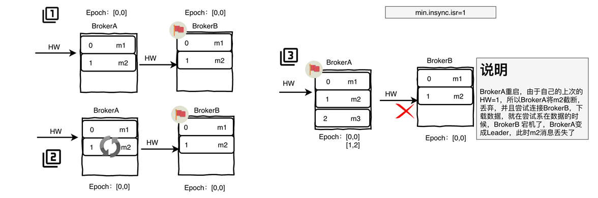

# 一、kafka概述

## 1.介绍

Kafka是Apache软件基金会开发的一个开源流处理平台

由Scala和java编写

Kafka是一种**高吞吐量的分布式发布订阅消息系统**

- 消息队列 Message Queue
- kafka Streaming      实现实时在线流处理

**作用**： 一般用作系统间解耦、异步通信、削峰填谷等


## 2.消息队列

消息队列是一种在分布式和大数据开发中不可或缺的**中间件**。在分布式开发或者大数据开发中通常使用消息队列进行缓冲、系统间解耦和削峰填谷等业务场景，常见的消息队列工作模式大致会分位两大类：

1. **消费次数至多一次**：

   消息生产者将数据写入到消息系统，然后由消费者负责去拉取消息服务器中的消息，一旦消息被确认消费之后，由消息服务器主动删除队列中的数据，这种消费方式一半只允许被一个消费者消费，不允许重复消费。

2. **消费次数没有限制**：

   生产者发完数据以后，该消息能被多个消费者同时消费，并且同一个消费者可以多次消费消息服务器中的同一个记录。主要是因为消息服务器一班可以长时间存储海量信息。kafka采用这种方式。

   

## 3.Topic

- kafka集群中所有消息以Topic为单位
- 以Topic形式负责分类集群中的Record，每一个Record属于一个Topic
- 每个Topic通常会有多个订阅者


## 4.分区

- 每个Topic底层都会对应一组分区的日志用来持久化Topic中的Record
- Topic的每一个日志分区都会有一个Borker担当该分区的Leader，其他的Borker担当该分区的follower
- Leader负责分区数据的读写操作，follower负责同步改分区的数据。
- 如果分区的Leader宕机，该分区的其他follower会选取出新的leader继续负责该分区的读写
- Record被分到哪个分区，可以通过round-robin方式，也可以根据语义分区，例如基于记录中的key
- 每个日志分区是一个有序的不可变的日志序列，但分区之间的数据无序
- 其中集群的Leader的监控和Topic的部分元数据是存储在Zookeeper中


​	**使用分区的目的：**

1. 允许日志扩展到超出单个服务器所能容纳的大小

 	2. 负载均衡     ---   每个服务器充当某些分区的Leader，也可以充当其他分区的Follower


## 5. 偏移量offset

- 每一个Record都分配了唯一的序列编号offset
- 每个消费者会维护本次消费对应分区的偏移量，消费完一个批次的数据后，会将本次消费的偏移量提交给kafka集群、
- 消费者可以从topic分区中的任意位置读取队列数据


## 6. Group

- 消费者使用Consumer Group名称标记自己，发布到Topic的每条记都会传递到每个订阅Consumer Group的一个消费者实例。
- 如果每个Consumer实例都具有相同的Group，则每个Consumer实例均分消费。
- 如果每个Consumer实例具有不同的Group，则每条记录将广播到所有Group进程。


## 7. 数据存储

Kafka集群会持久化所有发布到Topic的Record信息，改Recod的持久化时间是通过配置文件指定，默认是168小时

` log.retention.hours=168`

Kafka底层会定期检查日志文件，然后将过从log中移除，由于Kafka使用磁盘存储日志文件，因此使用kafka长时间缓存一些日志文件不会存在问题。


## 8. 顺序写入和MMFile

Kafka的消息是保存或缓存在磁盘上的，一般认为在磁盘上读写数据是会降低性能的，但Kafka即使是普通的服务器，却可以轻松支持每秒百万级的写入请求。为了优化写入速度Kafka采用了两个技术：顺序写入和MMFile。

**顺序写入**

因为硬盘是机械结构，每次读写都会寻址->写入，其中寻址是一个机械动作，非常耗时。为了提高读写硬盘的速度，Kafka使用顺序I/O，这样省去了大量的内存开销以及节省了IO寻址的时间。

**MMFile**

Kafka充分利用了现代操作系统分页存储来利用内存提高I/O效率。Memory Mapped Files(简称mmap)，也称内存映射文件，它的工作原理数直接利用操作系统的Page实现文件到物理内存的直接映射。完成MMP映射后，用户对内存的所有操作会被操作系统自动刷新到磁盘上，极大的降低了IO使用率。


Kafka服务器在响应客户端读取时，底层使用ZeroCopy技术，无需拷贝到用户空间，直接将数据通过内核空间传递输出，数据并没有抵达用户空间。

常规IO方式如下：

1. 文件在磁盘中数据被copy到内核缓冲区
2. 从内核缓冲区copy到用户缓冲区
3. 用户缓冲区copy到内核与socket相关的缓冲区
4. 数据从socket缓冲区copy到相关协议引擎发送出去


Zero Copy方式：

1. 文件在磁盘中数据被copy到内核缓冲区
2. 从内核缓冲区copy到内核与socket相关的缓冲区
3. 数据从socket缓冲区copy的相关协议引擎发送出去


**DMA读取**

1. 用户进程调用read等系统调用向操作系统发出IO请求，请求读取数据到自己的内存缓冲区中，自己进入阻塞状态。

2. 操作系统收到请求之后，进一步将IO请求发送DMA，然后让cpu干别的活。

3. DMA进一步将IO请求发送到磁盘。
4. 磁盘驱动器收到DMA的IO请求，把数据从磁盘读取到驱动器的缓冲中。当驱动器的缓冲区满了之后，向DMA发出中断信号告知自己的缓冲区已满。
5. DMA收到磁盘驱动器的信号，将磁盘驱动器的缓冲中的数据拷贝到内核缓冲区中。此时不占用cpu。这个时候只要内核缓冲区的数据少于用户申请读的数据，内核就会一直重复步骤3和4，直到内核缓冲区的数据足够多为止。
6. 当DMA读取到足够的数据，就会发送中断信号给cpu。
7. cpu收到DMA的信号，将数据从内核拷贝到用户空间，系统调用返回


跟IO中断模式相比，DMA模式下，DMA就是cpu的一个代理，他负责了一部分的拷贝工作，从而减轻了cpu的负担，DMA的优点是：中断少，cpu负担低。


# 二、环境搭建

1. 同步时钟 ntpdate cn.pool.ntp.org **|** **ntp**[1-7].aliyun.com

   ` yum install ntp -y  `   安装ntpntpdate

    ` ntpdate ntp1.aliyun.com ` 

   ` clock -w`

2. 安装&启动Zookeeper

3. 安装&启动|关闭Kafka

   修改server.properties配置文件，需要修改的参数如下：

   ​	broker.id  

   ​	listener  sokect连接

   ​	log.dirs  kafka数据的存放地址，多个地址的话用逗号分割

   ​	zookeeper.connect   zk连接参数

启动命令  bin/kafka-server-start.sh -daemon config/server.properties

停止命令  bin/kafka-server-stop.sh

# 三、常用命令

1. 创建Topic

```
./bin/kafka-topics.sh 
         --bootstrap-server CentOSA:9092,CentOSB:9092,CentOSC:9092 
         --create 
         --topic topic02 
         --partitions 3 
         --replication-factor 3
```

2. 查看Topic

```
./bin/kafka-topics.sh 				
        --bootstrap-server CentOSA:9092,CentOSB:9092,CentOSC:9092 
	    --list

```

3. 查看Topic详情，包括分区、副本因子等信息

```
./bin/kafka-topics.sh 
    --bootstrap-server CentOSA:9092,CentOSB:9092,CentOSC:9092 
    --describe 
    --topic topic01

```

4. 修改Topic，分区数只能增加不能减少

```
./bin/kafka-topics.sh 
   --bootstrap-server CentOSA:9092,CentOSB:9092,CentOSC:9092 
   --alter 
   --topic topic03 
   --partitions 2

```

5. 删除Topic

```
./bin/kafka-topics.sh 
   --bootstrap-server CentOSA:9092,CentOSB:9092,CentOSC:9092 
   --delete 
   --topic topic03
```

6. 订阅Topic

```
./bin/kafka-console-consumer.sh 
                  --bootstrap-server CentOSA:9092,CentOSB:9092,CentOSC:9092 
                  --topic topic01 
                  --group g1 
                  --property print.key=true 
                  --property print.value=true 
                  --property key.separator=,
```

7. 生产数据

```
./bin/kafka-console-producer.sh 
                  --broker-list CentOSA:9092,CentOSB:9092,CentOSC:9092 
                  --topic topic01
```

8. 查看消费者组

```
./bin/kafka-consumer-groups.sh 
                  --bootstrap-server CentOSA:9092,CentOSB:9092,CentOSC:9092 
                  --list
```

9. 查看消费者组详情

```
./bin/kafka-consumer-groups.sh 
                  --bootstrap-server CentOSA:9092,CentOSB:9092,CentOSC:9092 
                  --describe 
                  --group g1
```

# 四、Kafka基础API

## 1. maven依赖

```xml
<dependency>
    <groupId>org.apache.kafka</groupId>
    <artifactId>kafka-clients</artifactId>
    <version>2.2.0</version>
</dependency>
```

## 2. 消费数据

```java
 		//1.创建Kafka链接参数
        Properties props=new Properties();
        props.put(ConsumerConfig.BOOTSTRAP_SERVERS_CONFIG,"CentOSA:9092,CentOSB:9092,CentOSC:9092");
        props.put(ConsumerConfig.KEY_DESERIALIZER_CLASS_CONFIG, StringDeserializer.class.getName());
        props.put(ConsumerConfig.VALUE_DESERIALIZER_CLASS_CONFIG,StringDeserializer.class.getName());
        props.put(ConsumerConfig.GROUP_ID_CONFIG,"group01");

        //2.创建Topic消费者
        KafkaConsumer<String,String> consumer=new KafkaConsumer<String, String>(props);
        //3.订阅topic开头的消息队列
        consumer.subscribe(Pattern.compile("^topic.*$"));

        while (true){
            ConsumerRecords<String, String> consumerRecords = consumer.poll(Duration.ofSeconds(1));
            Iterator<ConsumerRecord<String, String>> recordIterator = consumerRecords.iterator();
            while (recordIterator.hasNext()){
                ConsumerRecord<String, String> record = recordIterator.next();
                String key = record.key();
                String value = record.value();
                long offset = record.offset();
                int partition = record.partition();
                System.out.println("key:"+key+",value:"+value+",partition:"+partition+",offset:"+offset);
            }
        }
```
## 3. 生产数据

```java
		//1.创建链接参数
        Properties props=new Properties();
        props.put(ProducerConfig.BOOTSTRAP_SERVERS_CONFIG,"CentOSA:9092,CentOSB:9092,CentOSC:9092");
        props.put(ProducerConfig.KEY_SERIALIZER_CLASS_CONFIG, StringSerializer.class.getName());
        props.put(ProducerConfig.VALUE_SERIALIZER_CLASS_CONFIG,StringSerializer.class.getName());
    
        //2.创建生产者
        KafkaProducer<String,String> producer=new KafkaProducer<String, String>(props);

        //3.封账消息队列
        for(Integer i=0;i< 10;i++){
            ProducerRecord<String, String> record = new ProducerRecord<>("topic01",  "value" + i);
            producer.send(record);
        }

        producer.close();
```
## 4. Topic DML

```java
		//配置连接参数
        Properties props = new Properties();
        props.put(AdminClientConfig.BOOTSTRAP_SERVERS_CONFIG,
                    "CentOSA:9092,CentOSB:9092,CentOSC:9092");

        KafkaAdminClient adminClient= (KafkaAdminClient) KafkaAdminClient.create(props);

        //查询topics
        KafkaFuture<Set<String>> nameFutures = adminClient.listTopics().names();
        for (String name : nameFutures.get()) {
            System.out.println(name);
        }

        //创建Topics
        List<NewTopic> newTopics = Arrays.asList(new NewTopic("topic02", 2, (short) 3));

        //删除Topic
       // adminClient.deleteTopics(Arrays.asList("topic02"));

        //查看Topic详情
        DescribeTopicsResult describeTopics =
                adminClient.describeTopics(Arrays.asList("topic01"));
        Map<String, TopicDescription> tdm = describeTopics.all().get();
        for (Map.Entry<String, TopicDescription> entry : tdm.entrySet()) {
            System.out.println(entry.getKey()+"\t"+entry.getValue());
        }

        adminClient.close();
```

## 5. 自定义分区

实现Partitioner接口

```java
public class UserDefinePartitioner  implements Partitioner {
    private AtomicInteger atomicInteger=new AtomicInteger(0);
    @Override
    public int partition(String topic, Object key, byte[] keyBytes, Object value, byte[] valueBytes, Cluster cluster) {
        int numPartitions = cluster.partitionsForTopic(topic).size();
        if(keyBytes==null || keyBytes.length==0){
            return atomicInteger.addAndGet(1) & Integer.MAX_VALUE% numPartitions;
        } else {
            return Utils.toPositive(Utils.murmur2(keyBytes)) % numPartitions;
        }
    }

    @Override
    public void close() {
        System.out.println("close");
    }

    @Override
    public void configure(Map<String, ?> configs) {
        System.out.println("configure");
    }
}
```

指定自定义分区

```java
props.put(ProducerConfig.PARTITIONER_CLASS_CONFIG,UserDefinePartitioner.class.getName());
```


## 6. 序列化

1. 定义Bean，实现Serializable接口

```java
public class User implements Serializable {
    private Integer id;
    private String name;
    private Date birthDay;
    ...
 }
```

2. 指定生产者序列化参数

```java
		props.put(ProducerConfig.VALUE_SERIALIZER_CLASS_CONFIG,ObjectSerializer.class.getName());
	
		//2.创建生产者
        KafkaProducer<String,User> producer=new KafkaProducer<String, User>(props);

        //3.封账消息队列
        for(Integer i=0;i< 10;i++){
            ProducerRecord<String, User> record = new ProducerRecord<>("topic01", "key"+i,new User(i,"user"+i,new Date()));
            producer.send(record);
        }
```

```java
public class ObjectSerializer implements Serializer<Object> {

    @Override
    public void configure(Map<String, ?> configs, boolean isKey) {
        System.out.println("configure");
    }

    @Override
    public byte[] serialize(String topic, Object data) {
        return SerializationUtils.serialize((Serializable) data);
    }

    @Override
    public void close() {
        System.out.println("close");
    }
}
```

3. 指定消费者反序列化参数

```java
		props.put(ConsumerConfig.VALUE_DESERIALIZER_CLASS_CONFIG,ObjectDeserializer.class.getName());

		//2.创建Topic消费者
        KafkaConsumer<String,User> consumer=new KafkaConsumer<String, User>(props);
        //3.订阅topic开头的消息队列
        consumer.subscribe(Pattern.compile("^topic.*$"));

        while (true){
            ConsumerRecords<String, User> consumerRecords = consumer.poll(Duration.ofSeconds(1));
            Iterator<ConsumerRecord<String, User>> recordIterator = consumerRecords.iterator();
            while (recordIterator.hasNext()){
                ConsumerRecord<String, User> record = recordIterator.next();
                String key = record.key();
                User value = record.value();
                long offset = record.offset();
                int partition = record.partition();
                System.out.println("key:"+key+",value:"+value+",partition:"+partition+",offset:"+offset);
            }
        }
```

```java
public class ObjectDeserializer implements Deserializer<Object> {
    @Override
    public void configure(Map<String, ?> configs, boolean isKey) {
        System.out.println("configure");
    }

    @Override
    public Object deserialize(String topic, byte[] data) {
        return SerializationUtils.deserialize(data);
    }

    @Override
    public void close() {
        System.out.println("close");
    }
}
```


## 7.拦截器

1. 定义拦截器

```java
public class UserDefineProducerInterceptor implements ProducerInterceptor {
    @Override
    public ProducerRecord onSend(ProducerRecord record) {
        ProducerRecord wrapRecord = new ProducerRecord(record.topic(), record.key(), record.value());
        wrapRecord.headers().add("user","mashibing".getBytes());
        return wrapRecord;
    }

    @Override
    public void onAcknowledgement(RecordMetadata metadata, Exception exception) {
        System.out.println("metadata:"+metadata+",exception:"+exception);
    }

    @Override
    public void close() {
        System.out.println("close");
    }

    @Override
    public void configure(Map<String, ?> configs) {
        System.out.println("configure");
    }
}
```

2. 在生产者参数中设置拦截器

```java
props.put(ProducerConfig.INTERCEPTOR_CLASSES_CONFIG,UserDefineProducerInterceptor.class.getName());
```


# 五、Kafka高级API

## 1. offset自动控制

Kafka消费者默认对于未订阅的topic的offset的时候，也就是系统并没有存储该消费者的消费分区的记录信息，默认Kafka消费者的默认首次消费策略：latest。

```
auto.offset.reset=latest
```

- earliest - 自动将偏移量重置为最早的偏移量
- latest - 自动将偏移量重置为最新的偏移量
- none - 如果未找到消费者组的先前偏移量，则向消费者抛出异常

Kafka消费者在消费数据的时候默认会定期的提交消费的偏移量，这样就可以保证所有的消息至少可以被消费者消费1次,用户可以通过以下两个参数配置：

enable.auto.commit = true 默认

auto.commit.interval.ms = 5000 默认

```java
		//1.创建Kafka链接参数
        Properties props=new Properties();
        props.put(ConsumerConfig.BOOTSTRAP_SERVERS_CONFIG,"CentOSA:9092,CentOSB:9092,CentOSC:9092");
        props.put(ConsumerConfig.KEY_DESERIALIZER_CLASS_CONFIG, StringDeserializer.class.getName());
        props.put(ConsumerConfig.VALUE_DESERIALIZER_CLASS_CONFIG,StringDeserializer.class.getName());
        props.put(ConsumerConfig.GROUP_ID_CONFIG,"group01");
        props.put(ConsumerConfig.ENABLE_AUTO_COMMIT_CONFIG,true);
        props.put(ConsumerConfig.AUTO_COMMIT_INTERVAL_MS_CONFIG,10000);

        //2.创建Topic消费者
        KafkaConsumer<String,String> consumer=new KafkaConsumer<String, String>(props);
        //3.订阅topic开头的消息队列
        consumer.subscribe(Pattern.compile("^topic.*$"));

        while (true){
            ConsumerRecords<String, String> consumerRecords = consumer.poll(Duration.ofSeconds(1));
            Iterator<ConsumerRecord<String, String>> recordIterator = consumerRecords.iterator();
            while (recordIterator.hasNext()){
                ConsumerRecord<String, String> record = recordIterator.next();
                System.out.println(",value:"+record.value());

            }
        }
```

如果用户需要自己管理offset的自动提交，可以关闭offset的自动提交，手动管理offset提交的偏移量，注意用户提交的offset偏移量永远都要比本次消费的偏移量+1，因为提交的offset是kafka消费者下一次抓取数据的位置。

```java
		//1.创建Kafka链接参数
        Properties props=new Properties();
        props.put(ConsumerConfig.BOOTSTRAP_SERVERS_CONFIG,"CentOSA:9092,CentOSB:9092,CentOSC:9092");
        props.put(ConsumerConfig.KEY_DESERIALIZER_CLASS_CONFIG, StringDeserializer.class.getName());
        props.put(ConsumerConfig.VALUE_DESERIALIZER_CLASS_CONFIG,StringDeserializer.class.getName());
        props.put(ConsumerConfig.GROUP_ID_CONFIG,"group01");
        props.put(ConsumerConfig.ENABLE_AUTO_COMMIT_CONFIG,false);

        //2.创建Topic消费者
        KafkaConsumer<String,String> consumer=new KafkaConsumer<String, String>(props);
        //3.订阅topic开头的消息队列
        consumer.subscribe(Pattern.compile("^topic.*$"));

        while (true){
            ConsumerRecords<String, String> consumerRecords = consumer.poll(Duration.ofSeconds(1));
            Iterator<ConsumerRecord<String, String>> recordIterator = consumerRecords.iterator();
            while (recordIterator.hasNext()){
                ConsumerRecord<String, String> record = recordIterator.next();
                String value = record.value();
                long offset = record.offset();
                int partition = record.partition();
                Map<TopicPartition, OffsetAndMetadata> offsets=new HashMap<TopicPartition, OffsetAndMetadata>();

                offsets.put(new TopicPartition(record.topic(),partition),new OffsetAndMetadata(offset+1));
                consumer.commitAsync(offsets, new OffsetCommitCallback() {
                    @Override
                    public void onComplete(Map<TopicPartition, OffsetAndMetadata> offsets, Exception exception) {
                        System.out.println("完成："+offset+"提交！");
                    }
                });
                System.out.println("value:"+value+",partition:"+partition+",offset:"+offset);

            }
        }
```

## 2 .Acks & Retries

Kafka生产者在发送完一个的消息之后，要求Broker在规定的额时间Ack应答，如果没有在规定时间内应答，Kafka生产者会尝试n次重新发送消息。

acks=1 默认

- acks=1	 - Leader会将Record写到其本地日志中，但会在不等待所有Follower的完全确认的情况下做出响应。在这种情况下，如果Leader在确认记录后立即失败，但在Follower复制记录之前失败，则记录将丢失。

- acks=0     - 生产者根本不会等待服务器的任何确认。该记录将立即添加到套接字缓冲区中并视为已发送。在这种情况下，不能保证服务器已收到记录。

- acks=all   - 这意味着Leader将等待全套同步副本确认记录。这保证了只要至少一个同步副本仍处于活动状态，记录就不会丢失。这是最有力的保证。这等效于acks = -1设置。

   

如果生产者在规定的时间内，并没有得到Kafka的Leader的Ack应答，Kafka可以开启reties机制。

request.timeout.ms = 30000 默认

retries = 2147483647 默认

```java
		props.put(ProducerConfig.REQUEST_TIMEOUT_MS_CONFIG,1000);
        props.put(ProducerConfig.ACKS_CONFIG,"-1");
        props.put(ProducerConfig.RETRIES_CONFIG,10);
```


## 3. 幂等性

Kafka在**0.11.0.0**版本支持增加了对幂等的支持。幂等是针对生产者角度的特性。幂等可以保证上生产者发送的消息，不会丢失，而且不会重复。实现幂等的关键点就是服务端可以区分请求是否重复，过滤掉重复的请求。要区分请求是否重复的有两点：

> HTTP/1.1中对幂等性的定义是：一次和多次请求某一个资源对于资源本身应该具有同样的结果（网络超时等问题除外）。也就是说，其任意多次执行对资源本身所产生的影响均与一次执行的影响相同。

**记录下已处理过的请求标识**：光有唯一标识还不够，还需要记录下那些请求是已经处理过的，这样当收到新的请求时，用新请求中的标识和处理记录进行比较，如果处理记录中有相同的标识，说明是重复记录，拒绝掉。

幂等又称为exactly once。要停止多次处理消息，必须仅将其持久化到Kafka Topic中仅仅一次。在初始化期间，kafka会给生产者生成一个唯一的ID称为Producer ID或PID。

PID和序列号与消息捆绑在一起，然后发送给Broker。由于序列号从零开始并且单调递增，因此，仅当消息的序列号比该PID / TopicPartition对中最后提交的消息正好大1时，Broker才会接受该消息。如果不是这种情况，则Broker认定是生产者重新发送该消息。


enable.idempotence= false 默认

注意:在使用幂等性的时候，要求必须开启retries=true和acks=all

```java
		props.put(ProducerConfig.ACKS_CONFIG,"all");
        props.put(ProducerConfig.RETRIES_CONFIG,3);
		//开启幂等性
        props.put(ProducerConfig.ENABLE_IDEMPOTENCE_CONFIG,true);
		//开启幂等性后，该参数要小于或者等于5
		props.put(ProducerConfig.MAX_IN_FLIGHT_REQUESTS_PER_CONNECTION,1);
```


## 4. 事务

Kafka的幂等性，只能保证一条记录的在分区发送的原子性，但是如果要保证多条记录（多分区）之间的完整性，这个时候就需要开启kafk的事务操作。

在Kafka0.11.0.0除了引入的幂等性的概念，同时也引入了事务的概念。

通常Kafka的事务分为 **生产者事务**、**消费者&生产者事务**。

一般来说默认消费者消费的消息的级别是read_uncommited数据，这有可能读取到事务失败的数据，所有在开启生产者事务之后，需要用户设置消费者的事务隔离级别。

isolation.level = read_uncommitted 默认

该选项有两个值read_committed | read_uncommitted，如果开始事务控制，消费端必须将事务的隔离级别设置为read_committed

开启的生产者事务的时候，只需要指定transactional.id属性即可，一旦开启了事务，默认生产者就已经开启了幂等性。

但是要求"transactional.id"的取值必须是唯一的，同一时刻只能有一个"transactional.id"存储在，其他的将会被关闭。


### 生产者事务

```java
		//1.创建链接参数
        Properties props=new Properties();
        props.put(ProducerConfig.BOOTSTRAP_SERVERS_CONFIG,"CentOSA:9092,CentOSB:9092,CentOSC:9092");
        props.put(ProducerConfig.KEY_SERIALIZER_CLASS_CONFIG, StringSerializer.class.getName());
        props.put(ProducerConfig.VALUE_SERIALIZER_CLASS_CONFIG,StringSerializer.class.getName());
        props.put(ProducerConfig.TRANSACTIONAL_ID_CONFIG,"transaction-id");

        //2.创建生产者
        KafkaProducer<String,String> producer=new KafkaProducer<String, String>(props);
        producer.initTransactions();//初始化事务

        try{
            producer.beginTransaction();//开启事务
            //3.封账消息队列
            for(Integer i=0;i< 10;i++){
                Thread.sleep(10000);
                ProducerRecord<String, String> record = new ProducerRecord<>("topic01", "key" + i, "value" + i);
                producer.send(record);
            }
            producer.commitTransaction();//提交事务
        }catch (Exception e){
            producer.abortTransaction();//终止事务
        }

        producer.close();
```

消费者参数设置

```java
props.put(ConsumerConfig.ISOLATION_LEVEL_CONFIG,"read_committed");
```

### 消费者&生产者事务

适用于业务中同时用到了生产者和消费者，并且如果其中发生异常，生产和消费都需要回退的情况。

```java
		//1.生产者&消费者
        KafkaProducer<String,String> producer=buildKafkaProducer();
        KafkaConsumer<String, String> consumer = buildKafkaConsumer("group01");

        consumer.subscribe(Arrays.asList("topic01"));
        producer.initTransactions();//初始化事务

        try{
            while(true){
                ConsumerRecords<String, String> consumerRecords = consumer.poll(Duration.ofSeconds(1));
                Iterator<ConsumerRecord<String, String>> consumerRecordIterator = consumerRecords.iterator();
                //开启事务控制
                producer.beginTransaction();
                Map<TopicPartition, OffsetAndMetadata> offsets=new HashMap<TopicPartition, OffsetAndMetadata>();
                while (consumerRecordIterator.hasNext()){
                    ConsumerRecord<String, String> record = consumerRecordIterator.next();
                    //创建Record
                    ProducerRecord<String,String> producerRecord=new ProducerRecord<String,String>("topic02",record.key(),record.value());
                    producer.send(producerRecord);
                    //记录元数据
                    offsets.put(new TopicPartition(record.topic(),record.partition()),new OffsetAndMetadata(record.offset()+1));
                }
                //提交事务
                producer.sendOffsetsToTransaction(offsets,"group01");
                producer.commitTransaction();
            }
        }catch (Exception e){
            producer.abortTransaction();//终止事务
        }finally {
            producer.close();
        }
```


# 六、Kafka进阶

## 1. kafka副本同步机制

Kafka的Topic被分为多个分区，分区是是按照Segments存储文件块。

分区日志是存储在磁盘上的日志序列，Kafka可以保证分区里的数据是有序的。

其中Leader负责对应分区的读写、Follower负责同步分区的数据，0.11 版本之前Kafka使用highwatermarker机制保证数据的同步，但是基于highwatermarker的同步数据可能会导致数据的不一致或者是乱序。

在Kafka数据同步有以下概念：

**LEO**：log end offset 标识的是每个分区中最后一条消息的下一个位置，分区的每个副本都有自己的LEO.

**HW**:  high watermarker称为高水位线，所有HW之前的的数据都理解是已经备份的,当所有节点都备份成功，Leader会更新水位线。

**ISR**:   In-sync-replicas,kafka的leader会维护一份处于同步的副本集和，如果在`replica.lag.time.max.ms`时间内系统没有发送fetch请求，或者已然在发送请求，但是在该限定时间内没有赶上Leader的数据就被剔除ISR列表。在Kafka-0.9.0版本剔除`replica.lag.max.messages`消息个数限定，因为这个会导致其他的Broker节点频繁的加入和退出ISR。


依赖HW的概念实现数据同步（0.11 版本之前）存在数据不一致问题和丢失数据问题：

①：High Watermark Truncation followed by Immediate Leader Election（数据丢失）


 ②: Replica Divergence on Restart after Multiple Hard Failures（数据不一致）


可以看出0.11版本之前Kafka的副本备份机制的设计存在问题，因此Kafka-0.11版本引入了 Leader Epoch解决这个问题，不在使用HW作为数据截断的依据。而是已引入了Leader epoch的概念，任意一个Leader持有一个LeaderEpoch。该LeaderEpoch这是一个由Controller管理的32位数字，存储在Zookeeper的分区状态信息中，并作为LeaderAndIsrRequest的一部分传递给每个新的Leader。Leader接受Producer请求数据上使用LeaderEpoch标记每个Message。然后，该LeaderEpoch编号将通过复制协议传播，并用于替换HW标记，作为消息截断的参考点。


改进消息格式，以便每个消息集都带有一个4字节的Leader Epoch号。在每个日志目录中，会创建一个新的Leader Epoch Sequence文件，在其中存储Leader Epoch的序列和在该Epoch中生成的消息的Start Offset。它也缓存在每个副本中，也缓存在内存中。


**follower变成Leader**

当Follower成为Leader时，它首先将新的Leader Epoch和副本的LEO添加到Leader Epoch Sequence序列文件的末尾并刷新数据。给Leader产生的每个新消息集都带有新的“Leader Epoch”标记。

**Leader变成Follower**

需要从本地的Leader Epoch Sequence加载数据，将数据存储在内存中，给相应的分区的Leader发送epoch请求，该请求包含最新的EpochID,StartOffset信息.Leader接收到信息以后返回该EpochID所对应的LastOffset信息。该信息可能是最新EpochID的StartOffset或者是当前EpochID的Log End Offset信息.

情形1：Fllower的Offset比Leader的小


情形2：follower的Leader Epoch的信息startOffset信息比Leader返回的LastOffset要大，Follower回去重置自己的Leader Epoch文件，将Offset修改为Leader的LastOffset信息，并且截断自己的日志信息。


Follower在提取过程中，如果Follower看到的LeaderEpoch消息集大于其最新的LeaderEpoch，则会在其LeaderEpochSequence中添加新的LeaderEpoch和起始偏移量，并将Epoch数据文件刷新到磁盘。同时将Fetch日志信息刷新到本地日志文件。


**采用LeaderEpoch同步机制避免HW产生的数据丢失和数据不一致问题**

①：High Watermark Truncation followed by Immediate Leader Election（数据丢失）



 ②: Replica Divergence on Restart after Multiple Hard Failures（数据不一致）


## 2. Kafka-Eagle

kakfa-Eagle一个监视系统，监视kafka群集以及可视的使用者线程，偏移量，所有者等。

可以看到当前的使用者组，对于每个组，他们正在消耗的Topic以及该组在每个Topic中的偏移量，滞后日志大小和位置。

这对于了解用户从消息队列消耗的速度以及消息队列增加的速度很有用。

**安装步骤**

1. 配置环境变量

```shell
KE_HOME=/usr/kafka-eagle
PATH=$PATH:$KE_HOME/bin
export PATH
export KE_HOME
```

2. 修改配置文件

  vi conf/system-config.properties 

```properties
kafka.eagle.zk.cluster.alias=cluster1
cluster1.zk.list=CentOSA:2181,CentOSB:2181,CentOSC:2181
cluster1.kafka.eagle.offset.storage=kafka
# kafka 开启图表
kafka.eagle.metrics.charts=true
kafka.eagle.driver=com.mysql.jdbc.Driver
kafka.eagle.url=jdbc:mysql://192.168.52.1:3306/ke?useUnicode=true&characterEncoding=UTF-8&zeroDateTimeBehavior=convertToNull
kafka.eagle.username=root
kafka.eagle.password=root
```

3. 启动Kafka-eagle

```shell
 chmod u+x bin/ke.sh
 ./bin/ke.sh start
```


如果需要检测Kafka性能指标需要修改Kafka启动文件

```shell
vi kafka-server-start.sh

...

if [ "x$KAFKA_HEAP_OPTS" = "x" ]; then

  export KAFKA_HEAP_OPTS="-server -Xms2G -Xmx2G -XX:PermSize=128m -XX:+UseG1GC -XX:MaxGCPauseMillis=200 -XX:ParallelGCThreads=8 -XX:ConcGCThreads=5 -XX:InitiatingHeapOccupancyPercent=70"

  export JMX_PORT="9999"

  \#export KAFKA_HEAP_OPTS="-Xmx1G -Xms1G"

fi
```


## 3. Kafka-Flume集成

Flume是一种分布式的、可靠的和可用的服务，用于有效地收集、聚合和移动大量日志数据。它具有简单灵活的基于流数据流的体系结构。它具有健壮性和容错性，具有可调可靠性机制和多种故障转移和恢复机制。它使用了一个简单的可扩展数据模型，允许在线分析应用程序。

可用于收集kafka日志。

官网 http://flume.apache.org/

## 4. Kafka-SpringBoot集成

1. 加入Maven依赖

```xml
      <dependency>
           <groupId>org.springframework.kafka</groupId>
           <artifactId>spring-kafka</artifactId>
      </dependency>
```

2. kafka配置信息

```properties
spring.kafka.bootstrap-servers=CentOSA:9092,CentOSB:9092,CentOSC:9092

spring.kafka.producer.retries=5
spring.kafka.producer.acks=all
spring.kafka.producer.batch-size=16384
spring.kafka.producer.buffer-memory=33554432
spring.kafka.producer.transaction-id-prefix=transaction-id-
spring.kafka.producer.key-serializer=org.apache.kafka.common.serialization.StringSerializer
spring.kafka.producer.value-serializer=org.apache.kafka.common.serialization.StringSerializer
spring.kafka.producer.properties.enable.idempotence=true

spring.kafka.consumer.group-id=group1
spring.kafka.consumer.auto-offset-reset=earliest
spring.kafka.consumer.enable-auto-commit=true
spring.kafka.consumer.auto-commit-interval=100
spring.kafka.consumer.properties.isolation.level=read_committed
spring.kafka.consumer.key-deserializer=org.apache.kafka.common.serialization.StringDeserializer
spring.kafka.consumer.value-deserializer=org.apache.kafka.common.serialization.StringDeserializer
```

3. 生产数据

```java
@Transactional
@Service
public class OrderService implements IOrderService {

    @Autowired
    private KafkaTemplate kafkaTemplate;

    @Override
    public void saveOrder(String id,Object message) {
          //使用kafkaTemplate发送消息给服务器
    }
}
```

4. 消费数据

```java
@KafkaListeners(value = {@KafkaListener(topics = {"topic04"})})
@SendTo(value = {"topic05"})
public String listenner(ConsumerRecord<?, ?> cr) {

    return cr.value()+" mashibing edu";
}
```

